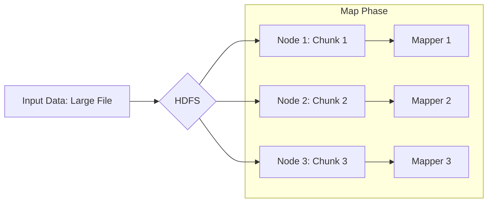

# Phân tích chi tiết: 6_mapreduce.pdf

Chào bạn, tôi là một chuyên gia về Big Data và Hệ thống Phân tán. Dựa trên nội dung slide "6_mapreduce.pdf" bạn cung cấp, tôi sẽ phân tích và trình bày lại một cách chi tiết, chuyên nghiệp bằng tiếng Việt dưới dạng Markdown.

---

# Chương 6: Kỹ thuật Xử lý Dữ liệu Lớn theo Khối (Phần 1) - MapReduce

Bài viết này phân tích sâu về **MapReduce**, một mô thức xử lý dữ liệu nền tảng trong hệ sinh thái Hadoop, được Google đề xuất và phát triển.

## 1. Tổng quan về MapReduce (Mô thức Xử lý Dữ liệu)

### Khái niệm và Đặc điểm

**MapReduce** là một mô thức lập trình (programming model) và cũng là một framework cho phép xử lý lượng dữ liệu khổng lồ song song trên các cụm máy tính phân tán. Trong môi trường Hadoop, MapReduce là mô thức xử lý dữ liệu mặc định.

**Các đặc điểm cốt lõi:**

*   **Đơn giản (Simplicity):** Người lập trình chỉ cần tập trung vào logic xử lý dữ liệu (thông qua 2 hàm Map và Reduce), không cần quan tâm đến việc quản lý tài nguyên phần cứng, phân tán tác vụ hay xử lý lỗi ở mức hệ thống.
*   **Linh hoạt (Flexibility):** Có thể xử lý hầu hết các bài toán dữ liệu thô (dữ liệu phi cấu trúc, bán cấu trúc) chỉ bằng cách thay đổi logic trong hàm Map và Reduce.
*   **Khả mở (Scalability):** Dễ dàng mở rộng quy mô xử lý bằng cách thêm các node (máy tính) vào cụm (cluster) mà không cần thay đổi mã nguồn.

### Cấu trúc của một MapReduce Job

Một chương trình MapReduce được gọi là một **Job**. Job này được chia nhỏ thành nhiều **Task** độc lập và được phân tán thực thi trên các node khác nhau trong cụm.

*   **Tính độc lập:** Mỗi tác vụ (task) chạy độc lập với các tác vụ khác, giúp tăng cường độ tin cậy và khả năng mở rộng.
*   **Giảm truyền thông:** Hệ thống tối ưu hóa việc truyền dữ liệu giữa các node, ưu tiên xử lý dữ liệu tại chỗ (data locality) để giảm băng thông mạng.
*   **Tránh đồng bộ:** Cơ chế này tránh các vấn đề về deadlock hay race condition bằng cách giữ các tác vụ tách biệt nhau.

## 2. Kiến trúc và Luồng Xử lý Dữ liệu

### Mô hình Dữ liệu Input - Output

MapReduce hoạt động chủ yếu với dữ liệu dạng file lớn và thường lấy dữ liệu từ **HDFS (Hadoop Distributed File System)**.

**Luồng dữ liệu:**

1.  **Input Data:** Dữ liệu đầu vào thường là một file lớn.
2.  **Input Splits (Phân chia đầu vào):** File lớn được chia thành các block nhỏ hơn (ví dụ: 128MB mỗi block). Các block này được lưu trữ trên các node khác nhau.
3.  **Data Locality:** Khi thực thi, mã chương trình MapReduce sẽ được gửi đến các node chứa dữ liệu tương ứng để xử lý tại chỗ, giảm thiểu việc di chuyển dữ liệu qua lại giữa các node.



### Mô hình Lập trình: Map và Reduce

Người lập trình cần cài đặt chính xác 2 hàm:
1.  **Map Function**
2.  **Reduce Function**

Dữ liệu trong MapReduce luôn được xử lý dưới dạng các cặp **(Key - Value)**.

#### Quy trình xử lý:

*   **Input Splits:** Dữ liệu đầu vào được chia nhỏ.
*   **Map Function:** Nhận đầu vào là một cặp `(Key, Value)` và sinh ra một danh sách các cặp `(Key', Value')` trung gian.
*   **Reduce Function:** Nhận đầu vào là một cặp `(Key', (list of Values))` và sinh ra kết quả cuối cùng.

| Phase | Input | Output | Mô tả |
| :--- | :--- | :--- | :--- |
| **Map** | `(K, V)` | `List(K', V')` | Hàm ánh xạ, xử lý dữ liệu thô và tạo cặp khóa-giá trị trung gian. |
| **Reduce** | `(K', List(V'))` | `List(K'', V'')` | Hàm t tổng hợp, gom nhóm dữ liệu theo khóa và xử lý các giá trị. |

## 3. Code Mẫu và Minh Họa

Để hiểu rõ hơn, chúng ta sẽ xem xét một bài toán kinh điển: **Đếm tần suất từ (Word Count)**.

### 3.1. Pseudo-code Logic

Dưới đây là logic lập trình cho bài toán Word Count:

```text
// Hàm Map
Function Map(Key, Value):
    // Key: Vị trí bắt đầu của đoạn văn bản
    // Value: Nội dung đoạn văn bản
    words = split(Value, " ") // Tách đoạn văn thành các từ
    For each word in words:
        Emit(word, 1) // Phát ra (từ, 1)

// Hàm Reduce
Function Reduce(Key, Values):
    // Key: Một từ duy nhất (ví dụ: "BigData")
    // Values: Danh sách các số 1 [1, 1, 1, ...]
    sum = 0
    For each value in Values:
        sum = sum + value // Cộng dồn
    Emit(Key, sum) // Phát ra (từ, t tổng số lần xuất hiện)
```

### 3.2. Code Mẫu Thực tế (Python)

Đây là cách cài đặt MapReduce bằng Python sử dụng thư viện `mrjob` hoặc logic tương tự:

```python
from mrjob.job import MRJob

class MRWordCount(MRJob):
    
    # Hàm Map: Nhận từng dòng và tách từ
    def mapper(self, _, line):
        words = line.split()
        for word in words:
            yield word.lower(), 1  # Emit (word, 1)

    # Hàm Reduce: Tính tổng
    def reducer(self, word, counts):
        yield word, sum(counts) # Emit (word, total_count)

if __name__ == '__main__':
    MRWordCount.run()
```

### 3.3. Code Mẫu (Java - Native Hadoop API)

Đây là cấu trúc chuẩn trong Java, thường dùng cho các hệ thống production lớn:

```java
public class WordCount {

  public static class TokenizerMapper extends Mapper<Object, Text, Text, IntWritable>{

    private final static IntWritable one = new IntWritable(1);
    private Text word = new Text();

    public void map(Object key, Text value, Context context) throws IOException, InterruptedException {
      StringTokenizer itr = new StringTokenizer(value.toString());
      while (itr.hasMoreTokens()) {
        word.set(itr.nextToken());
        context.write(word, one); // Emit (word, 1)
      }
    }
  }

  public static class IntSumReducer extends Reducer<Text,IntWritable,Text,IntWritable> {
    private IntWritable result = new IntWritable();

    public void reduce(Text key, Iterable<IntWritable> values, Context context) throws IOException, InterruptedException {
      int sum = 0;
      for (IntWritable val : values) {
        sum += val.get(); // Cộng dồn các giá trị 1
      }
      result.set(sum);
      context.write(key, result); // Emit (word, total)
    }
  }
}
```

## 4. Hướng dẫn Sử dụng và Phân tích

### Khi nào sử dụng MapReduce? (Use Cases)

MapReduce phù hợp với các bài toán xử lý **Batch Processing** (Xử lý hàng loạt) trên dữ liệu lớn:

1.  **Phân tích Log System:** Đếm số lần xuất hiện của các mã lỗi (Error Code) trong hàng triệu dòng log server.
2.  **Xử lý dữ liệu Web:** Lọc và trích xuất thông tin từ các file HTML lớn (Web Crawling).
3.  **Build Search Index:** Tạo chỉ mục từ khóa cho các công cụ tìm kiếm.
4.  **Phân tích dữ liệu khoa học:** Xử lý dữ liệu quan sát, dữ liệu gen, mô phỏng vật lý.

### Sử dụng như thế nào? (How to use)

1.  **Chuẩn bị Input:** Đưa dữ liệu lên HDFS.
2.  **Viết Code:** Cài đặt 2 hàm `Mapper` và `Reducer` (hoặc sử dụng các thư viện cấp cao như Hive/Pig nếu không cần tối ưu hóa thủ công).
3.  **Submit Job:** Gửi job lên Resource Manager (trong YARN) của Hadoop.
4.  **Theo dõi:** Giám sát quá trình thực thi qua UI của Hadoop (JobTracker/ResourceManager UI).

### Ưu & Nhược điểm

| Ưu điểm (Pros) | Nhược điểm (Cons) |
| :--- | :--- |
| **Khả năng mở rộng (Scalability):** Xử lý petabyte dữ liệu dễ dàng. | **Độ trễ (Latency):** Không phù hợp cho thời gian thực (Real-time). MapReduce chạy chậm trên các job nhỏ. |
| **Tolerance (Chịu lỗi):** Nếu một node bị lỗi, task sẽ được chuyển sang node khác tự động. | **Complexity (Phức tạp):** Viết code MapReduce "thuần" (Java) khá cồng kềnh và khó debug. |
| **Data Locality:** Giảm tải network bằng cách xử lý dữ liệu tại node lưu trữ. | **Disk I/O Heavy:** Khá nhiều thao tác ghi/đọc tạm thời ra đĩa cứng, gây chậm so với xử lý trong bộ nhớ (In-memory như Spark). |

## 5. Ví dụ Thực tế trong Industry

### Case Study: Facebook (Thời kỳ đầu)

Facebook sử dụng MapReduce rộng rãi để xử lý dữ liệu người dùng và log.
*   **Bài toán:** Tính toán "People You May Know" (PYMK) hoặc thống kê lượng truy cập theo khu vực.
*   **Cách làm:** Họ viết các MapReduce Job để quét qua dữ liệu bạn bè (Social Graph), loại bỏ các kết nối đã có, và tính toán số lượng bạn chung. Job này chạy hàng đêm (Overnight batch jobs).

### Case Study: Yahoo!

Yahoo! là một trong những người dùng lớn nhất của Hadoop và MapReduce.
*   **Bài toán:** Xử lý dữ liệu tìm kiếm và quảng cáo.
*   **Cách làm:** Sử dụng MapReduce để phân tích hành vi người dùng (User Behavior), gom nhóm các phiên tìm kiếm (Sessions) để tối ưu hóa vị trí quảng cáo (Ad ranking).

---

**Kết luận:** Mặc dù hiện nay Apache Spark (xử lý in-memory) đã trở nên phổ biến hơn do tốc độ, nhưng **MapReduce** vẫn là nền tảng cơ bản, là kim chỉ nam cho các hệ thống phân tán xử lý dữ liệu lớn theo khối (Batch Processing). Hiểu rõ MapReduce là chìa khóa để nắm bắt các khái niệm nâng cao hơn như YARN, HDFS và Spark.

---

Chào bạn, tôi là một chuyên gia về Big Data và Hệ thống Phân tán. Dưới đây là phân tích chi tiết về nội dung slide "6_mapreduce.pdf" của bạn, được trình bày một cách chuyên nghiệp và chi tiết theo yêu cầu.

---

# 📚 Phân tích và Hướng dẫn Chi tiết về MapReduce

Bài viết này phân tích quy trình xử lý dữ liệu bằng **MapReduce**, một mô hình lập trình cốt lõi trong hệ thống Big Data (như Hadoop). Chúng ta sẽ đi sâu vào từng giai đoạn của một tác vụ MapReduce điển hình: tính tổng doanh số bán hàng theo từng nhân viên.

## 1. Bài toán Ví dụ (Problem Statement)

Trước khi đi vào chi tiết kỹ thuật, chúng ta cần hiểu rõ bài toán mà slide đưa ra.

*   **Đầu vào (Input):** Một hoặc nhiều tệp văn bản lớn chứa dữ liệu giao dịch. Mỗi dòng (record) bao gồm:
    *   `Order ID`: Mã đơn hàng.
    *   `Employee Name`: Tên nhân viên thực hiện giao dịch.
    *   `Sale Amount`: Số tiền giao dịch.
*   **Đầu ra (Output):** Danh sách các cặp `(Key, Value)`:
    *   `Key`: Tên nhân viên (`Employee Name`).
    *   `Value`: Tổng doanh số (`Total Sales Amount`).

### Ví dụ dữ liệu đầu vào (Input Data Sample)

Giả sử chúng ta có file `sales_data.txt`:

```text
1001, Alice, 200
1002, Bob, 150
1003, Alice, 300
1004, Charlie, 100
1005, Bob, 250
```

---

## 2. Giai đoạn Map (Map Phase)

### Giải thích Khái niệm
Giai đoạn **Map** là bước xử lý song song đầu tiên. Dữ liệu đầu vào được chia thành các phần nhỏ (gọi là **Input Splits** hoặc **Chunks**). Mỗi Split được xử lý bởi một tác vụ Map độc lập (Mapper).

*   **Input:** Dòng dữ liệu thô (dạng text).
*   **Output:** Các cặp `(Key, Value)` trung gian.
*   **Logic:** Trong ví dụ này, Mapper đọc từng dòng, tách các trường, và phát ra `(Tên nhân viên, Doanh số)`.

### Code Mẫu (Python Pseudo-code)

```python
# Hàm Map: Nhận vào một dòng văn bản và phát ra (key, value)
def mapper(line):
    # Giả định định dạng: OrderID, EmployeeName, SaleAmount
    parts = line.split(',')
    if len(parts) == 3:
        employee_name = parts[1].strip()  # Lấy tên nhân viên
        sale_amount = int(parts[2].strip()) # Lấy số tiền
        
        # Phát ra (Key, Value)
        # Key: Tên nhân viên, Value: Doanh số của giao dịch đó
        print(f"{employee_name}\t{sale_amount}")

# Ví dụ chạy Map trên một dòng:
# Input: "1001, Alice, 200"
# Output: Alice   200
```

### Hướng dẫn Sử dụng
*   **Khi nào sử dụng?** Khi dữ liệu đầu vào lớn, cần xử lý song song để trích xuất thông tin (Extract), chuyển đổi định dạng (Transform).
*   **Sử dụng như thế nào?** Mỗi Mapper xử lý một phần dữ liệu. Mapper không cần biết các Mapper khác đang làm gì.
*   **Ưu điểm:** Tốc độ xử lý cao do song song hóa.
*   **Nhược điểm:** Mapper chỉ xử lý độc lập, không thể giao tiếp với nhau.

---

## 3. Giai đoạn Shuffle & Sort (Trộn và Sắp xếp)

### Giải thích Khái niệm
Đây là giai đoạn "bí mật" nhưng cực kỳ quan trọng, thường do hệ thống (như Hadoop YARN) tự động thực hiện.

*   **Shuffle:** Dữ liệu đầu ra từ các Mapper được tập hợp lại và gửi đến các Reducer tương ứng.
*   **Sort:** Dữ liệu được sắp xếp theo **Key**.
*   **Partitioning:** Các bản ghi có cùng Key sẽ được gửi đến cùng một Reducer.

**Quy trình:**
1.  Hệ thống đọc đầu ra của tất cả Mapper.
2.  Lọc theo Key (ví dụ: "Alice").
3.  Gom tất cả các Value của "Alice" lại thành một danh sách.
4.  Sắp xếp danh sách này.

### Minh họa luồng dữ liệu
*   Mapper 1 phát ra: `(Alice, 200)`
*   Mapper 2 phát ra: `(Alice, 300)`
*   **Shuffle & Sort** sẽ gom lại và tạo đầu vào cho Reducer:
    *   Key: `Alice`
    *   Values: `[200, 300]`

### Hướng dẫn Sử dụng
*   **Khi nào sử dụng?** Luôn luôn xảy ra trong mọi tác vụ MapReduce cần gom nhóm (Aggregation).
*   **Ưu điểm:** Đảm bảo dữ liệu được chuẩn hóa trước khi vào Reduce, cho phép xử lý theo nhóm.
*   **Nhược điểm:** Đây là giai đoạn gây ra nhiều I/O (đọc/ghi) nhất, có thể là "nút thắt cổ chai" (bottleneck) nếu dữ liệu quá lớn hoặc Key bị mất cân bằng (skew).

---

## 4. Giai đoạn Reduce (Reduce Phase)

### Giải thích Khái niệm
Giai đoạn **Reduce** nhận dữ liệu đã được sắp xếp và gom nhóm từ bước Shuffle & Sort.

*   **Input:** Một Key và một danh sách các Value tương ứng (ví dụ: `Alice, [200, 300]`).
*   **Output:** Kết quả cuối cùng của quá trình gom nhóm (ví dụ: `Alice, 500`).
*   **Logic:** Trong ví dụ này, Reduce thực hiện phép tính cộng (Sum) trên danh sách các giá trị.

### Code Mẫu (Python Pseudo-code)

```python
# Hàm Reduce: Nhận một key và danh sách các value
def reducer(key, values):
    # values là một danh sách các số: [200, 300, ...]
    total_sales = sum(values)
    
    # Phát ra kết quả cuối cùng
    print(f"{key}\t{total_sales}")

# Ví dụ chạy Reduce:
# Input: Key="Alice", Values=[200, 300]
# Output: Alice   500
```

### Hướng dẫn Sử dụng
*   **Khi nào sử dụng?** Khi cần tính toán tổng hợp (Aggregation) như: Tính tổng (Sum), đếm (Count), tìm max/min, hoặc gom nhóm dữ liệu phức tạp.
*   **Sử dụng như thế nào?** Reducer chỉ xử lý khi nhận được toàn bộ dữ liệu cho một Key nhất định.
*   **Ưu điểm:** Xử lý logic tập trung cho từng nhóm dữ liệu.
*   **Nhược điểm:** Nếu một Key có quá nhiều Value (ví dụ: nhân viên "Alice" có 1 triệu giao dịch), Reducer đó sẽ chạy rất lâu và có thể gây lỗi hết bộ nhớ (OOM - Out of Memory).

---

## 5. Ví dụ Thực tế trong Ngành Công Nghiệp

Dưới đây là các trường hợp áp dụng mô hình MapReduce tương tự như ví dụ trên:

| Ngành | Bài toán | Minh họa MapReduce |
| :--- | :--- | :--- |
| **Bán lẻ (Retail)** | **Phân tích hành vi khách hàng** | **Map:** Đọc log mua hàng, trích xuất `(CustomerID, ProductID)`. <br> **Reduce:** Đếm số lượng sản phẩm mỗi khách mua để đề xuất (Recommendation). |
| **Y tế (Healthcare)** | **Thống kê bệnh án** | **Map:** Đọc dữ liệu bệnh nhân, trích xuất `(DiseaseName, PatientCount)`. <br> **Reduce:** Tính tổng số ca bệnh theo từng loại bệnh. |
| **Mạng xã hội (Social Media)** | **Tính toán Degree of Friendship** | **Map:** Đọc danh sách bạn bè, phát ra `(UserA, UserB)`. <br> **Reduce:** Gom nhóm để tìm ra người dùng nào có nhiều bạn chung nhất. |
| **Log Analysis** | **Tính toán truy cập theo URL** | **Map:** Đọc log server, trích xuất `(URL, 1)`. <br> **Reduce:** Tính tổng số truy cập (Traffic) cho mỗi URL. |

---

## 6. Tóm tắt Luồng Dữ liệu (Data Flow Summary)

Dựa trên slide, luồng xử lý hoàn chỉnh như sau:

1.  **Input Split:** File đầu vào được chia nhỏ.
2.  **Map:** Mỗi Mapper xử lý một Split, sinh ra `(Key, Value)` tạm thời.
3.  **Partition & Shuffle:** Dữ liệu được gửi đi dựa trên hàm băm (Hash) của Key.
4.  **Sort:** Dữ liệu được sắp xếp theo Key ngay tại Mapper trước khi gửi đi.
5.  **Grouping:** Các Value của cùng một Key được gom thành một danh sách.
6.  **Reduce:** Reducer tính toán và sinh ra kết quả cuối cùng.
7.  **Output:** File kết quả chứa `(Key, Total Value)`.

### Kết luận
MapReduce là một mô hình mạnh mẽ để xử lý dữ liệu quy mô lớn (Batch Processing). Tuy nhiên, để tối ưu hóa, người lập trình cần tập trung vào việc viết hàm Map và Reduce hiệu quả, đồng thời chú ý đến việc cân bằng dữ liệu (Data Skew) để tránh tắc nghẽn tại giai đoạn Reduce.

---

Chào bạn, tôi là một chuyên gia về Big Data và Hệ thống Phân tán. Dưới đây là phân tích chi tiết về nội dung slide bạn cung cấp, trình bày một cách chuyên nghiệp và chi tiết theo yêu cầu.

---

# Phân tích và Hướng dẫn Thực hành MapReduce với Bài toán Word Count

Bài viết này đi sâu vào phân tích luồng xử lý dữ liệu của MapReduce thông qua bài toán kinh điển "Word Count" (Đếm từ). Chúng ta sẽ khám phá cách hệ thống phân tán này hoạt động, vai trò của các thành phần chính và cách triển khai thực tế.

## 1. Luồng xử lý dữ liệu với bài toán Word Count

Bài toán Word Count là "Hello World" của thế giới Big Data. Mục tiêu là đếm số lần xuất hiện của mỗi từ trong một hoặc nhiều tài liệu văn bản lớn.

### Khái niệm chính: Luồng xử lý (Data Flow)

Luồng xử lý trong MapReduce bao gồm 3 giai đoạn chính:

1.  **Input (Đầu vào):** Dữ liệu được chia thành các **Input Splits** (đoạn dữ liệu phân vùng), mỗi split được giao cho một **Mapper**.
2.  **Map:** Mapper xử lý từng dòng dữ liệu, sinh ra các cặp `(Key, Value)` trung gian. Với Word Count, Key là từ (word), Value là số đếm (thường là 1).
3.  **Reduce:** Các giá trị (Values) có cùng Key được gom nhóm và truyền đến **Reducer**. Reducer thực hiện phép tính t tổng hợp (ví dụ: cộng các giá trị 1 lại) để cho ra kết quả cuối cùng.

### Ví dụ Minh họa Luồng xử lý (Pseudo-code)

Dưới đây là luồng logic của Word Count được thể hiện bằng mã giả:

```python
# Dữ liệu đầu vào (Input Splits)
Input = [
    "hello world",
    "hello hadoop"
]

# --- Giai đoạn MAP ---
def map_function(document):
    for word in document.split():
        emit(word, 1)

# Kết quả sau Map (Intermediate Key-Value Pairs):
# ("hello", 1), ("world", 1), ("hello", 1), ("hadoop", 1)

# --- Giai đoạn SHUFFLE & SORT (Tự động của hệ thống) ---
# Hệ thống tự động gom nhóm các Key giống nhau:
# ("hello", [1, 1])
# ("world", [1])
# ("hadoop", [1])

# --- Giai đoạn REDUCE ---
def reduce_function(key, values):
    sum = 0
    for value in values:
        sum += value
    emit(key, sum)

# Kết quả cuối (Output):
# ("hello", 2)
# ("world", 1)
# ("hadoop", 1)
```

---

## 2. Chương trình Word Count thực tế

Để triển khai trên hệ thống thực tế (như Hadoop MapReduce), chúng ta cần viết code Java (hoặc Python streaming). Dưới đây là các ví dụ chi tiết.

### Ví dụ 1: Mã nguồn Java (Hadoop MapReduce)

Đây là cách tiếp cận chuẩn trong hệ sinh thái Hadoop.

#### Mapper Class
```java
import java.io.IOException;
import java.util.StringTokenizer;
import org.apache.hadoop.io.IntWritable;
import org.apache.hadoop.io.LongWritable;
import org.apache.hadoop.io.Text;
import org.apache.hadoop.mapreduce.Mapper;

public class WordCountMapper extends Mapper<LongWritable, Text, Text, IntWritable> {
    
    private final static IntWritable one = new IntWritable(1);
    private Text word = new Text();

    @Override
    public void map(LongWritable key, Text value, Context context) 
            throws IOException, InterruptedException {
        
        // Tách dòng văn bản thành các từ
        StringTokenizer itr = new StringTokenizer(value.toString());
        
        while (itr.hasMoreTokens()) {
            word.set(itr.nextToken());
            // Phát ra (Key, Value) = (Từ, 1)
            context.write(word, one);
        }
    }
}
```

#### Reducer Class
```java
import java.io.IOException;
import org.apache.hadoop.io.IntWritable;
import org.apache.hadoop.io.Text;
import org.apache.hadoop.mapreduce.Reducer;

public class WordCountReducer extends Reducer<Text, IntWritable, Text, IntWritable> {
    
    private IntWritable result = new IntWritable();

    @Override
    public void reduce(Text key, Iterable<IntWritable> values, Context context) 
            throws IOException, InterruptedException {
        
        int sum = 0;
        // Cộng tất cả các giá trị (1, 1, ...) lại
        for (IntWritable val : values) {
            sum += val.get();
        }
        result.set(sum);
        // Phát ra (Key, Value) cuối cùng = (Từ, Tổng số lượng)
        context.write(key, result);
    }
}
```

### Ví dụ 2: Sử dụng Python (Hadoop Streaming)
Nếu bạn muốn phát triển nhanh hoặc dùng Python, Hadoop cung cấp công cụ **Hadoop Streaming**.

**File `mapper.py`:**
```python
#!/usr/bin/env python3
import sys

def main():
    for line in sys.stdin:
        line = line.strip()
        words = line.split()
        for word in words:
            print(f"{word}\t1")

if __name__ == "__main__":
    main()
```

**File `reducer.py`:**
```python
#!/usr/bin/env python3
import sys

def main():
    current_word = None
    current_count = 0
    word = None

    for line in sys.stdin:
        line = line.strip()
        word, count = line.split('\t', 1)
        
        try:
            count = int(count)
        except ValueError:
            continue

        if current_word == word:
            current_count += count
        else:
            if current_word:
                print(f"{current_word}\t{current_count}")
            current_count = count
            current_word = word

    if current_word == word:
        print(f"{current_word}\t{current_count}")

if __name__ == "__main__":
    main()
```

**Cách chạy lệnh:**
```bash
hadoop jar hadoop-streaming.jar \
    -input /input \
    -output /output \
    -mapper mapper.py \
    -reducer reducer.py \
    -file mapper.py \
    -file reducer.py
```

---

## 3. MapReduce trên môi trường phân tán

Khi dữ liệu quá lớn để xử lý trên một máy, MapReduce sẽ phân chia công việc trên một cụm (Cluster) các máy tính.

### Kiến trúc phân tán
Hệ thống bao gồm hai loại node chính:
1.  **Master Node (Nút chính):** Quản lý và điều phối công việc.
2.  **Slave Node (Nút phụ):** Thực thi các tác vụ được giao.

### Vai trò của các thành phần (Job Tracker & Task Tracker)
*(Dựa trên kiến trúc Hadoop MapReduce 1.x)*

| Thành phần | Vai trò | Vị trí |
| :--- | :--- | :--- |
| **JobTracker** | - **Quản lý tài nguyên:** Nhận các yêu cầu job từ client.<br>- **Lập lịch:** Phân bổ các tác vụ (Map/Reduce) cho TaskTracker.<br>- **Theo dõi tiến độ:** Giám sát trạng thái của các tác vụ, xử lý lỗi nếu TaskTracker bị chết. | Master Node |
| **TaskTracker** | - **Thực thi:** Chạy các tác vụ (Map Task hoặc Reduce Task) được chỉ định.<br>- **Báo cáo:** Gửi tín hiệu "heartbeat" định kỳ đến JobTracker để thông báo trạng thái và khả năng hoạt động. | Slave Node |

### Luồng hoạt động trong môi trường phân tán:
1.  **Client** gửi job (bao gồm code Map, Reduce và dữ liệu input) đến **JobTracker**.
2.  **JobTracker** chia dữ liệu input thành các **Input Splits** (ví dụ: 128MB mỗi split).
3.  **JobTracker** chọn các **TaskTracker** có dung lượng trống và đặt các **Map Task** vào đó.
4.  Sau khi Map Task hoàn thành, dữ liệu trung gian được lưu tạm thời và **JobTracker** sẽ chỉ định các **Reduce Task** trên các TaskTracker khác để xử lý.
5.  Kết quả được ghi vào hệ thống file phân tán (HDFS).

---

## 4. Phân tích & Hướng dẫn Sử dụng (Use Cases & Best Practices)

### Khi nào sử dụng MapReduce? (Use Cases)
*   **Xử lý Lô (Batch Processing):** Khi bạn không cần kết quả tức thì (Real-time) mà có thể chờ vài giờ hoặc vài ngày.
*   **Phân tích Log Server:** Đếm số lần lỗi (Error code) xuất hiện trong hàng triệu dòng log.
*   **Trích xuất dữ liệu thô:** Lọc dữ liệu từ các file CSV/Text khổng lồ để chuyển đổi sang định dạng khác.
*   **Xây dựng chỉ mục tìm kiếm:** Xử lý tài liệu để tạo từ điển (Inverted Index).

### Sử dụng như thế nào? (How to use)
1.  **Chuẩn bị dữ liệu:** Đưa dữ liệu lên HDFS (Hadoop Distributed File System).
2.  **Viết Logic:** Xác định hàm `map()` (tách biệt dữ liệu) và `reduce()` (tổng hợp).
3.  **Cấu hình:** Thiết lập các tham số như số lượng Reduce task, bộ nhớ (Memory).
4.  **Triển khai:** Submit Job lên Cluster thông qua Command Line Interface (CLI) hoặc API.

### Ưu & Nhược điểm

| Ưu điểm (Pros) | Nhược điểm (Cons) |
| :--- | :--- |
| **Tính mở rộng (Scalability):** Xử lý petabyte dữ liệu dễ dàng bằng cách thêm node. | **Độ trễ (Latency):** Rất chậm đối với các tác vụ nhỏ do overhead (khởi tạo JVM, ghi đĩa). |
| **Tolerance (Chịu lỗi):** Nếu một node chết, JobTracker sẽ giao tác vụ cho node khác. | **Không phù hợp cho Real-time:** Phù hợp cho Batch, không dùng cho Streaming data. |
| **Đơn giản hóa:** Che giấu sự phức tạp của việc song song hóa và mạng lưới. | **Tốn tài nguyên:** Khởi động một Job mới tốn nhiều thời gian và CPU. |

---

## 5. Ví dụ Thực tế trong Industry

Dưới đây là các trường hợp sử dụng MapReduce thực tế của các công ty lớn:

1.  **Yahoo!:**
    *   **Bài toán:** Xây dựng chỉ mục cho công cụ tìm kiếm.
    *   **Cách làm:** Họ dùng MapReduce để quét hàng tỷ trang web, trích xuất từ khóa (Map), và gom nhóm URL chứa từ khóa đó (Reduce) để tạo ra chỉ mục tìm kiếm khổng lồ.

2.  **Facebook (Log Analysis):**
    *   **Bài toán:** Phân tích hành vi người dùng và thống kê.
    *   **Cách làm:** Mỗi ngày, Facebook xử lý hàng petabyte dữ liệu log (ai đã click vào đâu, ai đã like cái gì). MapReduce được dùng để chạy các job tổng hợp thống kê hàng ngày (ví dụ: "Top 10 bài viết hot nhất ngày hôm qua").

3.  **LinkedIn:**
    *   **Bài toán:** "People You May Know" (Những người bạn có thể biết).
    *   **Cách làm:** Sử dụng MapReduce để phân tích đồ thị xã hội (Social Graph). MapReduce tính toán số lượng kết nối chung giữa người dùng A và người dùng B để đề xuất kết nối.

---

## Tóm tắt

Bài toán **Word Count** không chỉ là ví dụ đơn giản mà nó chứa đựng toàn bộ bản chất của **MapReduce**: việc chia nhỏ (Map), truyền dữ liệu qua mạng (Shuffle), và gom nhóm xử lý (Reduce). Hiểu rõ luồng xử lý này và vai trò của **JobTracker** và **TaskTracker** là bước nền tảng quan trọng để làm việc với các hệ thống Big Data phân tán.

---

Chào bạn, với vai trò là một chuyên gia về Big Data và Hệ thống Phân tán, tôi sẽ phân tích và trình bày lại nội dung từ các slide về MapReduce một cách chi tiết, chuyên nghiệp và dễ hiểu theo yêu cầu của bạn.

---

# 📚 Phân Tích & Hướng Dẫn Chi Tiết Về MapReduce Algorithms

Tài liệu này trình bày các thuật toán cơ bản và tiên tiến có thể thực thi trên khung khổ **MapReduce**. Dưới đây là phân tích chi tiết cho từng phần.

---

## 1. Tổng Quan Về Các Thuật Toán MapReduce

**MapReduce** là một mô hình lập trình song song phân tán (distributed programming model) được thiết kế để xử lý lượng dữ liệu khổng lồ (Big Data) trên các cụm máy tính (clusters). Slide này liệt kê các thuật toán phổ biến có thể triển khai bằng MapReduce:

*   **Sorting (Sắp xếp):** Sắp xếp dữ liệu lớn.
*   **Searching (Tìm kiếm):** Tìm kiếm thông tin trong tập dữ liệu.
*   **TF-IDF (Term Frequency-Inverse Document Frequency):** Thuật toán xử lý ngôn ngữ tự nhiên (NLP) để đánh giá tầm quan trọng của một từ trong một tài liệu so với một tập hợp các tài liệu.
*   **BFS (Breadth-First Search):** Tìm kiếm theo chiều rộng, thường dùng cho các bài toán đồ thị.
*   **PageRank:** Thuật toán của Google để xếp hạng tầm quan trọng của các trang web (nodes) trong đồ thị.
*   **Các thuật toán nâng cao khác.**

---

## 2. Thuật Toán Sắp Xếp (Sort Algorithm)

Thuật toán sắp xếp trong MapReduce được xem như một bài test "độ mạnh" (raw speed) của hệ thống Hadoop, thường được ví von là một cuộc "đua tốc độ IO" (**IO drag race**).

### A. Giải thích Khái niệm

*   **Input:** Một tập hợp các file, mỗi dòng chứa một giá trị (value).
    *   *Mapper Key:* Tên file và số thứ tự dòng.
    *   *Mapper Value:* Nội dung của dòng đó.
*   **Ý tưởng cốt lõi (Idea):**
    *   Tận dụng đặc tính của **Reducer**: Các cặp (key, value) được xử lý theo thứ tự tăng dần của `key`.
    *   **Mapper:** Chuyển đổi dữ liệu đầu vào thành cặp `(value, _)`. Mục đích là đưa dữ liệu cần sắp xếp lên làm `key`.
    *   **Reducer:** Chỉ đơn giản là in ra `key` (vì `key` đã được sắp xếp) và một giá trị rỗng hoặc giá trị ban đầu.

### B. Mã giả (Pseudo-code) & Code Mẫu

Dựa trên ý tưởng "Identity function" (hàm nhận dạng), ta có thể viết lại logic như sau:

#### 1. Mapper Phase
Mục tiêu: Lấy giá trị từ dòng input và dùng nó làm Key.

```python
# Python Pseudo-code cho Mapper
def mapper(key, value):
    # key: filename, line_number
    # value: content of the line (e.g., "Apple", "Banana", "100")
    
    # Emit (value, _) để giá trị trở thành key mới
    # Dấu '_' biểu thị giá trị phụ (không quan trọng cho việc sort)
    emit(value, "_")
```

#### 2. Reducer Phase
Mục tiêu: Nhận dữ liệu đã được MapReduce Framework tự động sắp xếp theo Key và in ra.

```python
# Python Pseudo-code cho Reducer
def reducer(key, values):
    # key: giá trị đã được sort (ví dụ: "100", "Apple", "Banana")
    # values: iterable các giá trị phụ (ví dụ: ["_", "_", "_"])
    
    # Chỉ cần emit key là đủ, vì key đã có thứ tự
    emit(key, "")
```

### C. Phân tích cơ chế Shuffle & Partition

Đây là phần quan trọng nhất để thuật toán Sort hoạt động đúng.

*   **Partition:** Dữ liệu từ Mapper được chia nhỏ và gửi đến các Reducer khác nhau.
*   **Hash Function:** Cần chọn hàm băm (hash function) sao cho:
    $$k_1 < k_2 \Rightarrow \text{hash}(k_1) < \text{hash}(k_2)$$
    *   *Giải thích:* Nếu dữ liệu được chia đều nhưng không đúng thứ tự (ví dụ: Reducer 1 nhận dữ liệu từ 'A' đến 'M', Reducer 2 nhận từ 'N' đến 'Z'), nhưng Reducer 1 chạy xong trước Reducer 2, kết quả đầu ra sẽ bị sai thứ tự toàn cục. Do đó, hàm băm phải đảm bảo tính **toàn cục (total order)**.

### D. Ưu & Nhược điểm

| Tiêu chí | Chi tiết |
| :--- | :--- |
| **Ưu điểm** | • Khả năng mở rộng (Scalability) cực tốt, sắp xếp hàng Petabyte dữ liệu.<br>• Tự động cân bằng tải (Load balancing) giữa các Reducer. |
| **Nhược điểm** | • Tốn nhiều tài nguyên IO (Đọc/Ghi) và Network (Shuffle).<br>• Độ trễ (Latency) cao so với các thuật toán sắp xếp trong bộ nhớ (In-memory sort). |

---

## 3. Thuật Toán Tìm Kiếm (Search Algorithm)

Mặc dù slide không đi sâu vào code cụ thể cho Search, nhưng dựa trên cấu trúc MapReduce, chúng ta có thể hiểu thuật toán này như sau:

### A. Giải thích Khái niệm
*   **Input:** Các file văn bản.
*   **Mapper:** Đọc từng dòng, kiểm tra xem dòng đó có chứa từ khóa (keyword) cần tìm hay không.
*   **Reducer:** Thu thập các kết quả và trả về danh sách các file/dòng chứa từ khóa.

### B. Code Mẫu (Minh họa)

```python
# Mapper: Tìm từ khóa "Hadoop"
def mapper(key, value):
    # value là nội dung dòng văn bản
    if "Hadoop" in value:
        # Emit (key, value) hoặc chỉ emit (key, 1) để đếm số lần xuất hiện
        emit("Found", value)

# Reducer: Đơn giản là gom kết quả
def reducer(key, values):
    for v in values:
        emit(v, "Matched")
```

### C. Sử dụng như thế nào?
*   **Khi nào sử dụng?** Khi cần tìm kiếm song song trên hàng triệu file văn bản mà không cần cơ sở dữ liệu quan hệ.
*   **Ưu điểm:** Phân tích đồng thời (Parallel processing) giúp tốc độ tìm kiếm nhanh hơn đáng kể so với tìm kiếm tuần tự.

---

## 4. Ví dụ Thực Tế & Bài Tập Thực Tiễn

### Ví dụ 1: Lĩnh vực Phân tích Tài chính (Financial Analysis)
*   **Bài toán:** Sắp xếp hàng tỷ giao dịch chứng khoán theo mã ticker (ví dụ: AAPL, GOOG, MSFT) để phân tích xu hướng.
*   **Áp dụng MapReduce:**
    *   **Mapper:** Đọc log giao dịch, emit `(Ticker, Price)`.
    *   **Shuffle & Sort:** Framework tự động gom các giao dịch của cùng một mã ticker lại với nhau.
    *   **Reducer:** Tính toán giá trung bình, tổng khối lượng giao dịch cho từng mã.

### Ví dụ 2: Lĩnh vực Y tế (Healthcare)
*   **Bài toán:** Tìm kiếm bệnh nhân có triệu chứng cụ thể trong hàng triệu hồ sơ bệnh án.
*   **Áp dụng MapReduce:**
    *   **Mapper:** Quét từng hồ sơ, emit `(PatientID, Symptom)` nếu triệu chứng khớp với từ khóa tìm kiếm.
    *   **Reducer:** Liệt kê danh sách `PatientID`.

---

## 5. Tóm tắt & Kết luận

*   **MapReduce** là nền tảng mạnh mẽ để xử lý dữ liệu thô (Raw Data).
*   **Sort Algorithm** là bài test quan trọng, minh chứng cho khả năng xử lý IO và thứ tự dữ liệu của hệ thống.
*   **Shuffle & Partition** là các bước quyết định sự thành bại của thuật toán, đặc biệt là yêu cầu về hàm băm (Hash function) để giữ đúng thứ tự.
*   Để sử dụng hiệu quả, cần hiểu rõ **Trade-off**: Tối ưu hóa tốc độ xử lý song song nhưng phải đánh đổi bằng băng thông mạng và IO disk.

---

Chào bạn, với vai trò là một chuyên gia về Big Data và Hệ thống Phân tán, tôi sẽ phân tích nội dung slide về MapReduce, cải thiện các đoạn mã giả và trình bày chi tiết theo yêu cầu của bạn.

Dưới đây là tài liệu được hệ thống lại dưới dạng Markdown chuyên nghiệp.

---

# Phân tích và Hướng dẫn thực hành MapReduce: Từ Search đến TF-IDF

Tài liệu này phân tích các thuật toán MapReduce cơ bản bao gồm **Search Algorithm** (Thuật toán Tìm kiếm) và **TF-IDF** (Tần suất Thuật ngữ - Tần suất Ngược của Tài liệu), dựa trên các slide học tập.

---

## 1. Thuật toán Tìm kiếm (Search Algorithm)

Đây là ví dụ kinh điển về MapReduce để tìm kiếm một pattern (mẫu) cụ thể trong một kho dữ liệu văn bản lớn (ví dụ: logs, tài liệu).

### Khái niệm và Giải thích

*   **Input (Đầu vào):**
    *   Một tập hợp các file chứa văn bản.
    *   Một mẫu tìm kiếm (search pattern).
*   **Mapper:**
    *   **Key:** Tên file và số dòng (`filename, line_number`).
    *   **Value:** Nội dung của dòng đó (`line_content`).
    *   **Logic:** Mapper nhận input, so sánh nội dung dòng với pattern. Nếu khớp, nó output một cặp `(filename, "_")`. Dấu gạch dưới "_" ở đây là một giá trị đánh dấu đơn giản để tiết kiệm dung lượng.
*   **Reducer:**
    *   Sử dụng hàm **Identity Function** (hàm nhận dạng). Nghĩa là Reducer không thay đổi giá trị đầu vào, chỉ đơn giản là chuyển tiếp (pass-through) kết quả từ Mapper. Nếu một file có nhiều dòng khớp pattern, Reducer sẽ nhận nhiều cặp `(filename, "_")` và output chúng.

### Mã giả và Code Mẫu

Dưới đây là mã giả gốc từ slide và mã Python minh họa thực tế sử dụng thư viện `mrjob` (một framework MapReduce phổ biến).

#### A. Mã giả gốc (Pseudo-code)

```python
# Mapper
def mapper(filename, line_number, line_content, pattern):
    if pattern in line_content:
        emit(filename, "_")

# Reducer (Identity)
def reducer(filename, values):
    for value in values:
        emit(filename, value)
```

#### B. Code Mẫu thực tế (Python - Hadoop Streaming)

```python
#!/usr/bin/env python3
import sys

def main():
    # Pattern cần tìm (lấy từ tham số dòng lệnh hoặc file cấu hình)
    search_pattern = "error" # Ví dụ: tìm lỗi "error"
    
    # Mapper
    for line in sys.stdin:
        # Giả sử input là: filename:line_content
        # Trong thực tế Hadoop, key là offset, value là line
        try:
            # Đọc dữ liệu (filename, content)
            filename, content = line.strip().split(':', 1)
            
            if search_pattern in content:
                # Output: (filename, 1) - Dùng 1 để đếm số lần xuất hiện
                print(f"{filename}\t1")
        except ValueError:
            continue

if __name__ == "__main__":
    main()
```

### Hướng dẫn Sử dụng & Phân tích

| Tiêu chí | Nội dung chi tiết |
| :--- | :--- |
| **Khi nào sử dụng?** | Khi cần tìm kiếm một từ khóa hoặc pattern trong hàng triệu/tỷ file văn bản (Log analysis, Search Engine, Data Mining). |
| **Sử dụng như thế nào?** | 1. Map: Đọc từng dòng, kiểm tra pattern.<br>2. Reduce: Gom nhóm theo filename. |
| **Ưu điểm** | *Tính mở rộng (Scalability):* Xử lý song song trên hàng nghìn node.<br>*Đơn giản:* Logic dễ hiểu, dễ implement. |
| **Nhược điểm** | *Network I/O:* Nếu pattern xuất hiện rất nhiều, Mapper sẽ emit rất nhiều cặp `(filename, "_")` gây tắc nghẽn mạng. |

### Optimization (Tối ưu hóa)

Slide đề cập đến việc tối ưu bằng **Combiner**.

*   **Vấn đề:** Nếu một file có 1000 dòng chứa "error", Mapper sẽ emit 1000 cặp `(filename, "_")`. Reducer nhận 1000 dòng này chỉ để output 1 dòng.
*   **Giải pháp (Combiner):** Combiner chạy tại node Mapper (local) để gom các bản ghi trùng lặp trước khi gửi lên Reducer.
*   **Code tối ưu:**
    ```python
    # Combiner (tại node Mapper)
    def combiner(filename, values):
        # Chỉ emit một lần cho dù có bao nhiêu dòng khớp
        emit(filename, "_")
    ```

---

## 2. Thuật toán TF-IDF (Term Frequency - Inverse Document Frequency)

TF-IDF là thuật toán thống kê dùng để đánh giá tầm quan trọng của một từ đối với một tài liệu trong một tập hợp hoặc một kho lưu trữ ngôn ngữ.

### Khái niệm và Giải thích

*   **Term Frequency (TF):** Tần suất xuất hiện của một từ trong một tài liệu. Từ xuất hiện nhiều lần trong tài liệu A thì TF cao.
*   **Inverse Document Frequency (IDF):** Tần suất ngược của tài liệu. Đo lường mức độ hiếm của từ đó trong toàn bộ kho dữ liệu (corpus).
    *   Công thức: $IDF(t) = \log(\frac{Total\ Documents}{Number\ of\ documents\ containing\ t})$
*   **Observation (Thông tin cần thu thập):**
    *   Số lần term $X$ xuất hiện trong tài liệu cụ thể (tính TF).
    *   Tổng số từ trong mỗi tài liệu (để chuẩn hóa TF).
    *   Số tài liệu chứa term $X$ (tính IDF).

### Mã giả và Code Mẫu

Thuật toán này thường chia làm 3 giai đoạn MapReduce hoặc sử dụng các bước tiền xử lý.

#### A. Mã giả gốc (Pseudo-code)

```python
# Giai đoạn 1: Tính TF (Term Frequency)
# Input: (doc_id, text)
def mapper_tf(doc_id, text):
    for word in text.split():
        emit((doc_id, word), 1)

def reducer_tf(doc_id_word, counts):
    total_tf = sum(counts)
    emit(doc_id_word, total_tf)

# Giai đoạn 2: Tính IDF (Inverse Document Frequency)
# Input: (doc_id, text)
def mapper_idf(doc_id, text):
    unique_words = set(text.split())
    for word in unique_words:
        emit(word, doc_id) # Gửi từ và doc_id chứa nó

def reducer_idf(word, doc_ids):
    # doc_ids là một iterable chứa các doc_id khác nhau
    doc_count = count_unique(doc_ids)
    emit(word, log(TOTAL_DOCS / doc_count))

# Giai đoạn 3: Kết hợp TF * IDF (thường làm ngoài MapReduce hoặc Join)
```

#### B. Code Mẫu thực tế (Python)

```python
import math
from collections import defaultdict

# Dữ liệu mẫu
documents = {
    "doc1": "big data hadoop spark",
    "doc2": "big data analysis",
    "doc3": "machine learning"
}

def calculate_tf_idf(docs):
    # 1. Tính TF và thu thập thông tin cho IDF
    tf_counts = defaultdict(lambda: defaultdict(int))
    doc_freq = defaultdict(int) # Số tài liệu chứa từ
    total_docs = len(docs)
    
    for doc_id, text in docs.items():
        words = text.split()
        # Đếm tần suất trong doc
        for word in words:
            tf_counts[doc_id][word] += 1
        
        # Đếm Document Frequency (chỉ đếm 1 lần mỗi từ trong 1 doc)
        unique_words = set(words)
        for word in unique_words:
            doc_freq[word] += 1

    # 2. Tính toán TF-IDF
    tfidf_scores = defaultdict(lambda: defaultdict(float))
    
    for doc_id, words in tf_counts.items():
        total_words_in_doc = sum(words.values())
        for word, count in words.items():
            # TF: (Số lần xuất hiện / Tổng số từ trong doc)
            tf = count / total_words_in_doc
            
            # IDF: log(Tổng số doc / Số doc chứa từ)
            idf = math.log(total_docs / doc_freq[word])
            
            tfidf_scores[doc_id][word] = tf * idf
            
    return tfidf_scores

# Chạy và In kết quả
scores = calculate_tf_idf(documents)
for doc, terms in scores.items():
    print(f"Document: {doc}")
    for term, score in terms.items():
        print(f"  {term}: {score:.4f}")
```

### Hướng dẫn Sử dụng & Phân tích

| Tiêu chí | Nội dung chi tiết |
| :--- | :--- |
| **Khi nào sử dụng?** | *Search Engines:* Xếp hạng tài liệu quan trọng nhất cho truy vấn.<br>*Text Mining/Clustering:* Phân loại tài liệu, tóm tắt văn bản.<br>*Recommendation System:* Tìm similarities giữa các bài viết/tin tức. |
| **Sử dụng như thế nào?** | 1. **Map Phase 1:** Đọc tài liệu, emit `(word, doc_id)`.<br>2. **Reduce Phase 1:** Tính IDF cho mỗi từ (số lượng doc_id nhận được).<br>3. **Map Phase 2:** Tính TF cho mỗi từ trong từng doc.<br>4. **Join:** Kết hợp TF và IDF để ra điểm số cuối cùng. |
| **Ưu điểm** | *Phổ biến:* Chuẩn mực trong xử lý văn bản.<br>*Có ý nghĩa thống kê:* Giảm trọng số của các từ phổ biến (như "là", "của") và tăng trọng số từ hiếm, quan trọng. |
| **Nhược điểm** | *Chi phí tính toán cao:* Cần nhiều giai đoạn MapReduce.<br>*Không nắm bắt ngữ cảnh:* Chỉ quan tâm đến tần suất, không hiểu nghĩa (Sử dụng BERT/Transformer hiện đại hơn cho việc này). |

### Ví dụ Thực tế trong Ngành

*   **Google Search:** Khi bạn gõ "Công nghệ Big Data", Google không chỉ tìm các trang có chữ "Big Data" mà còn tính toán xem trang nào có chỉ số TF-IDF cao nhất (tức là trang đó nói về Big Data một cách chuyên sâu, không phải trang tin tức tổng hợp có nhiều từ khác).
*   **Phân tích cảm xúc (Sentiment Analysis):** Dùng TF-IDF để tìm các từ khóa quan trọng trong đánh giá sản phẩm (ví dụ: từ "pin" xuất hiện nhiều trong các đánh giá tiêu cực).

---

Chào bạn, với tư cách là một chuyên gia về Big Data và Hệ thống Phân tán, tôi sẽ phân tích chi tiết nội dung slide về quy trình tính toán **TF-IDF (Term Frequency - Inverse Document Frequency)** sử dụng **MapReduce**.

Dưới đây là tài liệu được trình bày lại một cách chuyên nghiệp, chi tiết và có kèm theo mã nguồn minh họa.

---

# TF-IDF Calculation using MapReduce

**TF-IDF** là một kỹ thuật thống kê để đánh giá mức độ quan trọng của một từ (word) đối với một tài liệu (document) trong một tập hợp các tài liệu (corpus). Nó được tính bằng tích của hai chỉ số:
*   **TF (Term Frequency):** Tần suất xuất hiện của từ trong tài liệu.
*   **IDF (Inverse Document Frequency):** Logarithm của tỷ lệ nghịch giữa số lượng tài liệu chứa từ đó và tổng số tài liệu.

Quy trình này được chia thành **4 Jobs (Công việc)** riêng biệt trên Hadoop MapReduce.

---

## Job 1: Tính tần suất từ trong từng tài liệu (TF)

Mục tiêu của Job này là đếm số lần mỗi từ xuất hiện trong từng tài liệu cụ thể.

### 1.1. Giải thích Khái niệm
*   **Input:** Dạng cặp `(tên_tài liệu, nộidung_tài liệu)`.
*   **Mapper:** Thực hiện tokenize (tách từ) nội dung và emit (phát ra) cặp `(word, docname)` kèm theo giá trị `1`.
*   **Reducer:** Nhận dữ liệu từ Mapper, thực hiện tổng hợp (sum) các giá trị `1` để tính tần suất thực tế của từ trong tài liệu đó.

### 1.2. Mã nguồn minh họa (Python)

```python
# Mapper cho Job 1
import sys

def mapper():
    for line in sys.stdin:
        # Giả định input: doc_name \t content
        doc_name, content = line.strip().split('\t', 1)
        
        # Tách từ (tokenize) - đơn giản hóa
        words = content.split()
        
        for word in words:
            # Output: ((word, docname), 1)
            print(f"({word},{doc_name})\t1")

# Reducer cho Job 1
from itertools import groupby

def reducer():
    for key, group in groupby(sys.stdin, key=lambda x: x.split('\t')[0]):
        # key: (word,docname)
        total_count = sum(int(val.split('\t')[1]) for val in group)
        # Output: ((word, docname), n)
        print(f"{key}\t{total_count}")

if __name__ == "__main__":
    # Trong môi trường Hadoop, mapper/reducer được gọi riêng
    # Ở đây để minh họa logic
    mapper() 
    # reducer()
```

### 1.3. Hướng dẫn Sử dụng
*   **Khi nào sử dụng?** Khi cần đếm tần suất xuất hiện của các cặp `(Từ, Tài liệu)`.
*   **Sử dụng như thế nào?** Chuẩn hóa dữ liệu đầu vào thành `(docname, content)`. Mapper tách từ, Reducer cộng dồn.
*   **Combiner:** Trong slide có ghi "Combiner is same as Reducer". Điều này có nghĩa là ta có thể tối ưu hóa bằng cách dùng Combiner để giảm lượng dữ liệu truyền giữa Mapper và Reducer bằng cách cộng dồn cục bộ tại Mapper trước.
*   **Ưu điểm:** Giảm tải cho network I/O.

---

## Job 2: Tính tần suất tích lũy và tổng số từ trong tài liệu

Mục tiêu của Job này là chuẩn bị dữ liệu cho việc tính IDF. Nó cần tổng hợp lại theo tài liệu để biết tài liệu đó có bao nhiêu từ tổng cộng (`N`).

### 2.1. Giải thích Khái niệm
*   **Input:** Kết quả của Job 1: `((word, docname), n)`.
*   **Mapper:** Đổi key để group theo tài liệu: `(docname, (word, n))`.
*   **Reducer:** Với mỗi tài liệu, nó cần:
    1.  Tính tổng số từ trong tài liệu (`N = sum(n)`).
    2.  Emit kết quả cho từng từ trong tài liệu đó, kèm theo cả `n` (tần suất từ đó) và `N` (tổng tần suất tài liệu).

### 2.2. Mã nguồn minh họa (Python)

```python
# Mapper cho Job 2
import sys

def mapper():
    for line in sys.stdin:
        # Input từ Job 1: ((word,docname)\t n)
        pair, count = line.strip().split('\t')
        # Parse pair: (word, docname)
        word, docname = pair.strip('()').split(',')
        
        # Output: (docname, (word, n))
        print(f"{docname}\t({word},{count})")

# Reducer cho Job 2
from itertools import groupby

def reducer():
    for docname, group in groupby(sys.stdin, key=lambda x: x.split('\t')[0]):
        doc_data = []
        # Đọc dữ liệu tài liệu
        for line in group:
            val = line.strip().split('\t')[1]
            word, n = val.strip('()').split(',')
            doc_data.append((word, int(n)))
        
        # Tính N = sum(n) cho tài liệu này
        N = sum(n for _, n in doc_data)
        
        # Emit: ((word, docname), (n, N))
        for word, n in doc_data:
            print(f"({word},{docname})\t({n},{N})")

if __name__ == "__main__":
    mapper()
```

### 2.3. Hướng dẫn Sử dụng
*   **Khi nào sử dụng?** Khi cần chuẩn hóa dữ liệu theo ngữ cảnh (document-level normalization).
*   **Ưu điểm:** Cho phép tính toán các chỉ số phụ thuộc vào ngữ cảnh lớn hơn (cả tài liệu) mà không cần load toàn bộ dữ liệu vào memory.

---

## Job 3: Tính số tài liệu chứa từ (DF)

Mục tiêu là tìm `d` (document frequency) - số lượng tài liệu mà từ đó xuất hiện ít nhất một lần.

### 3.1. Giải thích Khái niệm
*   **Input:** `((word, docname), (n, N))`.
*   **Mapper:** Group lại theo từ (word): `(word, (docname, n, N, 1))`. Giá trị `1` ở cuối dùng để đếm số tài liệu.
*   **Reducer:** Với mỗi từ (word), nó cộng dồn các giá trị `1` để ra `d` (số tài liệu chứa từ đó).

### 3.2. Mã nguồn minh họa (Python)

```python
# Mapper cho Job 3
import sys

def mapper():
    for line in sys.stdin:
        # Input: ((word,docname)\t(n,N))
        pair, counts = line.strip().split('\t')
        word, docname = pair.strip('()').split(',')
        n, N = counts.strip('()').split(',')
        
        # Output: (word, (docname, n, N, 1))
        print(f"{word}\t({docname},{n},{N},1)")

# Reducer cho Job 3
from itertools import groupby

def reducer():
    for word, group in groupby(sys.stdin, key=lambda x: x.split('\t')[0]):
        d = 0 # Document frequency
        # Lưu lại dữ liệu để emit ở bước cuối
        buffer = []
        
        for line in group:
            val = line.strip().split('\t')[1]
            docname, n, N, one = val.strip('()').split(',')
            d += int(one)
            # Lưu trữ để emit ra (word, docname) và các giá trị cũ
            buffer.append((docname, n, N))
        
        # Outputs: ((word, docname), (n, N, d))
        for docname, n, N in buffer:
            print(f"({word},{docname})\t({n},{N},{d})")

if __name__ == "__main__":
    mapper()
```

### 3.3. Hướng dẫn Sử dụng
*   **Khi nào sử dụng?** Khi cần tính IDF (Inverse Document Frequency).
*   **Lưu ý:** Slide đề cập "Assume D is known" (D là tổng số tài liệu). Trong thực tế, D có thể được tính bằng một MapReduce job đếm dòng đơn giản hoặc hardcode nếu đã biết trước.

---

## Job 4: Tính toán TF-IDF

Đây là job cuối cùng, thực hiện phép nhân để ra kết quả cuối cùng.

### 4.1. Giải thích Khái niệm
*   **Input:** `((word, docname), (n, N, d))`.
*   **Mapper (hoặc Reducer):** Thực hiện công thức:
    $$TF = \frac{n}{N}$$
    $$IDF = \log(\frac{D}{d})$$
    $$TF \times IDF = \frac{n}{N} \times \log(\frac{D}{d})$$
*   **Reducer:** Trong slide ghi "Just the identity function", có nghĩa là Mapper đã xử lý xong hết, Reducer chỉ việc pass-through (in lại kết quả) hoặc Mapper/Reducer có thể gộp làm một nếu logic cho phép.

### 4.2. Mã nguồn minh họa (Python)

```python
# Mapper cho Job 4
import sys
import math

# Giả sử D (Total Documents) được định nghĩa trước hoặc truyền vào
# Ví dụ: D = 1000
D = 1000 

def mapper():
    for line in sys.stdin:
        # Input: ((word,docname)\t(n,N,d))
        pair, values = line.strip().split('\t')
        word, docname = pair.strip('()').split(',')
        n, N, d = map(int, values.strip('()').split(','))
        
        # Tính TF-IDF
        tf = n / N
        idf = math.log(D / d)
        tf_idf = tf * idf
        
        # Output: ((word, docname), TF-IDF)
        print(f"({word},{docname})\t{tf_idf}")

# Reducer: Identity (chỉ pass dữ liệu)
def reducer():
    for line in sys.stdin:
        print(line.strip())

if __name__ == "__main__":
    mapper()
```

### 4.3. Hướng dẫn Sử dụng
*   **Khi nào sử dụng?** Khi đã có đủ các thành phần (TF, DF, N) để tính toán trọng số cuối cùng.
*   **Ưu điểm:** Logic đơn giản, dễ dàng scale.

---

## Tổng kết & Tối ưu hóa (Final Thoughts)

### 5.1. Phân tích quy trình
Quy trình TF-IDF trên MapReduce là ví dụ điển hình của **Data Flow Pipeline**. Thay vì cố gắng làm tất cả trong một Job (sẽ rất phức tạp và dễ tràn bộ nhớ), chúng ta chia thành các bước nhỏ:
1.  Local Count (TF).
2.  Aggregation by Doc (Tính N).
3.  Global Count (Tính d).
4.  Final Calculation.

### 5.2. Tối ưu hóa (Optimization)
*   **Code Reuse:** Các lớp (class) stock như Aggregation (tính tổng) và Identity (đẩy dữ liệu) có thể tái sử dụng.
*   **Reduce I/O (Jobs 3 & 4):** Slide chỉ ra rằng Job 3 và Job 4 có thể gộp lại trong cùng một Reducer.
    *   *Tại sao?* Job 3 emit `((word, docname), (n, N, d))`. Thay vì ghi ra disk rồi Job 4 lại đọc vào, ta có thể thiết kế một Reducer nhận `(word, (docname, n, N))`, tính `d` (bằng cách đếm số lượng input), sau đó ngay lập tức tính TF-IDF và emit kết quả cuối.
    *   *Lợi ích:* Tiết kiệm 1 lần Read/Write từ HDFS, tăng tốc độ xử lý đáng kể.

### 5.3. Thách thức về Scale
*   **Memory Usage:** Slide cảnh báo "must take care to ensure flat memory usage".
*   **Giải thích:** Trong Reducer, nếu một từ (word) xuất hiện trong quá nhiều tài liệu (ví dụ từ "the", "a"), danh sách `(docname, n, N)` có thể quá lớn để fit vào RAM của một Node xử lý.
*   **Giải pháp:** Sử dụng kỹ thuật **Secondary Sort** hoặc thiết kế lại Key để phân phối dữ liệu đều hơn (ví dụ: Hash Key).

### 5.4. Ví dụ thực tế trong ngành
*   **Công cụ Tìm kiếm (Search Engines):** Google, Bing sử dụng TF-IDF (hoặc các biến thể nâng cao như BM25) để xếp hạng relevancy của kết quả tìm kiếm.
*   **Recommendation Systems:** Đánh giá sự quan trọng của một từ trong đánh giá sản phẩm để tìm người dùng có sở thích tương tự.
*   **Document Clustering:** Phân loại các bài báo, tài liệu theo chủ đề dựa trên từ khóa quan trọng.

---

Dưới đây là tài liệu phân tích và trình bày lại nội dung về **Thuật toán Tìm kiếm theo Chiều rộng (Breadth-First Search - BFS)** trong môi trường **MapReduce**, được đóng gói theo yêu cầu chuyên nghiệp.

---

# Thuật toán Tìm kiếm theo Chiều rộng (BFS) trên MapReduce

## 1. Tổng quan về Bài toán Đồ thị (Graph Data Structure)

### Khái niệm
Việc thực hiện tính toán trên cấu trúc dữ liệu đồ thị yêu cầu xử lý tại mỗi nút (node). Mỗi nút trong đồ thị thường chứa:
1.  **Dữ liệu riêng (Node-specific data):** Thông tin định danh hoặc thuộc tính của nút đó.
2.  **Liên kết (Links/Edges):** Các đường dẫn trỏ đến các nút lân cận.

### Vấn đề cốt lõi
*   **Traversing (Duyệt đồ thị):** Thuật toán cần di chuyển qua lại giữa các nút để thực hiện bước tính toán.
*   **Bài toán MapReduce:** Làm thế nào để duyệt một đồ thị bằng MapReduce? Chúng ta nên biểu diễn đồ thị như thế nào để phù hợp với mô hình này?

---

## 2. Thuật toán BFS (Breadth-First Search)

### Khái niệm
BFS là một thuật toán lặp (iterated algorithm) trên đồ thị.
*   **Nguyên lý:** Bắt đầu từ một nút nguồn (origin), mở rộng "tiền tuyến" (frontier) ra xa thêm một cấp độ (level) với mỗi lần lặp.
*   **Ví dụ minh họa:**
    *   Level 0: Nút nguồn (ví dụ: nút 1).
    *   Level 1: Các nút hàng xóm trực tiếp của nút nguồn (ví dụ: nút 2, 3).
    *   Level 2: Các nút hàng xóm của nút 2 và 3 (ví dụ: nút 4).

### Thách thức khi áp dụng MapReduce
MapReduce tiêu chuẩn là một mô hình xử lý **một lần** (batch processing). Tuy nhiên, BFS là một thuật toán **lặp** (iterative) vì ta cần thông tin từ cấp độ trước để tính cấp độ tiếp theo.

*   **Vấn đề:** Thuật toán BFS không "vừa vặn" (fit) với mô hình MapReduce độc lập.
*   **Giải pháp:** Sử dụng các **đợt chạy MapReduce lặp lại (Iterated passes)**.
    *   Đầu vào của đợt chạy thứ $N$ là kết quả đầu ra của đợt chạy thứ $N-1$.
    *   Quá trình này lặp lại cho đến khi không còn nút mới nào được khám phá.

---

## 3. Biểu diễn Đồ thị (Graph Representations)

Đây là phần quan trọng nhất để tối ưu hóa BFS trên Big Data.

### Phương pháp trực quan nhất (Không khuyến khích)
Sử dụng cấu trúc tham chiếu (references) từ mỗi nút trỏ đến hàng xóm của nó (giống như con trỏ trong C/C++ hoặc object reference trong Java).

*   **Hạn chế:** Gửi toàn bộ đồ thị (hoặc một phần lớn) đến một task Map (hoặc hàng nghìn task Map) đòi hỏi một lượng bộ nhớ khổng lồ, dễ gây ra **OutOfMemoryError**.

### Giải pháp tối ưu cho MapReduce
Thay vì gửi cả đối tượng nút, chúng ta nên biểu diễn đồ thị dưới dạng các cặp **(Key, Value)** đơn giản.

#### Ví dụ biểu diễn (Adjacency List)
Chúng ta có thể biểu diễn đồ thị dưới dạng danh sách kề:
*   **Key:** ID của nút hiện tại.
*   **Value:** Danh sách các nút hàng xóm (hoặc thông tin đường đi).

**Cấu trúc dữ liệu mẫu:**
```text
NodeID    Neighbors
1         [2, 3]
2         [1, 4]
3         [1, 4]
4         [2, 3]
```

---

## 4. Code Mẫu & Hướng dẫn Sử dụng

### A. Mô phỏng Logic BFS với MapReduce (Pseudo-code)

Dưới đây là logic giả lập cho một lượt chạy (iteration) của BFS trên MapReduce. Giả sử chúng ta đang tìm đường đi ngắn nhất từ một nguồn.

#### 1. Định nghĩa Dữ liệu (Node Representation)
Mỗi nút sẽ lưu trữ:
*   Danh sách hàng xóm (Adjacency List).
*   Khoảng cách từ nguồn (Distance).
*   Trạng thái (Visited or not).

#### 2. Mapper Code
Mapper nhận vào một nút và thông tin khoảng cách hiện tại, sau đó "phát" (emit) thông tin đến các hàng xóm.

```python
# Python Pseudo-code for BFS Mapper
def mapper(node_id, node_data):
    # node_data = {'neighbors': [list], 'distance': int, 'color': str}
    
    # Nếu nút này đã được thăm (Black), ta không cần xử lý lại
    if node_data['color'] == 'BLACK':
        return
    
    # Phát thông tin đến các hàng xóm (Edge propagation)
    for neighbor in node_data['neighbors']:
        # Hàng xóm nhận thông báo: "Ta cách nguồn bao xa?"
        emit(neighbor, node_data['distance'] + 1)
    
    # Phát lại thông tin nút hiện tại để giữ cấu trúc đồ thị (State preservation)
    emit(node_id, node_data)
```

#### 3. Reducer Code
Reducer nhận thông tin từ Mapper và cập nhật khoảng cách mới nhất (ngắn nhất).

```python
# Python Pseudo-code for BFS Reducer
def reducer(key, values):
    # values là danh sách các message: [Node_Data, Distance_Update, ...]
    
    current_distance = INF
    neighbors = []
    
    for value in values:
        if isinstance(value, NodeData):
            # Giữ lại danh sách hàng xóm
            neighbors = value.neighbors
            if value.distance < current_distance:
                current_distance = value.distance
        elif isinstance(value, int):
            # Cập nhật khoảng cách mới (từ Mapper)
            if value < current_distance:
                current_distance = value
    
    # Nếu khoảng cách thay đổi, nút này có thể dùng cho lượt sau
    new_color = 'BLACK' if current_distance != INF else 'WHITE'
    
    # Emit kết quả mới
    emit(key, {'neighbors': neighbors, 'distance': current_distance, 'color': new_color})
```

### B. Ví dụ thực tế: Tính toán PageRank (Bài toán tương tự)

PageRank cũng là một thuật toán lặp trên đồ thị, sử dụng logic tương tự BFS (truyền thông tin qua lại giữa các nút).

**Khi nào sử dụng?**
*   Khi bạn có đồ thị khổng lồ (hàng tỷ nút, hàng chục tỷ cạnh) và cần tìm đường đi ngắn nhất, hoặc tính toán tầm quan trọng của các nút.

**Sử dụng như thế nào?**
1.  **Input Format:** Dạng text file, mỗi dòng: `NodeID \t Neighbor1,Neighbor2,...`
2.  **Driver Program:** Viết một script (Java/Python) điều khiển vòng lặp.
    *   Chạy MapReduce Job 1.
    *   Kiểm tra điều kiện dừng (ví dụ: không còn nút mới có khoảng cách thay đổi).
    *   Chạy MapReduce Job 2...
3.  **Lưu trữ:** Sử dụng HDFS để lưu trữ đầu ra của mỗi iteration.

### C. Ưu & Nhược điểm

| Tiêu chí | Phân tích |
| :--- | :--- |
| **Ưu điểm** | **Tính mở rộng (Scalability):** Xử lý được đồ thị lớn hơn bộ nhớ của một máy đơn.<br>**Tolerance (Chịu lỗi):** MapReduce tự động xử lý nếu một node tính toán bị lỗi.<br>**Phù hợp Batch:** Tối ưu cho bài toán duyệt toàn bộ đồ thị một cách chậm rãi. |
| **Nhược điểm** | **Độ trễ (Latency):** Rất chậm cho các bài toán cần phản hồi thời gian thực (Real-time).<br>**Overhead I/O:** Mỗi iteration là một Job MapReduce riêng biệt, tốn kém I/O ghi xuống HDFS.<br>**Khó khăn với đồ thị có cấu trúc phức tạp:** Việc xử lý các đồ thị có tính chất "tiến hóa" (Dynamic graph) rất khó khăn. |

---

## 5. Ví dụ Thực tế trong Công nghiệp

### 1. Mạng xã hội (Social Networks)
*   **Bài toán:** Tìm bạn chung (Mutual Friends) hoặc đề xuất bạn bè (Friend Recommendation).
*   **Ứng dụng BFS:** Duyệt qua các kết nối để tìm đường đi ngắn nhất giữa hai người dùng (Degrees of Separation). Ví dụ: Facebook tìm xem bạn cách một người lạ bao nhiêu "cái bắt tay".

### 2. Hệ thống Định tuyến (Routing Systems)
*   **Bài toán:** Tìm đường đi ngắn nhất trong mạng lưới giao thông hoặc mạng máy tính.
*   **Ứng dụng:** Các công ty logistics sử dụng đồ thị (đường phố là cạnh, giao lộ là nút) để tính toán lộ trình giao hàng tối ưu nhất.

### 3. Web Crawling
*   **Bài toán:** Lập chỉ mục (Indexing) các trang web.
*   **Ứng dụng:** Các công cụ tìm kiếm (Google, Bing) sử dụng các biến thể của BFS để duyệt web (Web Crawling), bắt đầu từ các trang seed và lan tỏa ra các liên kết bên ngoài.

---

## Tóm tắt

Để thực hiện **BFS trên MapReduce**, chúng ta không thể dùng thuật toán đệ quy hay queue truyền thống. Thay vào đó, chúng ta:
1.  **Biểu diễn đồ thị** dưới dạng danh sách kề (Adjacency List) lưu trên HDFS.
2.  **Chia nhỏ bài toán** thành các MapReduce Jobs lặp lại.
3.  **Mỗi iteration** tương đương với một bước tiến của "tiền tuyến" (frontier) trong BFS.
4.  **Lưu ý:** Cần tối ưu hóa việc truyền dữ liệu giữa các iteration để tránh tắc nghẽn I/O.

---

Chào bạn, tôi là chuyên gia về Big Data và Hệ thống Phân tán. Dưới đây là phân tích chi tiết về nội dung slide "6_mapreduce.pdf" mà bạn đã cung cấp, được trình bày lại một cách chuyên nghiệp bằng tiếng Việt theo yêu cầu.

---

# Phân tích Đại diện Đồ thị và Tìm Đường đi Ngắn nhất trong MapReduce

Tài liệu này tập trung vào các phương pháp biểu diễn đồ thị (Graph Representation) và cách tiếp cận để giải quyết bài toán tìm đường đi ngắn nhất (Shortest Path) trong môi trường tính toán phân tán, cụ thể là với mô hình MapReduce.

## 1. Đại diện Đồ thị Trực tiếp (Direct References)

### Khái niệm
Phương pháp này sử dụng các đối tượng (objects) để biểu diễn các nút (nodes) trong đồ thị. Mỗi đối tượng `GraphNode` chứa dữ liệu của nó và một danh sách các tham chiếu trực tiếp đến các nút mà nó kết nối đến (các cạnh đi ra - `out_edges`).

### Phân tích Code & Cấu trúc Dữ liệu
Cấu trúc này thường được định nghĩa như một lớp đối tượng trong các ngôn ngữ hướng đối tượng (OOP).

```java
// Định nghĩa lớp GraphNode
class GraphNode {
    Object data;           // Dữ liệu của nút (ví dụ: tên, ID)
    Vector<GraphNode> out_edges; // Danh sách các nút kề (cạnh đi ra)
    GraphNode iter_next;   // Con trỏ để duyệt qua danh sách (nếu cần)

    // Constructor và các phương thức khác...
}
```

### Giải thích Chi tiết
*   **Inherent Structure (Cấu trúc bẩm sinh):** Cấu trúc dữ liệu này phản ánh trực tiếp mối quan hệ thực tế giữa các nút.
*   **Iteration (Lặp):** Để duyệt qua các nút kề, hệ thống cần phải đi theo các con trỏ từ nút này sang nút khác.
*   **Common View of Shared Memory (Chung view bộ nhớ chia sẻ):** Điều này giả định rằng tất cả các nút đều nằm trong cùng một không gian bộ nhớ và có thể truy cập lẫn nhau. Điều này yêu cầu cơ chế **synchronization (đồng bộ hóa)** để đảm bảo tính toàn vẹn dữ liệu khi nhiều luồng truy cập cùng lúc.
*   **Not Easily Serializable (Khó tuần tự hóa):** Các con trỏ bộ nhớ chỉ có ý nghĩa trong một máy tính đơn lẻ. Khi chuyển dữ liệu qua mạng trong môi trường phân tán (như MapReduce), các con trỏ này trở nên vô nghĩa.

### Ưu & Nhược điểm
| Tiêu chí | Ưu điểm | Nhược điểm |
| :--- | :--- | :--- |
| **Truy xuất** | Nhanh chóng khi duyệt trực tiếp trên RAM. | Phù hợp cho các hệ thống **Single Machine** (máy đơn). |
| **Phân tán** | - | **Không khả thi** trong môi trường phân tán do phụ thuộc vào con trỏ bộ nhớ địa phương. |
| **Bộ nhớ** | - | Chi phí bộ nhớ cao nếu lưu trữ đầy đủ đối tượng. |

---

## 2. Ma trận Kề (Adjacency Matrices)

### Khái niệm
Đây là một phương pháp đại diện đồ thị kinh điển sử dụng một ma trận vuông. Nếu có một liên kết từ nút `i` đến nút `j`, thì giá trị tại vị trí `M[i][j]` bằng `1` (hoặc trọng số của cạnh).

### Minh họa
Giả sử đồ thị có 5 nút (0 đến 4):

```
      0  1  2  3  4
    0 0  1  0  1  1
    1 1  0  1  0  1
    2 0  1  0  0  0
    3 1  0  0  0  0
    4 1  1  0  0  0
```

*   Hàng 0 có các giá trị `1` tại cột 1, 3, 4 -> Nút 0 kết nối đến nút 1, 3, 4.

### Ưu & Nhược điểm
*   **Ưu điểm:** Kiểm tra sự tồn tại của cạnh `(i, j)` rất nhanh (truy cập trực tiếp `M[i][j]`).
*   **Nhược điểm:** Đối với các đồ thị lớn (ví dụ: Web, Mạng xã hội), ma trận này sẽ rất thưa (sparse) vì số lượng cạnh thực tế nhỏ hơn rất nhiều so với số lượng cạnh có thể có ($N^2$). Điều này gây lãng phí bộ nhớ khổng lồ.

---

## 3. Ma trận Kề Dạng Thưa (Sparse Matrices)

### Khái niệm
Vì ma trận kề thường chứa rất nhiều số `0`, ta chỉ cần lưu trữ các giá trị khác `0` (các cạnh thực sự tồn tại).

### Cấu trúc Dữ liệu
Thay vì lưu ma trận $N \times N$, ta lưu trữ:
*   **Key:** Nút nguồn (source node).
*   **Value:** Danh sách các nút đích (destination nodes).

**Ví dụ:**
*   Dạng ma trận: Nút 1 nối với 3, 18, 200.
*   Dạng thưa (Sparse):
    ```text
    1: [3, 18, 200]
    2: [6, 12, 80, 400]
    3: [1, 14]
    ...
    ```

### Ứng dụng trong MapReduce
Đây là định dạng lý tưởng cho MapReduce. Nút nguồn có thể làm **Key**, và danh sách nút đích là **Value**. Điều này cho phép phân chia (partition) đồ thị một cách tự nhiên để xử lý song song.

---

## 4. Tìm Đường đi Ngắn nhất (Finding the Shortest Path)

### Khái niệm
*   **Bài toán:** Tìm đường đi có tổng trọng số (hoặc số lượng cạnh) nhỏ nhất từ một nút nguồn (start node) đến một hoặc nhiều nút đích (target nodes).
*   **Tên gọi:** *Single-Source Shortest Path (SSSP)*.
*   **Thuật toán kinh điển:** Dijkstra (trên máy đơn).

### Câu hỏi: Có thể dùng BFS (Breadth-First Search) với MapReduce không?
Câu trả lời là **Có**, nhưng cần một cách tiếp cận đặc biệt gọi là **Iterative MapReduce** (hoặc các vòng lặp tính toán).

### Giải thích Intuition (Trực giác)
Bài toán có thể được giải quyết bằng phương pháp quy hoạch động (inductive approach). Ta tính toán khoảng cách đến các nút một cách tuần tự.

#### Logic thuật toán:
1.  **Khởi tạo:**
    *   `DistanceTo(startNode) = 0`
    *   Các nút khác: `DistanceTo(n) = Infinity` (vô cực)

2.  **Bước 1 (Các nút kề trực tiếp):**
    *   Với tất cả các nút `n` trực tiếp kết nối từ `startNode`:
    *   `DistanceTo(n) = 1`

3.  **Bước 2 (Mở rộng):**
    *   Với một nút `n` bất kỳ, khoảng cách đến `n` là `1 +` khoảng cách nhỏ nhất (min) trong số các nút `m` có thể đi đến `n`.
    *   Công thức: `DistanceTo(n) = 1 + min(DistanceTo(m))` với mọi `m` là nút nguồn của cạnh `(m, n)`.

### Ví dụ Code Mẫu (Pseudo-code cho MapReduce)

Để thực hiện SSSP trên MapReduce, ta thường chạy một chuỗi các công việc (job) cho đến khi khoảng cách không còn thay đổi.

**Dữ liệu đầu vào (Input):**
Dạng `Adjacency List`: `NodeID [Neighbors...]`
Dạng `Distance`: `NodeID Distance`

**Mapper:**
```python
def map(node_id, neighbors_and_distance):
    # node_id: ID của nút hiện tại
    # neighbors_and_distance: (danh sách hàng xóm, khoảng cách hiện tại)
    
    neighbors, current_dist = neighbors_and_distance
    
    # Phát tán khoảng cách hiện tại đến tất cả hàng xóm
    for neighbor in neighbors:
        # Hàng xóm 'neighbor' có thể đến được từ 'node_id' 
        # với khoảng cách là current_dist + 1
        emit(neighbor, current_dist + 1)
        
    # Giữ lại cấu trúc đồ thị để vòng lặp sau vẫn biết đường đi
    emit(node_id, (neighbors, current_dist)) 
```

**Reducer:**
```python
def reduce(node_id, values):
    # values là danh sách các khoảng cách mới được đề xuất + (danh sách hàng xóm cũ)
    
    min_distance = Infinity
    neighbors = [] # Giữ lại danh sách hàng xóm
    
    for value in values:
        if isinstance(value, tuple): 
            # Đây là cấu trúc đồ thị cũ (neighbors list)
            neighbors = value[0]
            # Cập nhật lại khoảng cách cũ nếu cần (để giữ cấu trúc)
            old_dist = value[1]
            if old_dist < min_distance:
                min_distance = old_dist
        else:
            # Đây là khoảng cách mới được Mapper gửi đến
            if value < min_distance:
                min_distance = value
                
    # Phát ra kết quả cuối cùng cho nút này
    emit(node_id, (neighbors, min_distance))
```

### Sử dụng khi nào và như thế nào?
*   **Khi nào sử dụng?**
    *   Khi đồ thị quá lớn không thể nạp vào RAM của một máy đơn (ví dụ: Map của thế giới, Graph của Facebook).
    *   Khi cần tính toán các thuộc tính toàn cục của đồ thị (PageRank, Connected Components, Shortest Path).
*   **Sử dụng như thế nào?**
    *   **Cách 1 (BFS kinh điển):** Chạy MapReduce cho mỗi độ sâu (level). Vòng lặp 1 tìm tất cả nút ở khoảng cách 1, vòng lặp 2 tìm khoảng cách 2...
    *   **Cách 2 (Distributed Dijkstra):** Sử dụng biến toàn cục hoặc cơ chế "thông điệp" để cập nhật khoảng cách tốt nhất. Trong MapReduce, cách này thường được thực hiện bằng cách chạy lặp lại (iterations) cho đến khi không còn cập nhật khoảng cách mới (giảm giá trị).

### Ví dụ Thực tế trong Công nghiệp
1.  **Google Maps:** Tìm đường đi ngắn nhất giữa hai địa điểm trên một biểu đồ đường bộ khổng lồ.
2.  **Mạng xã hội:** Đề xuất "Bạn của bạn bè" (Friend of Friend) hoặc tính toán khoảng cách giữa hai người dùng (degrees of separation).
3.  **Phân tích Rủi ro Tài chính:** Tính toán tác động lan truyền (cascading failures) trong mạng lưới các ngân hàng hoặc giao dịch.

---

## Tóm tắt Phân tích

| Khái niệm | Bản chất | Phù hợp với MapReduce? |
| :--- | :--- | :--- |
| **Direct References** | Dùng con trỏ đối tượng. | **Không** (Chỉ cho Single Machine). |
| **Adjacency Matrix** | Ma trận vuông $N \times N$. | **Khó** (Quá lớn và thưa). |
| **Sparse Matrix** | List các cạnh (Key-Value). | **Rất tốt** (Tiêu chuẩn cho Graph Processing). |
| **Shortest Path** | Tính toán khoảng cách theo từng bước. | **Có** (Dùng thuật toán lặp - Iterative BFS/Dijkstra). |

---

Chào bạn, tôi là chuyên gia về Big Data và Hệ thống Phân tán. Dưới đây là phân tích chi tiết nội dung slide về **MapReduce và thuật toán tìm đường ngắn nhất (Shortest Path)**, được trình bày chuyên nghiệp bằng tiếng Việt theo yêu cầu của bạn.

---

# Phân tích thuật toán MapReduce cho Tìm Đường Ngắn Nhất (Shortest Path Algorithm)

Tài liệu này mô tả cách tiếp cận để giải quyết bài toán tìm đường đi ngắn nhất trong một đồ thị (Graph) sử dụng mô hình lập trình MapReduce. Đây là một ví dụ điển hình của việc xử lý dữ liệu đồ thị quy mô lớn (Large-scale Graph Processing).

## 1. From Intuition to Algorithm (Từ trực quan đến thuật toán)

### Khái niệm chính
Thuật toán này mô phỏng quá trình **Breadth-First Search (BFS)** - Tìm kiếm theo chiều rộng. Ý tưởng cơ bản là lan truyền khoảng cách từ nút nguồn (start node) đến các nút láng giềng.

*   **Input:** Một nút `n` (key) và thông tin liên quan `(D, points-to)` (value).
    *   `D`: Khoảng cách từ nút bắt đầu đến nút `n`.
    *   `points-to`: Danh sách các nút có thể đi tới từ `n`.
*   **Logic Map:** Với mỗi nút `p` trong danh sách `points-to`, ta phát ra (emit) một cặp `(p, D + 1)`. Điều này có nghĩa là: "Nút `p` có thể được đến từ `n` với khoảng cách là `D + 1`".
*   **Logic Reduce:** Nút Reduce nhận tất cả các khoảng cách tiềm năng đến một nút `p` và chọn ra giá trị nhỏ nhất (minimum).

### Code mẫu (Pseudo-code)

Dưới đây là đoạn mã giả minh họa cho logic trên, được viết bằng Python để dễ hiểu.

```python
# --- MAPPER ---
def mapper(node_id, value):
    """
    Input: node_id (Key), value = (distance, list_of_neighbors)
    """
    distance, neighbors = value
    
    # Phát ra thông tin về cấu trúc đồ thị (giữ lại nút gốc)
    # Điều này giải quyết vấn đề "Where'd the points-to list go?" ở slide 42
    emit(node_id, ('graph_info', neighbors))
    
    # Lan truyền khoảng cách đến các nút láng giềng
    for neighbor in neighbors:
        # Giả sử neighbors là danh sách các nút, weight = 1
        new_distance = distance + 1
        emit(neighbor, ('distance', new_distance))

# --- REDUCER ---
def reducer(node_id, values):
    """
    Input: node_id (Key), values = Danh sách các khoảng cách hoặc info
    """
    min_distance = float('inf')
    points_to = []
    
    for value_type, val in values:
        if value_type == 'graph_info':
            # Giữ lại cấu trúc đồ thị cho vòng lặp tiếp theo
            points_to = val
        elif value_type == 'distance':
            # Tìm khoảng cách nhỏ nhất
            if val < min_distance:
                min_distance = val
    
    # Output: (min_distance, points_to)
    # Nếu không tìm thấy đường đi ngắn hơn, giữ nguyên khoảng cách cũ
    emit(node_id, (min_distance, points_to))
```

---

## 2. Discussion (Thảo luận về vòng lặp và trạng thái)

### Vấn đề (Problem)
MapReduce là một mô hình Stateless (không trạng thái) và thường kết thúc sau một Job. Tuy nhiên, thuật toán BFS đòi hỏi nhiều bước (hop) để đi hết đồ thị.
*   **Vấn đề:** Sau khi Mapper chạy xong, thông tin về cấu trúc đồ thị (`points-to list`) bị mất. Nếu không có nó, Reduce sẽ không biết nút nào để tiếp tục lan truyền ở bước sau.

### Giải pháp (Solution)
*   **Vòng lặp (Iteration):** Một thành phần ngoài MapReduce (như một bộ điều phối hoặc script điều khiển) sẽ lấy output của Reduce và feed (cung cấp) lại làm input cho Mapper của iteration tiếp theo.
*   **Giữ lại cấu trúc:** Mapper cần emit thêm cặp `(n, points-to)`. Điều này đảm bảo rằng sau mỗi bước,Reduce vẫn giữ được danh sách các nút láng giềng để tiếp tục quá trình tính toán.

### Code Mẫu: Vòng lặp điều khiển (Driver Script)

```python
# Pseudo-code cho việc điều khiển vòng lặp
def run_bfs(start_node, graph_data):
    # Khởi tạo khoảng cách cho node bắt đầu là 0, các node khác là vô cùng
    current_distances = initialize_distances(graph_data, start_node)
    
    iteration = 0
    while True:
        print(f"Running MapReduce Iteration {iteration}...")
        
        # Chạy MapReduce Job
        # Input: current_distances (bao gồm distance và points-to)
        output = run_mapreduce_job(mapper, reducer, input_data=current_distances)
        
        # Kiểm tra điều kiện dừng (Termination)
        if output == current_distances:
            print("Khoảng cách không thay đổi. Thuật toán hội tụ.")
            break
            
        current_distances = output
        iteration += 1
        
    return current_distances
```

---

## 3. Blow-up and Termination (Phát triển và Điều kiện dừng)

### Phân tích
*   **Blow-up (Phát triển):** Thuật toán bắt đầu từ một nút. Ở các iteration sau, số lượng nút trong frontier (biên giới) tăng lên. MapReduce sẽ xử lý song song tất cả các nút này.
*   **Termination (Điều kiện dừng):**
    *   Thuật toán sẽ dừng khi không còn tìm thấy các lộ trình mới hoặc không còn cải thiện được khoảng cách.
    *   **Logic:** Nếu khoảng cách tính được tại iteration mới lớn hơn hoặc bằng khoảng cách đang có, ta không cập nhật.
    *   **Lưu ý quan trọng:** Mapper cần emit `(n, D)` (khoảng cách hiện tại của nút `n`) để đảm bảo Reducer có thông tin đầy đủ so sánh với khoảng cách mới.

### Code Mẫu: Cập nhật trạng thái (Reducer với Termination Logic)

```python
def reducer_with_termination(node_id, values):
    current_dist = float('inf')
    graph_structure = []
    
    # Phân loại input
    for val_type, val in values:
        if val_type == 'current_dist':
            current_dist = val # Khoảng cách đang có từ iteration trước
        elif val_type == 'new_dist':
            if val < current_dist:
                current_dist = val # Cập nhật nếu tìm thấy đường đi ngắn hơn
        elif val_type == 'graph_info':
            graph_structure = val
            
    emit(node_id, (current_dist, graph_structure))
```

---

## 4. Adding weights (Xử lý đồ thị có trọng số)

### Khái niệm
Bài toán thực tế thường là **Weighted Shortest Path** (Tìm đường ngắn nhất có trọng số) thay vì chỉ đếm số bước (cost=1).

### Thay đổi thuật toán
*   **Input:** `points-to` không chỉ là danh sách nút, mà là danh sách các cặp `(node, weight)`.
*   **Công thức:** Thay vì `D + 1`, ta tính `D + w` (trọng số `w` của cạnh).
*   **Điều kiện:** Chỉ hoạt động chính xác với đồ thị có **trọng số dương** (positive-weighted graph).

### Code Mẫu: Hỗ trợ trọng số

```python
def mapper_weighted(node_id, value):
    distance, neighbors = value # neighbors là list of (neighbor_node, weight)
    
    emit(node_id, ('graph_info', neighbors))
    
    for neighbor, weight in neighbors:
        new_distance = distance + weight # Sử dụng trọng số
        emit(neighbor, ('distance', new_distance))

def reducer_weighted(node_id, values):
    # Logic tương tự như reducer cơ bản
    min_distance = float('inf')
    points_to = []
    
    for val_type, val in values:
        if val_type == 'graph_info':
            points_to = val
        elif val_type == 'distance':
            if val < min_distance:
                min_distance = val
                
    emit(node_id, (min_distance, points_to))
```

---

## 5. Comparison to Dijkstra (So sánh với thuật toán Dijkstra)

Đây là phần so sánh quan trọng giữa cách tiếp cận MapReduce và thuật toán chuẩn (Dijkstra).

| Tiêu chí | Dijkstra (Thuật toán đơn máy) | MapReduce (Phân tán) |
| :--- | :--- | :--- |
| **Cách hoạt động** | **Greedy (Tham lam):** Luôn ưu tiên mở rộng từ nút có chi phí thấp nhất trong frontier hiện tại. | **Song song toàn bộ:** Khám phá tất cả các đường đi trong một bước (hop) song song trên nhiều máy. |
| **Hiệu quả (Efficiency)** | **Cao hơn:** Tránh được việc tính toán các đường đi không cần thiết. | **Thấp hơn về mặt tính toán (Overhead):** Tính toán nhiều đường đi "vô ích" nhưng đổi lại tốc độ xử lý dữ liệu lớn nhanh hơn. |
| **Khả năng mở rộng (Scalability)** | **Hạn chế:** Phụ thuộc vào bộ nhớ của một máy (RAM) để lưu trữ trạng thái. | **Rất cao:** Có thể xử lý đồ thị lớn hơn nhiều so với bộ nhớ của một máy, phân bổ lên hàng nghìn node. |
| **Trường hợp Weight=1** | Tương đương về kết quả. | Tương đương về kết quả. |

### Khi nào sử dụng?
*   **Sử dụng Dijkstra:** Khi dữ liệu vừa và nhỏ, hoặc yêu cầu độ trễ thấp, chạy trên một máy mạnh.
*   **Sử dụng MapReduce/BFS Song song:** Khi dữ liệu đồ thị quá lớn (Ví dụ: Mạng xã hội, Graph web) không thể chứa trong bộ nhớ của một máy.

---

## 6. Tóm tắt & Hướng dẫn Sử dụng

### Khi nào sử dụng thuật toán MapReduce cho Graph Processing?
*   Khi bạn cần xử lý các bài toán **PageRank**, **Connected Components**, hoặc **Shortest Path** trên các đồ thị khổng lồ (hàng tỷ cạnh).
*   Khi dữ liệu nằm rải rác trên nhiều máy (HDFS).

### Sử dụng như thế nào?
1.  **Chuẩn bị dữ liệu:** Dạng hóa dữ liệu đồ thị thành cặp `(Node, Danh sách láng giềng)`.
2.  **Viết Mapper:** Nhận Node, emit `(Láng giềng, Khoảng cách)`.
3.  **Viết Reducer:** Nhận tất cả khoảng cách đến cùng một Node, chọn Min, giữ lại cấu trúc đồ thị.
4.  **Viết Driver:** Vòng lặp gọi MapReduce Job cho đến khi dữ liệu ổn định.

### Ưu & Nhược điểm
*   **Ưu điểm:**
    *   **Tính mở rộng (Scalability):** Xử lý được đồ thị lớn hơn RAM của 1 máy.
    *   **Tolerance (Chịu lỗi):** MapReduce tự động xử lý nếu một node tính toán bị lỗi.
*   **Nhược điểm:**
    *   **High Latency (Độ trễ cao):** Phải đọc/ghi dữ liệu ra đĩa sau mỗi vòng lặp (I/O cost).
    *   **Không tối ưu:** Tốn tài nguyên tính toán cho các đường đi không shortest (khác với Dijkstra).

---

Chào bạn, với vai trò là một chuyên gia về Big Data và Hệ thống Phân tán, tôi sẽ phân tích và trình bày lại nội dung về **PageRank** từ tài liệu slide của bạn một cách chi tiết, chuyên nghiệp và dễ hiểu dưới dạng Markdown.

---

# PageRank: Thuật toán Đánh giá Quan trọng của Web

PageRank là một thuật toán được phát triển bởi Google để xếp hạng các trang web dựa trên cấu trúc liên kết của chúng. Nó mô phỏng hành vi của một "người dùng ngẫu nhiên" duyệt web để xác định mức độ quan trọng của một trang web.

## 1. Khái niệm cơ bản (The Concept)

### Giải thích
Thuật toán này dựa trên giả định rằng một trang web càng có nhiều liên kết trỏ đến (backlinks) từ các trang web quan trọng khác thì nó càng quan trọng.

*   **Random Walk (Cuộc đi bộ ngẫu nhiên):** Mô phỏng việc người dùng bắt đầu từ một trang web bất kỳ và liên tục nhấp vào các liên kết ngẫu nhiên trên trang đó.
*   **Damping Factor (Hệ số ma sát):** Người dùng có thể cảm thấy mệt mỏi và quyết định gõ một URL hoàn toàn mới vào thanh địa chỉ thay vì nhấp liên kết. Xác suất này được gọi là "random jump".

### Công thức Toán học
Điểm PageRank của một trang A được tính như sau:

$$PR(A) = (1 - d) + d \left( \frac{PR(T_1)}{C(T_1)} + \dots + \frac{PR(T_n)}{C(T_n)} \right)$$

**Trong đó:**
*   $PR(A)$: Điểm PageRank của trang A.
*   $T_1, \dots, T_n$: Các trang web liên kết trỏ đến trang A.
*   $PR(T_i)$: Điểm PageRank của trang trỏ nguồn $T_i$.
*   $C(T_i)$: Số lượng liên kết outbound (out-degree) của trang $T_i$.
*   $d$: **Damping factor** (thường thiết lập là 0.85), đại diện cho xác suất người dùng tiếp tục nhấp chuột.

### Logic vận hành (Intuition)
*   **Tính toán lặp lại (Iterative):** Điểm PR của trang A phụ thuộc vào điểm PR của các trang trỏ đến nó. Do đó, ta phải chạy thuật toán qua nhiều vòng (iteration) cho đến khi các giá trị PR ổn định (converged).
*   **Phân phối điểm:** Ở mỗi vòng, một trang sẽ "chia sẻ" điểm PR của nó cho các trang mà nó liên kết đến.
*   **Công thức:**
    *   Một phần điểm số được giữ lại (tỷ lệ $1-d$).
    *   Một phần điểm số được chia đều cho các liên kết outbound (tỷ lệ $d$).

---

## 2. Phân tích & Cải thiện Code (Code Extraction & Improvement)

Tài liệu slide cung cấp pseudo-code cho bước đầu tiên của thuật toán. Dưới đây là phần trích xuất và viết lại chi tiết.

### Pseudo-code gốc từ slide
Slide mô tả logic cơ bản:
1.  Tạo hai bảng `current` và `next` chứa giá trị PR.
2.  Khởi tạo `current` với các giá trị ban đầu.
3.  Lặp qua các trang, phân phối PR từ `current` sang `next` của các trang được liên kết.
4.  Gán `current = next`, tạo `next` mới.
5.  Lặp lại cho đến khi hội tụ.

### Code Mẫu (Python Implementation)
Dưới đây là cách hiện thực hóa logic này bằng Python một cách hoàn chỉnh. Trong thực tế, ta thường dùng Dictionary để biểu diễn đồ thị và điểm số.

```python
def calculate_pagerank(graph, damping_factor=0.85, iterations=100, tolerance=1.0e-6):
    """
    Tính PageRank cho các node trong đồ thị.
    
    Args:
        graph (dict): Đồ thị dạng {node: [list_of_outgoing_nodes]}
        damping_factor (float): Hệ số ma sát (d)
        iterations (int): Số lần lặp tối đa
        tolerance (float): Ngưỡng hội tụ
    
    Returns:
        dict: Bảng điểm PageRank của các node
    """
    # 1. Khởi tạo (Seed 'current' with initial PR values)
    num_pages = len(graph)
    # Bắt đầu với giá trị 1.0 cho tất cả trang
    current_pr = {node: 1.0 / num_pages for node in graph}
    
    # Tính toán lặp lại
    for i in range(iterations):
        next_pr = {}
        
        # Tính toán phần (1-d) / N
        # Đây là phần điểm số ngẫu nhiên (random jump) được chia đều
        random_jump = (1 - damping_factor) / num_pages
        
        for node in graph:
            # Bắt đầu với random jump
            rank = random_jump
            
            # Tính phần phân phối từ các trang trỏ đến (Inbound links)
            # Trong slide: current := next, nhưng logic thực là tính dựa trên current
            # Duyệt qua tất cả các node khác để xem chúng có trỏ đến node hiện tại không
            # (Để tối ưu, ta nên build reverse graph, nhưng ở đây minh họa logic trực quan)
            
            # Logic slide: "Iterate over all pages... distributing PR from 'current' into 'next' of linkees"
            # Cách tiếp cận chuẩn (Forward approach):
            # Node hiện tại sẽ nhận PR từ các node trỏ đến nó.
            
            # Tuy nhiên, để code chạy đúng với graph input (outgoing), ta cần reverse logic hoặc build reverse graph
            # Dưới đây là cách tính theo công thức chuẩn:
            # PR(A) = (1-d)/N + d * sum(PR(T)/C(T))
            
            pass # Logic này cần reverse graph, xem bên dưới

# --- CÁCH HIỆN THỰC CHUẨN HƠN VỚI REVERSE GRAPH ---
def pagerank_optimized(graph, d=0.85, max_iter=100, tol=1e-6):
    # 1. Build Reverse Graph (Ma trận liên kết ngược)
    # Để biết trang A nhận PR từ những trang nào
    reverse_graph = {}
    for node, outlinks in graph.items():
        for link in outlinks:
            if link not in reverse_graph:
                reverse_graph[link] = []
            reverse_graph[link].append(node)
            
    # 2. Khởi tạo
    N = len(graph)
    pr = {node: 1.0 / N for node in graph}
    
    # 3. Vòng lặp (Iteration)
    for _ in range(max_iter):
        new_pr = {}
        diff = 0
        
        for node in graph:
            # Tính giá trị mới
            # PR(A) = (1-d)/N + d * sum(PR(T)/C(T))
            inbound_sum = 0
            
            # Lấy danh sách các trang trỏ đến node hiện tại
            inlinks = reverse_graph.get(node, [])
            
            for neighbor in inlinks:
                # neighbor là T, nó trỏ đến node (A)
                # C(neighbor) là số outbound links của neighbor
                outbound_count = len(graph[neighbor])
                if outbound_count > 0:
                    inbound_sum += pr[neighbor] / outbound_count
            
            new_val = (1 - d) / N + d * inbound_sum
            new_pr[node] = new_val
            
            # Tính độ sai lệch để kiểm tra hội tụ
            diff += abs(new_val - pr[node])
            
        pr = new_pr
        
        # Kiểm tra điều kiện dừng (Convergence)
        if diff < tol:
            print(f"Hội tụ sau vòng lặp {_ + 1}")
            break
            
    return pr

# Ví dụ dữ liệu (Graph)
web_graph = {
    'A': ['B', 'C'],
    'B': ['C'],
    'C': ['A'],
    'D': ['C']
}

# Chạy thử
final_pr = pagerank_optimized(web_graph)
print(final_pr)
```

---

## 3. Hướng dẫn Sử dụng & Phân tích (Usage Guide)

### Khi nào sử dụng? (Use Cases)
*   **Search Engines (Công cụ tìm kiếm):** Xếp hạng kết quả tìm kiếm để trang quan trọng nhất hiển thị đầu tiên.
*   **Recommendation Systems:** Đề xuất các bài viết/blog liên quan dựa trên cấu trúc liên kết nội dung.
*   **Social Network Analysis:** Tìm người có ảnh hưởng (Influencers) trong mạng xã hội (Twitter Retweet graph, Facebook Like graph).
*   **Phân tích hệ thống sinh học:** Xác định các protein quan trọng trong mạng lưới tương tác protein.

### Sử dụng như thế nào? (How to use)
1.  **Xây dựng đồ thị (Graph Construction):** Thu thập dữ liệu liên kết (URL trỏ đến URL nào).
2.  **Chuẩn hóa dữ liệu:** Loại bỏ các liên kết vòng (self-loops) hoặc liên kết nội bộ không có ý nghĩa.
3.  **Chạy thuật toán lặp:** Áp dụng công thức toán học ở trên, lặp lại cho đến khi giá trị PR thay đổi không đáng kể (dưới ngưỡng tolerance).
4.  **Lưu trữ:** Lưu kết quả vào cơ sở dữ liệu (Cassandra, HBase) để phục vụ truy vấn nhanh.

### Ưu & Nhược điểm

| Tiêu chí | Ưu điểm (Pros) | Nhược điểm (Cons) |
| :--- | :--- | :--- |
| **Tính khách quan** | Dựa trên cấu trúc liên kết thực tế, khó thao túng hơn các chỉ số meta tag. | Dễ bị thao túng bởi các "liên kết ma" (Link farms) nếu không có bộ lọc. |
| **Tính lan truyền** | Phân phối điểm số tự nhiên từ trang quan trọng sang trang ít quan trọng hơn. | **Tính toán chậm:** Với đồ thị lớn (hàng tỷ trang), việc lặp lại rất tốn tài nguyên. |
| **Khả năng mở rộng** | Phù hợp với môi trường phân tán (MapReduce/Spark) vì mỗi trang tính toán độc lập. | **Cold Start:** Không thể tính PR cho các trang mới (không có liên kết vào). |

---

## 4. Ví dụ Thực tế trong Industry

### Ví dụ 1: Google Search (Thời kỳ đầu)
Trước đây, Google sử dụng PageRank thuần túy để quyết định trang web nào có thứ hạng cao khi bạn tìm kiếm "Thời tiết Hà Nội". Trang web của VnExpress có thể có PR cao hơn một blog cá nhân vì có nhiều trang khác liên kết đến nó.

### Ví dụ 2: Twitter "Who to Follow"
Twitter sử dụng biến thể của PageRank (Personalized PageRank) để xác định bạn nên theo dõi ai.
*   **Logic:** Nếu bạn theo dõi A, và A theo dõi B, B có khả năng được đề xuất cho bạn cao.
*   **Cải tiến:** Thay vì chỉ tính toán trên toàn bộ Twitter, họ tính toán dựa trên "hành lang" (neighborhood) của bạn để giảm tải.

### Ví dụ 3: Phân tích gian lận tín dụng
Các công ty fintech sử dụng đồ thị liên kết để phát hiện gian lận.
*   Nếu một nhóm người dùng (nodes) liên kết với nhau (chuyển tiền qua lại) nhưng không có liên kết ra ngoài mạng lưới (không giao dịch với người dùng uy tín), họ có thể bị đánh dấu là gian lận dựa trên độ "tách biệt" trong đồ thị PageRank.

---

## 5. Tóm tắt (Summary)

PageRank là nền tảng của các hệ thống phân tích đồ thị lớn. Mặc dù Google đã chuyển sang các thuật toán phức tạp hơn (như RankBrain, BERT), nhưng nguyên lý cơ bản của PageRank về việc **phân phối uy tín qua các liên kết** vẫn là kiến thức nền tảng bắt buộc trong ngành Big Data và AI.

---

Chào bạn, tôi là một chuyên gia về Big Data và Hệ thống Phân tán. Dưới đây là phân tích chi tiết về nội dung slide "6_mapreduce.pdf" của bạn, được trình bày lại một cách chuyên nghiệp bằng tiếng Việt theo yêu cầu.

---

# Phân tích thuật toán PageRank trên Hadoop MapReduce

Tài liệu này mô tả cách thức phân phối và thực thi thuật toán PageRank sử dụng mô hình lập trình MapReduce. PageRank là một thuật toán đồ thị phức tạp, nhưng các insight (bản chất) của nó cho phép nó được song song hóa một cách hiệu quả.

## 1. Phân tích & Cải thiện Code

Trong slide không cung cấp code cụ thể mà chỉ là các bước logic (pseudo-code). Dưới đây là phần trích xuất và viết lại các đoạn code mẫu tương ứng với các Phase (Giai đoạn) được mô tả.

### Phase 1: Parse HTML (Phân tích HTML)

**Logic từ Slide:**
*   **Input:** `(URL, page content)`
*   **Map:** Trích xuất danh sách các URL liên kết (outgoing links) từ nội dung trang. Gán PageRank ban đầu (PRinit).
*   **Reduce:** Identity function (Chỉ chuyển tiếp dữ liệu).

**Code Mẫu (Python - Hadoop Streaming):**

```python
# Mapper: parse_html_mapper.py
import sys
import json

def main():
    PR_INIT = 1.0  # PageRank ban đầu
    
    for line in sys.stdin:
        # Giả định input: URL<TAB>HTML_Content
        url, html_content = line.strip().split('\t', 1)
        
        # Logic trích xuất links (đơn giản hóa)
        # Trong thực tế dùng BeautifulSoup hoặc Regex
        links = extract_links(html_content) 
        
        # Emit: (URL, (PR_init, list_of_urls))
        # Format: URL \t (PR_init, links_json)
        print(f"{url}\t{json.dumps({'pr': PR_INIT, 'links': links})}")

def extract_links(content):
    # Mock function
    return ["http://siteA.com", "http://siteB.com"]

if __name__ == "__main__":
    main()
```

### Phase 2: PageRank Distribution (Phân phối PageRank)

**Logic từ Slide:**
*   **Input:** `(URL, (cur_rank, url_list))`
*   **Map:** Với mỗi link trong `url_list`, emit `(link_target, contribution)`. Đồng thời emit `(URL, url_list)` để giữ cấu trúc đồ thị cho vòng lặp tiếp theo.
*   **Reduce:** Tính toán `new_rank = (1-d) + d * sum(contributions)`. Emit `(URL, (new_rank, url_list))`.

**Code Mẫu (Python - Hadoop Streaming):**

```python
# Mapper: pagerank_mapper.py
import sys
import json

D = 0.85 # Damping factor

def main():
    for line in sys.stdin:
        url, data_str = line.strip().split('\t', 1)
        data = json.loads(data_str)
        
        cur_rank = data['pr']
        url_list = data['links']
        
        # 1. Emit contributions to children
        if url_list:
            contribution = cur_rank / len(url_list)
            for link in url_list:
                # Emit (Target_URL, contribution_value)
                print(f"{link}\t{json.dumps({'type': 'contrib', 'val': contribution})}")
        
        # 2. Emit the graph structure (to carry over to next iteration)
        # Emit (URL, graph_structure)
        print(f"{url}\t{json.dumps({'type': 'graph', 'links': url_list})}")

# Reducer: pagerank_reducer.py
import sys
import json

D = 0.85

def main():
    current_url = None
    accumulated_rank = 0.0
    url_list = []
    
    for line in sys.stdin:
        url, val_str = line.strip().split('\t', 1)
        val = json.loads(val_str)
        
        if url != current_url:
            if current_url:
                # Calculate new rank
                new_rank = (1 - D) + D * accumulated_rank
                print(f"{current_url}\t{json.dumps({'pr': new_rank, 'links': url_list})}")
            
            current_url = url
            accumulated_rank = 0.0
            url_list = []
        
        if val['type'] == 'contrib':
            accumulated_rank += val['val']
        elif val['type'] == 'graph':
            url_list = val['links']
            
    # Output for the last key
    if current_url:
        new_rank = (1 - D) + D * accumulated_rank
        print(f"{current_url}\t{json.dumps({'pr': new_rank, 'links': url_list})}")

if __name__ == "__main__":
    main()
```

---

## 2. Giải thích Khái niệm (Concept Explanation)

### A. Parallelization Insights (Các insight cho phép song song hóa)

Đây là nền tảng lý thuyết để MapReduce có thể xử lý PageRank.

1.  **Dependency Isolation (Phụ thuộc cô lập):**
    *   **Giải thích:** Giá trị PageRank mới (`next` table) của một trang A chỉ phụ thuộc vào các trang liên kết đến A (in-links), và không phụ thuộc trực tiếp vào giá trị PageRank mới của các trang khác trong cùng một lượt tính toán.
    *   **Tầm quan trọng:** Điều này có nghĩa là chúng ta không cần đợi toàn bộ mạng lưới được tính toán xong mới biết được giá trị của A. Chúng ta có thể tính toán đóng gói (batch).

2.  **Row-level Parallelism (Song song hóa theo hàng):**
    *   **Giải thích:** Ma trận kề (Adjacency Matrix) của đồ thị web có thể được xử lý song song theo từng hàng (tương ứng với từng trang web).
    *   **Tầm quan trọng:** Mỗi Mapper có thể xử lý một phần của đồ thị mà không cần dữ liệu toàn cục.

3.  **Sparsity (Tính thưa):**
    *   **Giải thích:** Ma trận kề web rất thưa (sparse), tức là một trang chỉ liên kết đến một phần rất nhỏ trong hàng tỷ trang web khác.
    *   **Tầm quan trọng:** Thay vì lưu ma trận khổng lồ, ta chỉ cần lưu các cặp `(source, target)`. Điều này giảm đáng kể lượng dữ liệu cần truyền qua mạng (I/O).

### B. MapReduce Implementation (Triển khai MapReduce)

*   **Map Step (Bản đồ):**
    *   **Nhiệm vụ:** "Phân tách" (Fragment) PageRank. Một trang có PageRank `R` và có `k` liên kết outbound sẽ "tặng" `R/k` điểm cho mỗi trang đích.
    *   **Output:** Các cặp `(trang_đích, điểm_đóng_góp)`.

*   **Reduce Step (Giảm):**
    *   **Nhiệm vụ:** "Tổng hợp". Tại mỗi trang đích, ta cộng tất cả các điểm đóng góp nhận được từ các trang nguồn.
    *   **Công thức:** `PR(A) = (1 - d) + d * sum(PR(Ti) / C(Ti))`
        *   `d`: Damping factor (thường là 0.85).
        *   `Ti`: Các trang trỏ đến A.
        *   `C(Ti)`: Số lượng liên kết outbound của Ti.

---

## 3. Hướng dẫn Sử dụng (Usage Guide)

### Khi nào sử dụng? (Use Cases)
*   **Xử lý đồ thị khổng lồ (Massive Graph Processing):** Khi đồ thị (graph) quá lớn để fit vào RAM của một máy đơn lẻ (ví dụ: Web Graph, Social Network).
*   **Thuật toán có thể phân tách (Decomposable Algorithms):** Các bài toán mà tại đó, kết quả cuối cùng là tổng hợp của các phần độc lập (PageRank, Counting Inversions, Matrix Multiplication).
*   **Batch Processing:** Các bài toán không cần realtime, có thể chạy theo lô (batch) hàng ngày/tháng.

### Sử dụng như thế nào? (How to use)
1.  **Biểu diễn đồ thị:** Chuyển đổi dữ liệu web thành định dạng `(URL, List_of_Links)`.
2.  **Khởi tạo:** Gán PageRank ban đầu cho mọi URL (ví dụ: `1/N` hoặc `1.0`).
3.  **Vòng lặp (Iterations):**
    *   Chạy MapReduce Phase 2 (Distribution).
    *   Lấy output làm input cho vòng lặp tiếp theo.
    *   Lặp lại cho đến khi PageRank hội tụ (giá trị thay đổi rất nhỏ) hoặc đạt số vòng lặp giới hạn.
4.  **Lưu trữ:** Lưu kết quả cuối cùng.

### Ưu & Nhược điểm (Pros & Cons)

| Tiêu chí | Ưu điểm (Pros) | Nhược điểm (Cons) |
| :--- | :--- | :--- |
| **Khả năng mở rộng (Scalability)** | Có thể xử lý hàng tỷ trang web chỉ với cluster máy tính giá rẻ. | Hiệu quả không tối ưu cho đồ thị nhỏ (overhead của MapReduce). |
| **Tính ổn định (Fault Tolerance)** | Nếu một node chết, MapReduce tự động tái khởi động task trên node khác. | Phải ghi dữ liệu xuống đĩa (Disk I/O) ở mỗi MapReduce job (vòng lặp), gây chậm. |
| **Độ phức tạp (Complexity)** | Logic đơn giản, dễ debug. | Code dài dòng, phải quản lý serialization/deserialization. |
| **Tốc độ (Speed)** | Tốt cho dữ liệu lớn. | **Rất chậm** so với các framework đồ thị chuyên dụng như Apache Spark GraphX hay Pregel vì phải tải dữ liệu qua lại giữa các vòng lặp. |

---

## 4. Ví dụ Thực tế (Real-world Examples)

### Ví dụ 1: Công cụ Tìm kiếm (Search Engines)
*   **Ngành:** Công nghệ thông tin.
*   **Ứng dụng:** Google (ban đầu), Bing, Yahoo.
*   **Cách dùng:** Dùng MapReduce để tính toán chỉ số uy tín (PageRank) của hàng tỷ trang web. Kết quả này được kết hợp với các yếu tố khác (nội dung, vị trí địa lý) để xếp hạng kết quả tìm kiếm.

### Ví dụ 2: Phân tích Mạng xã hội (Social Network Analysis)
*   **Ngành:** Truyền thông xã hội, An ninh mạng.
*   **Ứng dụng:** Tìm người có ảnh hưởng (Influencer detection), phát hiện cộng đồng (Community detection).
*   **Cách dùng:** Thay vì web links, dữ liệu là các mối quan hệ "Follow", "Friend". Ta áp dụng thuật toán tương tự (Random Walk) trên MapReduce để tìm ra các node trung tâm (Central nodes) trong mạng lưới.

### Ví dụ 3: Hệ thống Đề xuất (Recommender Systems)
*   **Ngành:** Thương mại điện tử (E-commerce).
*   **Ứng dụng:** Amazon, Shopee.
*   **Cách dùng:** Dùng Graph-based algorithms (giống PageRank) để tìm các sản phẩm có liên quan. Ví dụ: "Những người mua sản phẩm A cũng thường mua sản phẩm B", suy ra B là một node "quan trọng" liên quan đến A.

---

Chào bạn, tôi là chuyên gia về Big Data và Hệ thống Phân tán. Dưới đây là phân tích chi tiết về nội dung slide "6_mapreduce.pdf" mà bạn đã cung cấp, được trình bày lại một cách chuyên nghiệp bằng tiếng Việt.

---

# Phân tích và Hướng dẫn Chi tiết về MapReduce trong Tính toán Lặp (Iterative Computation)

## 1. Tổng quan về Vấn đề

Slide này đề cập đến giai đoạn kết thúc của một quy trình MapReduce phức tạp, cụ thể là trong thuật toán **PageRank**. Điểm mấu chốt là cách xử lý các bài toán yêu cầu chạy lặp đi lặp lại (iterative) trên nền tảng MapReduce, vốn ban đầu được thiết kế cho các tác vụ một lần (one-pass).

## 2. Hoàn thiện Quy trình (Finishing up)

Phần này mô tả logic điều khiển cho một thuật toán lặp (như PageRank).

### Giải thích Khái niệm

Trong thuật toán PageRank, ta cần thực hiện nhiều vòng lặp (iterations) để các giá trị PageRank có thể lan truyền qua các liên kết và ổn định (convergence). Quy trình này không thể kết thúc chỉ sau một MapReduce job duy nhất.

*   **Convergence (Sự hội tụ):** Là trạng thái mà các giá trị PageRank không thay đổi đáng kể giữa các vòng lặp. Ta cần một tiêu chí để dừng.
*   **Phase 2:** Trong ngữ cảnh PageRank, Phase 2 thường là giai đoạn **Reduce** hoặc một job MapReduce riêng biệt thực hiện tính toán.

### Logic Quy trình (Pseudo-code)

Dưới đây là mã giả mô tả vòng đời của một thuật toán lặp trên MapReduce:

```python
def page_rank_iterative(graph, max_iterations=10, threshold=0.001):
    # Khởi tạo PageRank ban đầu
    ranks = initialize_ranks(graph)
    
    for i in range(max_iterations):
        # Chuẩn bị dữ liệu đầu vào cho MapReduce
        input_data = prepare_input(ranks, graph)
        
        # Chạy Phase 2 (MapReduce Job)
        # Map: Phân phối rank đến các node đích
        # Reduce: Tính toán rank mới
        new_ranks = run_mapreduce_job(input_data)
        
        # Kiểm tra hội tụ (Convergence Check)
        if check_convergence(ranks, new_ranks, threshold):
            print("Đã hội tụ!")
            break
        
        # Cập nhật ranks cho vòng lặp tiếp theo
        ranks = new_ranks

    # Xuất kết quả cuối cùng
    save_results(ranks)
    return ranks

def check_convergence(old_ranks, new_ranks, threshold):
    total_diff = 0
    for node in new_ranks:
        diff = abs(new_ranks[node] - old_ranks.get(node, 0))
        total_diff += diff
    
    # So sánh chênh lệch tổng thể hoặc chênh lệch từng key
    return total_diff < threshold
```

### Hướng dẫn Sử dụng

*   **Khi nào sử dụng?**
    *   Khi xử lý các bài toán đồ thị (Graph Processing) như PageRank, Shortest Path.
    *   Khi dữ liệu quá lớn để xử lý trong bộ nhớ (RAM) của một máy và cần chia nhỏ dữ liệu.
*   **Sử dụng như thế nào?**
    *   Viết một driver program (bằng Java, Python) để lặp lại việc gọi MapReduce Job.
    *   Job đầu ra (output) của vòng lặp trước sẽ trở thành đầu vào (input) của vòng lặp sau.
    *   Sử dụng Hadoop API hoặc frameworks wrapper như Oozie để orchestrate các job này.
*   **Ưu điểm:** Khả năng mở rộng (scalability) tuyệt vời, xử lý được dữ liệu lớn.
*   **Nhược điểm:** Hiệu suất không tốt do overhead của việc đọc/ghi dữ liệu từ disk (HDFS) ở mỗi vòng lặp.

---

## 3. Ghi chú (Remark)

Phần này phân tích các thách thức và điểm mấu chốt khi thực hiện song song hóa (parallelization) trong MapReduce.

### Giải thích Khái niệm

*   **"Heavy lifting" (Công việc nặng nhọc):** MapReduce đảm nhận phần tính toán phức tạp nhất.
*   **Independent PageRank computations:** Trong một bước (step) cụ thể, việc tính PageRank của một node `A` phụ thuộc vào các node trỏ đến `A`, nhưng không phụ thuộc vào node `B` (nếu `B` không liên quan). Tính độc lập này cho phép chia đều công việc cho các mapper/reducer.
*   **Compact representations (Biểu diễn gọn):** Để giảm thời gian truyền dữ liệu giữa các nodes, ta chỉ nên gửi những dữ liệu cần thiết. Ví dụ: thay vì gửi toàn bộ cấu trúc graph, chỉ gửi `(source_node, destination_node, rank_value)`.

### Ví dụ Dữ liệu (Data Representation)

Thay vì lưu trữ ma trận kề (adjacency matrix) cồng kềnh, ta sử dụng danh sách liên kết dạng key-value.

**Input cho MapReduce (Format):**
```text
Node_A  [Node_B, Node_C]  // Dạng nén: Node A trỏ đến B và C
Node_B  [Node_C]
```

**Output Mapper (Dạng truyền tải):**
```text
Node_B  0.5  // Gửi một phần rank của A đến B
Node_C  0.5  // Gửi một phần rank của A đến C
```

### Ưu & Nhược điểm

| Tiêu chí | Phân tích |
| :--- | :--- |
| **Ưu điểm** | - **Tính toán song song hoàn toàn:** Mỗi mapper/reducer làm việc độc lập.<br>- **Tolerant to failures:** Nếu một node tính toán chết, job có thể được khởi chạy lại. |
| **Nhược điểm** | - **Disk I/O Bottleneck:** Phải ghi kết quả xuống đĩa ở mỗi vòng lặp (không như Pregel hay Spark in-memory).<br>- **Latency cao:** Không phù hợp với các bài toán cần phản hồi nhanh (real-time).<br>- **Không scale được cho Internet thực:**正如 slide nói, nó chỉ hiệu quả cho đồ thị cỡ trung bình (intermediate-sized graphs). |

---

## 4. Ví dụ Thực tế trong Công nghiệp

### Bài toán: Lập chỉ mục Search Engine (Search Indexing)

Trước khi có các hệ thống hiện đại như Spark, Google và các công ty khác sử dụng MapReduce để xử lý web graph.

1.  **Bước 1 (Crawl):** Thu thập dữ liệu web.
2.  **Bước 2 (MapReduce Lặp):**
    *   **Map:** Đọc các trang web, trích xuất liên kết (links).
    *   **Reduce:** Tính toán PageRank cho mỗi URL.
    *   **Lặp lại** cho đến khi PageRank ổn định.
3.  **Bước 3 (Indexing):** Kết hợp PageRank với từ khóa để tạo chỉ mục tìm kiếm.

### Ví dụ Code Mẫu (Python với Hadoop Streaming)

Giả sử ta đang viết một Mapper cho PageRank để phân phối rank:

```python
#!/usr/bin/env python3
import sys

def mapper():
    """
    Đọc từng dòng từ stdin.
    Dòng 1: Dạng "Node_A \t [Node_B, Node_C]"
    Dòng 2: Dạng "Node_A \t 0.15" (Current Rank)
    """
    for line in sys.stdin:
        line = line.strip()
        parts = line.split('\t')
        
        # Nếu là cấu trúc đồ thị (Adjacency list)
        if len(parts) == 2 and parts[1].startswith('['):
            node = parts[0]
            neighbors = eval(parts[1]) # Parse list
            # Phát (Emit) cấu trúc đồ thị để giữ lại cho Reduce
            print(f"{node}\tGRAPH\t{neighbors}")
            
        # Nếu là giá trị PageRank
        elif len(parts) == 2:
            node = parts[0]
            rank = float(parts[1])
            # Phát (Emit) rank đến các node đích
            # (Logic lấy danh sách neighbors cần được xử lý trong Reduce hoặc Cache)
            # Trong ví dụ đơn giản này, ta giả định Mapper đã biết neighbors
            # hoặc ta cần một MapReduce job riêng để tính toán luồng rank.
            pass

if __name__ == "__main__":
    mapper()
```

**Lưu ý:** Trong thực tế, PageRank trên MapReduce thường tách biệt: 1 Job để tính toán rank mới từ rank cũ, và 1 Job để tổng hợp/kiểm tra hội tụ.

---

## 5. Kết luận

Slide này nhấn mạnh rằng **MapReduce là một công cụ mạnh mẽ nhưng không phải là "phép màu"**. Để giải quyết các bài toán phức tạp như PageRank, chúng ta phải:
1.  Chấp nhận chi phí overhead của việc đọc/ghi disk.
2.  Tối ưu hóa dữ liệu truyền tải (compact representations).
3.  Hiểu rõ giới hạn: MapReduce phù hợp với các bài toán batch processing quy mô lớn nhưng không phải là lựa chọn tốt cho các đồ thị siêu lớn (hàng tỷ cạnh) nếu không có các tối ưu hóa nâng cao hoặc thay thế bằng các framework như **Apache Spark** (thực hiện tính toán trong bộ nhớ) hoặc **Apache Giraph/Pregel** (thực hiện tính toán theo mô hình Bulk Synchronous Parallel).

---

