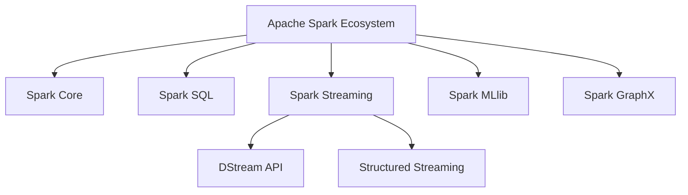
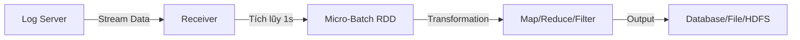

# Phân tích chi tiết: 8_spark_streaming.pdf

Chào bạn, tôi là một chuyên gia về Big Data và Hệ thống Phân tán. Dưới đây là tài liệu phân tích và trình bày chi tiết về nội dung slide "Spark Streaming" dựa trên những thông tin bạn cung cấp, được trình bày chuyên nghiệp bằng tiếng Việt với định dạng Markdown.

---

# 🚀 Apache Spark Streaming: Xử Lý Dữ Liệu Luồng Thời Gian Thực

Spark Streaming là một thành phần quan trọng trong hệ sinh thái Apache Spark, được thiết kế để xử lý dữ liệu thời gian thực (real-time data) với khả năng mở rộng cao và độ tin cậy tuyệt vời.

## 1. Khái Niệm Cơ Bản Về Data Streaming

### Giải thích Khái niệm
**Data Streaming** (Dữ liệu luồng) là một kỹ thuật cho phép truyền chuyển dữ liệu dưới dạng luồng liên tục và bền vững. Thay vì xử lý dữ liệu theo batch (lô) cố định, streaming xử lý dữ liệu khi chúng đến gần như tức thời.

### Vai Trò Trong Thời Đại Số
Kỹ thuật streaming ngày càng trở nên quan trọng và phổ biến cùng với sự tăng trưởng của dữ liệu số. Các hệ thống hiện đại cần xử lý lượng dữ liệu khổng lồ được sinh ra liên tục từ các nguồn khác nhau.

### Use Cases
- **IoT (Internet of Things)**: Dữ liệu cảm biến từ các thiết bị thông minh
- **Social Media**: Dòng tweet, post Facebook liên tục
- **Financial Trading**: Giao dịch chứng khoán thời gian thực
- **Log Monitoring**: Theo dõi log hệ thống
- **Fraud Detection**: Phát hiện gian lận trong thanh toán

## 2. Vai Trò Của Spark Streaming Trong Hệ Sinh Thái Apache Spark

Hệ sinh thái Apache Spark bao gồm các thành phần chính:



## 3. Tại Sao Chọn Spark Streaming? (Why Spark Streaming)

Spark Streaming được sử dụng để **thuyên chuyển dữ liệu thời gian thực (real-time data)** từ nhiều nguồn khác nhau như Twitter, Facebook, IoT và cho phép thực thi các phân tích dữ liệu mạnh mẽ từ các luồng dữ liệu này.

### Ưu Điểm Chính
- **Tích hợp với Spark Ecosystem**: Sử dụng chung engine tính toán với batch processing
- **Đa ngôn ngữ**: Hỗ trợ Python (PySpark), Scala, Java, R
- **Fault Tolerance**: Khả năng chịu lỗi cao
- **High Throughput**: Xử lý lượng dữ liệu lớn
- **Micro-batch Architecture**: Linh hoạt giữa latency và throughput

### Nhược Điểm
- **Latency**: Vì là micro-batch, độ trễ thường cao hơn so với true streaming (như Flink)
- **Complexity**: Cấu hình phức tạp hơn so với các framework đơn giản
- **Memory Management**: Cần tinh chỉnh GC và memory cho workload lớn

## 4. Tổng Quan Về Spark Streaming

Spark Streaming là thành phần quan trọng trong hệ sinh thái Spark, bên cạnh Spark core API. Nó cho phép xử lý luồng dữ liệu với **thông lượng lớn (hight-throughput)** và có **khả năng chịu lỗi (fault-tolerant)**.

### Khái Niệm DStream

Spark Streaming gọi luồng là **DStream (Discretized Stream)**, mỗi luồng là một chuỗi các RDD cần phải xử lý trực tuyến.

#### Cấu Trúc DStream
```
Time Interval 1: [RDD_1] → [RDD_2] → [RDD_3] → ...
Time Interval 2: [RDD_1] → [RDD_2] → [RDD_3] → ...
Time Interval 3: [RDD_1] → [RDD_2] → [RDD_3] → ...
```

## 5. Sample Code: Cài đặt Spark Streaming cơ bản

### Ví dụ 1: PySpark Streaming với Socket Source

```python
from pyspark import SparkContext
from pyspark.streaming import StreamingContext

# 1. Khởi tạo SparkContext và StreamingContext
sc = SparkContext("local[2]", "NetworkWordCount")
ssc = StreamingContext(sc, 1)  # Batch interval = 1 second

# 2. Tạo DStream từ socket
lines = ssc.socketTextStream("localhost", 9999)

# 3. Phân tích luồng dữ liệu
words = lines.flatMap(lambda line: line.split(" "))
pairs = words.map(lambda word: (word, 1))
word_counts = pairs.reduceByKey(lambda x, y: x + y)

# 4. In kết quả
word_counts.pprint()

# 5. Bắt đầu xử lý
ssc.start()
ssc.awaitTermination()
```

### Ví dụ 2: PySpark Streaming với File Source

```python
from pyspark import SparkContext
from pyspark.streaming import StreamingContext

# Khởi tạo StreamingContext
ssc = StreamingContext(sc, 1)

# Tạo DStream từ thư mục
lines = ssc.textFileStream("hdfs://localhost:9000/user/logs/")

# Xử lý dữ liệu
error_logs = lines.filter(lambda line: "ERROR" in line)
error_counts = error_logs.count()

# In kết quả
error_counts.pprint()

# Bắt đầu xử lý
ssc.start()
ssc.awaitTermination()
```

### Ví dụ 3: Java Spark Streaming

```java
import org.apache.spark.SparkConf;
import org.apache.spark.api.java.JavaSparkContext;
import org.apache.spark.streaming.api.java.JavaDStream;
import org.apache.spark.streaming.api.java.JavaStreamingContext;
import org.apache.spark.streaming.Durations;

public class JavaNetworkWordCount {
    public static void main(String[] args) throws Exception {
        // Khởi tạo SparkConf
        SparkConf conf = new SparkConf().setAppName("JavaNetworkWordCount");
        
        // Khởi tạo JavaSparkContext
        JavaSparkContext jsc = new JavaSparkContext(conf);
        
        // Khởi tạo JavaStreamingContext với batch interval 1 giây
        JavaStreamingContext jssc = new JavaStreamingContext(jsc, Durations.seconds(1));
        
        // Tạo DStream từ socket
        JavaDStream<String> lines = jssc.socketTextStream("localhost", 9999);
        
        // Phân tích dữ liệu
        JavaDStream<String> words = lines.flatMap(line -> Arrays.asList(line.split(" ")).iterator());
        JavaPairDStream<String, Integer> pairs = words.mapToPair(word -> new Tuple2<>(word, 1));
        JavaPairDStream<String, Integer> wordCounts = pairs.reduceByKey((x, y) -> x + y);
        
        // In kết quả
        wordCounts.print();
        
        // Bắt đầu xử lý
        jssc.start();
        jssc.awaitTermination();
    }
}
```

### Ví dụ 4: Window Operations trong Spark Streaming

```python
from pyspark import SparkContext
from pyspark.streaming import StreamingContext

ssc = StreamingContext(sc, 1)  # Batch interval = 1s

# Tạo DStream
lines = ssc.socketTextStream("localhost", 9999)

# Window operations: 30 giây window, slide mỗi 10 giây
windowed_word_counts = lines.flatMap(lambda line: line.split(" ")) \
    .map(lambda word: (word, 1)) \
    .reduceByKeyAndWindow(lambda x, y: x + y, lambda x, y: x - y, 30, 10)

windowed_word_counts.pprint()

ssc.start()
ssc.awaitTermination()
```

### Ví dụ 5: SQL Query trên DStream

```python
from pyspark import SparkContext
from pyspark.streaming import StreamingContext
from pyspark.sql import SQLContext

sc = SparkContext("local[2]", "SQLStream")
ssc = StreamingContext(sc, 1)
sqlContext = SQLContext(sc)

# Tạo DStream
lines = ssc.socketTextStream("localhost", 9999)

# Chuyển đổi DStream sang DataFrame
def process_rdd(rdd):
    if not rdd.isEmpty():
        df = sqlContext.createDataFrame(rdd, ["text"])
        df.registerTempTable("logs")
        
        # SQL Query
        result = sqlContext.sql("SELECT text, COUNT(*) as count FROM logs GROUP BY text")
        result.show()

lines.foreachRDD(process_rdd)

ssc.start()
ssc.awaitTermination()
```

## 6. Các Khái Niệm Quan Trọng Trong Spark Streaming

### 6.1. Receiver-based vs Direct Approach

| Feature | Receiver-based | Direct Approach |
|---------|----------------|-----------------|
| **Data Loss** | Có thể mất dữ liệu (Write Ahead Log cần thiết) | Không mất dữ liệu (At-least-once) |
| **Throughput** | Cao hơn | Tốt |
| **Complexity** | Phức tạp hơn | Đơn giản hơn |
| **Use Case** | Legacy systems | Kafka integration |

### 6.2. Checkpointing

```python
# Thiết lập checkpoint
ssc.checkpoint("hdfs://localhost:9000/checkpoint")

# Sử dụng updateStateByKey (bắt buộc checkpoint)
def updateFunction(newValues, runningCount):
    if runningCount is None:
        runningCount = 0
    return sum(newValues, runningCount)

running_counts = pairs.updateStateByKey(updateFunction)
```

### 6.3. Fault Tolerance trong Spark Streaming

Spark Streaming đảm bảo fault tolerance thông qua:
- **RDD Lineage**: Tái tạo dữ liệu bị mất
- **Checkpointing**: Lưu state của application
- **Write Ahead Logs**: Ghi log trước khi xử lý

## 7. Ví dụ Thực Tế Trong Ngành Công Nghiệp

### Case Study 1: Real-time Fraud Detection (Ngân hàng)

```python
# Fraud Detection System
from pyspark import SparkContext
from pyspark.streaming import StreamingContext

ssc = StreamingContext(sc, 1)

# Nhận giao dịch từ Kafka
transactions = ssc.socketTextStream("kafka-broker", 9092)

# Phân tích giao dịch nghi ngờ
suspicious_transactions = transactions.filter(
    lambda tx: float(tx.split(",")[3]) > 10000 or  # Giao dịch > 10k
    tx.split(",")[2] in ["high_risk_country"]      # Quốc gia rủi ro cao
)

# Gửi cảnh báo
def send_alert(rdd):
    for tx in rdd.collect():
        send_to_fraud_team(tx)

suspicious_transactions.foreachRDD(send_alert)

ssc.start()
ssc.awaitTermination()
```

### Case Study 2: IoT Monitoring System

```python
# IoT Sensor Monitoring
ssc = StreamingContext(sc, 1)

# Nhận dữ liệu cảm biến
sensor_data = ssc.socketTextStream("iot-gateway", 8888)

# Tính toán nhiệt độ trung bình theo window
avg_temp = sensor_data.map(lambda x: float(x.split(",")[1])) \
    .reduceByWindow(lambda x, y: (x + y) / 2, 60, 30)  # 60s window, 30s slide

# Alert nếu nhiệt độ > 50°C
avg_temp.filter(lambda temp: temp > 50).pprint()

ssc.start()
ssc.awaitTermination()
```

### Case Study 3: Social Media Analytics

```python
# Twitter Hashtag Counter
from pyspark import SparkContext
from pyspark.streaming import StreamingContext
from pyspark.streaming.kafka import KafkaUtils

ssc = StreamingContext(sc, 5)

# Đọc từ Kafka
kafkaStream = KafkaUtils.createStream(
    ssc, 
    'localhost:2181', 
    'twitter-consumer-group', 
    {'twitter-topic': 1}
)

# Đếm hashtag
hashtags = kafkaStream.flatMap(lambda line: line[1].split(" ")) \
    .filter(lambda word: word.startswith("#")) \
    .map(lambda tag: (tag, 1)) \
    .reduceByKeyAndWindow(lambda x, y: x + y, 300, 60)  # Top trending 5 phút

hashtags.pprint()

ssc.start()
ssc.awaitTermination()
```

## 8. So Sánh Spark Streaming vs Các Công Cụ Khác

| Tiêu chí | Spark Streaming | Flink | Kafka Streams | Storm |
|----------|-----------------|-------|---------------|-------|
| **Latency** | Medium (seconds) | Very Low (ms) | Low (ms) | Very Low (ms) |
| **Throughput** | Very High | Very High | High | Medium |
| **Fault Tolerance** | Excellent | Excellent | Good | Good |
| **Complexity** | Medium | High | Low | Medium |
| **Use Case** | Batch + Stream | Real-time ML | Kafka ecosystem | Legacy streaming |

## 9. Best Practices

### Khi Nào Sử Dụng Spark Streaming?
✅ **Nên dùng khi:**
- Bạn đã có Spark ecosystem
- Cần xử lý lượng dữ liệu lớn (TB/ngày)
- Cần tích hợp với batch processing
- Đòi hỏi fault tolerance cao
- Có team熟悉 với Spark

❌ **Không nên dùng khi:**
- Cần latency cực thấp (< 100ms)
- Hệ thống nhỏ, đơn giản
- Không có resource để vận hành Spark cluster

### Cấu hình tối ưu

```python
# Cấu hình Spark Streaming tối ưu
conf = SparkConf() \
    .set("spark.streaming.backpressure.enabled", "true") \
    .set("spark.streaming.kafka.maxRatePerPartition", "1000") \
    .set("spark.serializer", "org.apache.spark.serializer.KryoSerializer") \
    .set("spark.sql.shuffle.partitions", "200")

sc = SparkContext(conf=conf)
ssc = StreamingContext(sc, 1)
```

## 10. Kết Luận

Spark Streaming là một **powerful framework** để xử lý dữ liệu thời gian thực, đặc biệt phù hợp cho các doanh nghiệp đã đầu tư vào hệ sinh thái Spark. Với khả năng xử lý high-throughput, fault tolerance và tích hợp sẵn với các thành phần khác, Spark Streaming là lựa chọn hàng đầu cho các hệ thống big data phân tán.

Tuy nhiên, cần lưu ý về **latency** và **complexity** khi lựa chọn công nghệ này cho các use case yêu cầu thời gian thực cực kỳ thấp.

---

**Tài liệu tham khảo:**
- Apache Spark Documentation: https://spark.apache.org/docs/latest/streaming-programming-guide.html
- Databricks Spark Streaming Guide
- Spark Streaming: The Definitive Guide by Bill Chambers & Matei Zaharia

---

Chào bạn, tôi là một chuyên gia về Big Data và Hệ thống Phân tán. Dưới đây là phân tích chi tiết về nội dung slide Spark Streaming bạn cung cấp, được trình bày một cách chuyên nghiệp và chi tiết theo yêu cầu.

---

# Phân tích & Hướng dẫn Chi tiết về Spark Streaming

Tài liệu này tóm tắt các kiến thức nền tảng về **Apache Spark Streaming**, một thành phần quan trọng trong hệ sinh thái Spark用于 xử lý dữ liệu thời gian thực (real-time data processing).

## 1. Ưu điểm của Spark Streaming (Advantages)

Theo slide số 6, nội dung tập trung vào các lợi ích chính của Spark Streaming so với các công cụ xử lý luồng khác.

### Giải thích Khái niệm
**Spark Streaming** là một component của Apache Spark cho phép xử lý dữ liệu lớn từ các nguồn dữ liệu trực tiếp (live data sources) với các thao tác tương tự như xử lý batch (xử lý khối lượng lớn dữ liệu một lần). Dưới đây là các ưu điểm chính:

*   **Tích hợp với Spark Ecosystem:** Bạn có thể sử dụng cùng một codebase để xử lý cả dữ liệu batch (RDD) và dữ liệu streaming.
*   **Mô hình xử lý mạnh mẽ:** Hỗ trợ các thao tác phức tạp như `map`, `reduce`, `join`, `window` operations.
*   **Tính Fault Tolerance (Chịu lỗi):** Dữ liệu được lưu trữ trong bộ nhớ (in-memory) và có cơ chế phục hồi tự động nếu lỗi xảy ra.

### Hướng dẫn Sử dụng

| Tiêu chí | Chi tiết |
| :--- | :--- |
| **Khi nào sử dụng?** | Khi bạn cần xử lý dữ liệu liên tục từ các nguồn như log server, sensor data, IoT, hoặc social media feeds (Twitter) và cần phân tích chúng theo thời gian thực. |
| **Sử dụng như thế nào?** | Sử dụng `SparkSession` và `StreamingContext` để khởi tạo ứng dụng. Dữ liệu được chia thành các batch nhỏ (ví dụ: 1 giây) và xử lý tuần tự. |
| **Ưu điểm** | - **Unified Engine:** Một engine cho cả batch và streaming.<br>- **High-level API:** Dễ dàng phát triển.<br>- **Exactly-once semantics:** Đảm bảo dữ liệu không bị mất hoặc xử lý trùng lặp. |
| **Nhược điểm** | - **Latency:** Tốc độ delay cao hơn so với Apache Flink hoặc Kafka Streams (do cơ chế micro-batch).<br>- **Memory Management:** Cần cấu hình kỹ lưỡng để tránh OutOfMemory. |

### Ví dụ Thực tế
**Ngành Tài chính:** Ngân hàng sử dụng Spark Streaming để giám sát các giao dịch thẻ tín dụng trong thời gian thực để phát hiện gian lận (fraud detection). Dữ liệu giao dịch được đưa vào, xử lý để so sánh với hành vi người dùng và cảnh báo ngay lập tức nếu có bất thường.

---

## 2. Luồng hoạt động & Chi tiết Luồng hoạt động (Workflow & Details)

Slide số 7 và 8 mô tả quy trình từ khi khởi tạo đến khi xử lý dữ liệu.

### Giải thích Khái niệm
Quy trình hoạt động của Spark Streaming bao gồm các giai đoạn chính:
1.  **Khởi tạo:** Tạo `StreamingContext`.
2.  **Nhận dữ liệu (Ingestion):** Dữ liệu được pull từ nguồn (Input Source) về thông qua **Receivers**.
3.  **Tạo Batch (DStream):** Dữ liệu được tích lũy trong một khoảng thời gian (ví dụ: 1 giây) và tạo thành một **RDD** (Resilient Distributed Dataset).
4.  **Xử lý:** Các thao tác (transformation) được áp dụng lên RDD này.
5.  **Xuất kết quả (Output):** Kết quả được lưu trữ hoặc đẩy ra ngoài.

### Ví dụ minh họa Luồng hoạt động

Dưới đây là mô phỏng luồng xử lý dữ liệu log server:



### Code Mẫu: Cấu hình Luồng hoạt động cơ bản (Python/PySpark)

```python
from pyspark import SparkContext
from pyspark.streaming import StreamingContext

# 1. Khởi tạo SparkContext và StreamingContext
# Batch Interval = 1 giây
sc = SparkContext("local[2]", "NetworkWordCount")
ssc = StreamingContext(sc, 1)

# 2. Tạo InputDStream (Kết nối tới một máy chủ TCP)
# Dữ liệu từ netcat sẽ được nhận qua Receiver
lines = ssc.socketTextStream("localhost", 9999)

# 3. Xử lý dữ liệu (Transformation)
# Tách dòng thành các từ và đếm số lượng
words = lines.flatMap(lambda line: line.split(" "))
pairs = words.map(lambda word: (word, 1))
word_counts = pairs.reduceByKey(lambda a, b: a + b)

# 4. Xuất kết quả (Output)
word_counts.pprint()

# 5. Bắt đầu xử lý
ssc.start()
ssc.awaitTermination()
```

---

## 3. Streaming Fundamentals & Streaming Context

Slide số 9 và 10 đi sâu vào các thành phần cốt lõi: **Streaming Context**, **InputDStream**, và **Receiver**.

### Giải thích Khái niệm

*   **Streaming Context (`ssc`):**
    *   Là **entry point** (cửa vào) chính cho mọi chương trình Spark Streaming, tương tự như `SparkContext` trong Spark Core hoặc `SparkSession` trong Spark SQL.
    *   Nó quản lý việc chạy các job, phục hồi sau lỗi, và thiết lập các thông số cơ bản (như batch interval).

*   **InputDStream:**
    *   Là một luồng dữ liệu đầu vào. Nó đại diện cho một chuỗi các RDD (mỗi RDD chứa dữ liệu của một khoảng thời gian).
    *   Dữ liệu đầu vào có thể đến từ nhiều nguồn khác nhau.

*   **Receiver:**
    *   Là một thành phần chạy trên Executor để "nghe" (listen) và nhận dữ liệu từ nguồn.
    *   Dữ liệu nhận được sẽ được lưu vào bộ nhớ (memory) hoặc disk tùy cấu hình, sau đó tạo thành một RDD khi hết thời gian batch.

*   **Các nguồn dữ liệu có sẵn (Built-in Sources):**
    *   **Twitter:** Lấy dữ liệu từ Twitter Streaming API.
    *   **Akka Actor:** Dùng cho giao tiếp giữa các Actor.
    *   **ZeroMQ:** Một thư viện messaging library.
    *   Ngoài ra còn có **Kafka**, **Kinesis**, **File System**, **Socket**.

### Hướng dẫn Sử dụng

| Tiêu chí | Chi tiết |
| :--- | :--- |
| **Khi nào sử dụng?** | Khi bạn cần kết nối với các nguồn dữ liệu phức tạp hoặc tùy chỉnh luồng dữ liệu vào. |
| **Sử dụng như thế nào?** | - Khởi tạo `StreamingContext`.<br>- Gọi hàm tạo InputDStream tương ứng với nguồn (ví dụ: `ssc.socketTextStream`, `KafkaUtils.createDirectStream`).<br>- Định nghĩa các phép toán trên DStream. |
| **Ưu điểm** | - **Linh hoạt:** Hỗ trợ nhiều loại nguồn (push-based và pull-based).<br>- **Receiver:** Đơn giản hóa việc kết nối với các API phức tạp. |
| **Nhược điểm** | - **Receiver:** Có thể成为 bottleneck (điểm nghẽn) nếu tốc độ nhận dữ liệu chậm hơn tốc độ xử lý.<br>- **Complexity:** Cấu hình Receiver cho các nguồn như Kafka đòi hỏi hiểu biết sâu về cấu trúc dữ liệu. |

### Code Mẫu: Sử dụng Streaming Context và các nguồn khác nhau

```python
from pyspark.streaming import StreamingContext
from pyspark.streaming.kafka import KafkaUtils

# Khởi tạo Streaming Context với Batch Interval = 5 giây
ssc = StreamingContext(sc, 5)

# --- Ví dụ 1: Nguồn Socket (Đơn giản, dùng cho test) ---
# Lắng nghe dữ liệu từ localhost:9999
socket_stream = ssc.socketTextStream("localhost", 9999)

# --- Ví dụ 2: Nguồn Kafka (Phổ biến trong thực tế) ---
# Cấu hình kết nối tới Kafka
kafka_params = {
    "bootstrap.servers": "localhost:9092",
    "auto.offset.reset": "latest",
    "group.id": "spark-streaming-group"
}
topics = ["sensor_data"]

# Tạo DStream từ Kafka (Direct approach)
kafka_stream = KafkaUtils.createDirectStream(
    ssc,
    topics,
    kafka_params
)

# Xử lý dữ liệu từ Kafka (dữ liệu là key-value binary)
# Ví dụ: Parse JSON message
def process_rdd(rdd):
    if not rdd.isEmpty():
        # Logic xử lý ở đây
        df = spark.read.json(rdd.map(lambda x: x[1])) # x[1] là value
        df.show()

# Áp dụng foreachRDD để xử lý từng batch
kafka_stream.foreachRDD(process_rdd)

# Bắt đầu luồng
ssc.start()
ssc.awaitTermination()
```

### Ví dụ Thực tế: Hệ thống giám sát Server (Server Monitoring)

*   **Scenario:** Một công ty có hàng trăm server, mỗi server gửi log (CPU, RAM, Error) về một trung tâm tập trung qua socket hoặc Kafka.
*   **Application:**
    1.  **Streaming Context** được khởi tạo với batch interval là 10 giây.
    2.  **InputDStream** kết nối tới Kafka topic `server_logs`.
    3.  **Receiver** nhận dữ liệu JSON.
    4.  **Logic:** Dùng Spark SQL để parse JSON, lọc các log có level là "ERROR", đếm số lượng lỗi theo từng server.
    5.  **Output:** Nếu số lỗi > 5 trong 10 giây, gửi cảnh báo (alert) qua email hoặc Slack.

---

## Tóm tắt kiến thức (Cheat Sheet)

| Thuật ngữ | Định nghĩa | Ví dụ |
| :--- | :--- | :--- |
| **DStream** | Represent a continuous stream of data (chuỗi các RDD). | `lines = ssc.socketTextStream(...)` |
| **Receiver** | Component nhận dữ liệu từ nguồn và lưu vào memory. | `TwitterReceiver`, `KafkaReceiver` |
| **Batch Interval** | Thời gian để tạo một RDD mới (thường là 0.5s - vài giây). | `ssc = StreamingContext(sc, 1)` (1 giây) |
| **Transformations** | Các phép toán lên DStream (map, reduce, window). | `words.map(lambda x: (x, 1))` |
| **Output Operations** | Ghi kết quả ra ngoài (foreachRDD, saveAsTextFiles). | `dstream.pprint()` |

---

Chào bạn, tôi là chuyên gia về Big Data và Hệ thống Phân tán. Dưới đây là phân tích chi tiết về nội dung slide Spark Streaming của bạn, được trình bày một cách chuyên nghiệp bằng tiếng Việt với các yêu cầu cụ thể bạn đã đưa ra.

---

# Phân tích và Hướng dẫn Chi tiết về Apache Spark Streaming

Tài liệu này cung cấp cái nhìn tổng quan về các khái niệm nền tảng của **Apache Spark Streaming**, một thành phần quan trọng trong hệ sinh thái Spark用于 xử lý dữ liệu thời gian thực (real-time data processing).

## 1. Khởi tạo (Initialization)

### Giải thích Khái niệm
Để bắt đầu sử dụng Spark Streaming, bước đầu tiên là khởi tạo một đối tượng `StreamingContext`. Đây là điểm вход chính cho mọi chức năng streaming.

-   **StreamingContext**: Là lớp chính để tạo các luồng dữ liệu (DStreams) và định nghĩa các phép toán trên chúng. Nó hoạt động như một lớp bao bọc (wrapper) cho `SparkContext`.
-   **SparkContext**: Là đối tượng đại diện cho kết nối tới một cụm Spark (Spark Cluster). Nó được sử dụng để tạo ra các RDDs, Accumulators và Broadcast Variables.

Mối quan hệ: `StreamingContext` là lớp mở rộng của `SparkContext`. Bạn cần có `SparkContext` để tạo ra `StreamingContext`.

### Code Mẫu (Python)

```python
from pyspark import SparkContext
from pyspark.streaming import StreamingContext

# 1. Khởi tạo SparkContext (lõi của Spark)
# "local[2]" nghĩa là chạy trên local machine với 2 worker threads
# "AppName" là tên ứng dụng để hiển thị trên Spark UI
sc = SparkContext("local[2]", "NetworkWordCount")

# 2. Khởi tạo StreamingContext với batch interval là 1 giây (1 second)
ssc = StreamingContext(sc, 1)

# Sau khi có ssc, bạn có thể định nghĩa các nguồn dữ liệu (DStreams) và bắt đầu xử lý
```

### Hướng dẫn Sử dụng

*   **Khi nào sử dụng?**
    *   Khi bạn cần xây dựng một ứng dụng xử lý dữ liệu thời gian thực (streaming application) bằng Spark.
    *   Là bước bắt buộc phải có để định nghĩa bất kỳ luồng dữ liệu nào.
*   **Sử dụng như thế nào?**
    *   Tạo một `SparkContext` với cấu hình cụm (cluster config).
    *   Truyền `SparkContext` đó vào hàm khởi tạo của `StreamingContext` cùng với khoảng thời gian batch (batch interval).
*   **Ưu & Nhược điểm:**
    *   **Ưu điểm:** Tích hợp chặt chẽ với Spark Core, cho phép sử dụng lại các cấu hình và thư viện của Spark.
    *   **Nhược điểm:** Việc cấu hình sai batch interval có thể gây ra tình trạng quá tải (overload) hoặc độ trễ cao.

---

## 2. DStream (Discretized Stream)

### Giải thích Khái niệm
**DStream (Discretized Stream)** là lớp trừu tượng chính đại diện cho luồng dữ liệu trong Spark Streaming.

-   **Cách hoạt động:** DStream coi dữ liệu streaming liên tục như một chuỗi các **RDD** (Resilient Distributed Datasets) rời rạc theo thời gian.
-   **Cấu trúc:** Mỗi RDD trong chuỗi này chứa dữ liệu của một khoảng thời gian cụ thể (ví dụ: dữ liệu trong 1 giây).
-   **Nguồn gốc:** Dữ liệu trong DStream có thể đến từ:
    1.  **Nguồn bên ngoài:** Như Kafka, Socket, Flume.
    2.  **Phép biến đổi (Transformation):** Kết quả của việc xử lý một DStream khác (ví dụ: `map`, `filter`, `reduce`).

### Ví dụ Trực quan
Hãy tưởng tượng một dòng sông (Stream). DStream chia dòng sông đó thành các xô nước (RDDs), mỗi xô chứa nước của một giây nhất định. Bạn có thể xử lý từng xô nước một.

### Code Mẫu (Minh họa tạo DStream từ Socket)

```python
# Sử dụng ssc đã tạo ở trên
# Tạo một DStream kết nối tới localhost trên cổng 9999
lines = ssc.socketTextStream("localhost", 9999)

# 'lines' bây giờ là một DStream.
# Nó liên tục nhận dữ liệu text từ socket và tạo RDD mới mỗi giây.
```

### Hướng dẫn Sử dụng

*   **Khi nào sử dụng?**
    *   Khi bạn cần xử lý dữ liệu đến liên tục, ví dụ: phân tích log server theo thời gian thực, xử lý tín hiệu IoT, theo dõi giao dịch tài chính.
*   **Sử dụng như thế nào?**
    *   Định nghĩa nguồn vào (InputDStream).
    *   Áp dụng các phép toán transformation (map, filter, flatMap) hoặc action (foreachRDD) lên DStream đó.
*   **Ưu & Nhược điểm:**
    *   **Ưu điểm:** Mô hình lập trình giống RDD (thân thiện với người dùng Spark), tự động xử lý fault tolerance (chịu lỗi), khả năng mở rộng cao.
    *   **Nhược điểm:** Độ trễ (latency) phụ thuộc vào batch interval (thường tính bằng giây), không phù hợp cho các tác vụ yêu cầu độ trễ mili giây (sub-second latency).

---

## 3. DStream Operation

### Giải thích Khái niệm
Các phép toán trên DStream được chia làm hai loại chính: **Transformation** và **Output Operation**.

-   **Nguyên lý:** Khi bạn áp dụng một phép toán (ví dụ: `flatMap`) lên một DStream, Spark Streaming sẽ áp dụng phép toán đó lên **mỗi RDD** trong chuỗi RDDs của DStream đó.
-   **Ví dụ trong slide:** Chuyển đổi luồng dữ liệu dòng (lines) thành luồng từ (words).
    1.  Input: DStream chứa các câu văn (mỗi giây một RDD mới).
    2.  Operation: `flatMap` cắt câu văn thành các từ.
    3.  Output: Một DStream mới chứa các từ (mỗi giây một RDD mới chứa các từ).

### Code Mẫu (Transformation)

```python
# lines: DStream input từ socket (ví dụ: "hello world")
# Áp dụng flatMap để tách các câu thành từ
words = lines.flatMap(lambda line: line.split(" "))

# words: DStream output (ví dụ: ["hello", "world"])
# Mỗi RDD trong 'words' là kết quả của việc áp dụng flatMap lên RDD tương ứng trong 'lines'
```

### Hướng dẫn Sử dụng

*   **Khi nào sử dụng?**
    *   Khi cần làm sạch, lọc, hoặc chuyển đổi dữ liệu thô trước khi lưu trữ hoặc phân tích sâu hơn.
*   **Sử dụng như thế nào?**
    *   Sử dụng các hàm tương tự như RDD API: `map`, `flatMap`, `filter`, `reduceByKey`, `groupByKey`, v.v.
*   **Ưu & Nhược điểm:**
    *   **Ưu điểm:** Đa dạng hóa logic xử lý, dễ dàng tích hợp với các thuật toán Machine Learning (MLlib).
    *   **Nhược điểm:** Các phép toán stateful (như `updateStateByKey`) đòi hỏi lưu trữ state (trạng thái) trước đó, có thể gây tốn bộ nhớ và phức tạp trong quản lý checkpoint.

---

## 4. InputDStreams

### Giải thích Khái niệm
**InputDStream** là một loại DStream đặc biệt đại diện cho luồng dữ liệu đầu vào từ các nguồn bên ngoài Apache Spark.

Slide phân loại các nguồn này thành 2 nhóm:
1.  **Basic Sources:** Các nguồn cơ bản có sẵn trong API Spark Streaming.
    *   **Socket:** Nhận dữ liệu qua TCP socket (thường dùng cho test).
    *   **File Systems:** Đọc dữ liệu từ các file mới được thêm vào một thư mục (HDFS, local file system).
2.  **Advanced Sources:** Các nguồn từ các hệ sinh thái bên ngoài, đòi hỏi các thư viện kết nối riêng.
    *   **Kafka:** Hệ thống message queue phổ biến nhất.
    *   **Flume:** Framework để thu thập, aggregating và chuyển dữ liệu log.
    *   **Kinesis:** Dịch vụ streaming của AWS.

### Code Mẫu (Kafka Integration - Advanced Source)

Đây là ví dụ phổ biến nhất trong thực tế.

```python
from pyspark.streaming.kafka import KafkaUtils

# Cấu hình kết nối tới Kafka
kafkaParams = {
    "bootstrap.servers": "localhost:9092",
    "auto.offset.reset": "latest",
    "group.id": "spark-streaming-group"
}

# Tạo DStream từ topic "test-topic" của Kafka
directKafkaStream = KafkaUtils.createDirectStream(
    ssc,
    ["test-topic"],  # Topic cần lắng nghe
    kafkaParams
)

# DStream này sẽ trả về một cặp (key, value) từ Kafka
lines = directKafkaStream.map(lambda x: x[1])
```

### Hướng dẫn Sử dụng

*   **Khi nào sử dụng?**
    *   **Socket/File:** Dùng cho chạy thử (debug), proof of concept, hoặc xử lý file batch đơn giản.
    *   **Kafka/Flume/Kinesis:** Dùng trong production environment để xử lý dữ liệu lớn, đảm bảo độ tin cậy, khả năng phục hồi sau lỗi (fault tolerance) và load balancing.
*   **Sử dụng như thế nào?**
    *   **Basic:** Sử dụng hàm `ssc.socketTextStream` hoặc `ssc.textFileStream`.
    *   **Advanced:** Cần thêm thư viện (dependency) vào project, sau đó sử dụng các lớp `KafkaUtils`, `FlumeUtils` để tạo stream.
*   **Ưu & Nhược điểm:**
    *   **Basic Sources:**
        *   *Ưu:* Đơn giản, dễ setup.
        *   *Nhược:* Không đảm bảo exactly-once semantics, xử lý lỗi kém.
    *   **Advanced Sources (Kafka):**
        *   *Ưu:* Đảm bảo dữ liệu không mất (durable), xử lý offset linh hoạt, throughput cao.
        *   *Nhược:* Cấu hình phức tạp hơn, phụ thuộc vào external system.

---

## 5. Ví dụ Thực tế trong Industry

Dưới đây là các kịch bản áp dụng Spark Streaming trong các ngành công nghiệp:

| Ngành | Use Case | Công nghệ kết hợp |
| :--- | :--- | :--- |
| **E-commerce (TMĐT)** | **Real-time Recommendation:** Phân tích hành vi clickstream của người dùng để đề xuất sản phẩm tức thì. | **Kafka** (nhận log click) + **Spark Streaming** (tính toán score) + **Redis** (lưu kết quả). |
| **Fintech (Tài chính)** | **Fraud Detection (Phát hiện gian lận):** Kiểm tra các giao dịch thẻ tín dụng để phát hiện hành vi bất thường theo thời gian thực. | **Kafka** (giao dịch) + **Spark MLlib** (mô hình dự đoán) + **HDFS/Cassandra** (lưu log). |
| **IoT (Vận tải)** | **Telematics (Theo dõi xe):** Xử lý hàng triệu tín hiệu GPS và cảm biến từ xe ô tô để cảnh báo nguy cơ hoặc tối ưu hóa tuyến đường. | **Kinesis/Kafka** (dữ liệu cảm biến) + **Spark Streaming** (tính toán vận tốc, địa điểm) + **Dashboard** (hiển thị). |
| **Social Media** | **Trending Analysis:** Đếm số lần xuất hiện của các hashtag để cập nhật xu hướng trending trong 5 phút gần nhất. | **Flume/Kafka** (dữ liệu tweet) + **Spark Streaming** (window operations) + **Elasticsearch** (search & visual). |

---

## Tóm tắt Phân tích

Nội dung slide này giới thiệu kiến trúc cơ bản của Spark Streaming:
1.  **Cấu trúc:** Bắt đầu từ `SparkContext` -> `StreamingContext`.
2.  **Mô hình dữ liệu:** Dữ liệu được xử lý dưới dạng chuỗi các `DStream` (gồm nhiều `RDD`).
3.  **Xử lý:** Các phép toán được apply tuần tự lên từng RDD trong chuỗi.
4.  **Nguồn vào:** Linh hoạt từ các nguồn cơ bản (Socket) đến các nguồn phức tạp trong sản xuất (Kafka, Flume).

Đây là nền tảng vững chắc để xây dựng các hệ thống xử lý dữ liệu thời gian thực có khả năng mở rộng và chịu lỗi cao.

---

Chào bạn, tôi là một chuyên gia về Big Data và Hệ thống Phân tán. Dưới đây là phân tích chi tiết về nội dung slide "8_spark_streaming.pdf" của bạn, được trình bày một cách chuyên nghiệp và chi tiết theo yêu cầu.

---

# Phân tích và Hướng dẫn Chi tiết về Spark Streaming (DStreams & Transformations)

Tài liệu này giới thiệu các khái niệm cốt lõi của **Spark Streaming** (cụ thể là API DStream - Discretized Stream), bao gồm cơ chế thu nhận dữ liệu và các phép biến đổi dữ liệu cơ bản.

## 1. Receiver: Cơ chế Thu nhận Dữ liệu (Ingestion)

### Giải thích Khái niệm
**Receiver** là thành phần quan trọng trong kiến trúc DStream của Spark Streaming. Nó đóng vai trò là cầu nối giữa nguồn dữ liệu bên ngoài (như Kafka, Kafka, Flume, hoặc file log) và Spark Engine.

*   **Discretized Stream (DStream):** Là lớp trừu tượng chính, đại diện cho một luồng dữ liệu liên tục.
*   **Cơ chế hoạt động:** Receiver sẽ "nghe" dữ liệu từ nguồn, sau đó **discretize** (chia nhỏ) luồng dữ liệu liên tục thành các **Batch** (khối dữ liệu theo thời gian).
*   **Lưu trữ:** Các batch này được lưu vào bộ nhớ (Memory) của Spark và được biểu diễn dưới dạng **RDD**. DStream thực chất là một chuỗi các RDD liên tiếp nhau.

### Khi nào sử dụng?
*   Khi bạn cần kết nối với các nguồn dữ liệu trực tiếp (Direct Stream) như Kafka, ZeroMQ, Flume.
*   Khi dữ liệu cần được buffer tạm thời trước khi xử lý để đảm bảo không mất dữ liệu nếu lỗi xảy ra.

### Sử dụng như thế nào?
Trong Spark Streaming, bạn thường tạo một `StreamingContext` và tạo InputDStream từ Receiver.

### Ưu & Nhược điểm
| Tiêu chí | Chi tiết |
| :--- | :--- |
| **Ưu điểm** | Đơn giản để thiết lập với nhiều nguồn dữ liệu (Kafka, Flume...). Hỗ trợ cơ chế **Write Ahead Logs (WAL)** để phục hồi sau lỗi. |
| **Nhược điểm** | Có thể gây ra **Single Point of Failure (SPOF)** nếu Receiver bị lỗi (mặc dù có thể khắc phục bằng Receiver冗余). Có thể gây mất dữ liệu (At-least-once semantics) nếu không cấu hình kỹ lưỡng. |

---

## 2. Transformations trên DStreams

### Giải thích Khái niệm
Tương tự như RDD, **DStream** cung cấp nhiều phép biến đổi (Transformation) cho phép chuyển đổi dữ liệu từ trạng thái này sang trạng thái khác. Các phép biến đổi này được áp dụng lên từng RDD trong chuỗi DStream.

**Các phép biến đổi phổ biến:**
*   **Map:** Ánh xạ mỗi phần tử thành một phần tử mới.
*   **FlatMap:** Ánh xạ mỗi phần tử thành 0 hoặc nhiều phần tử.
*   **Filter:** Lọc dữ liệu dựa trên điều kiện.
*   **Reduce:** Tích hợp dữ liệu (tổng hợp) trong mỗi batch.
*   **GroupBy:** Nhóm dữ liệu theo key.

### Ví dụ Thực tế trong Industry
*   **Log Processing:** Dùng `Filter` để loại bỏ các log không quan trọng, `Map` để trích xuất timestamp và lỗi.
*   **Real-time ETL:** Dùng `Map` để chuyển đổi định dạng JSON sang Object, `Reduce` để tính tổng doanh thu theo từng phút.

---

## 3. Map vs. FlatMap

### Giải thích Khái niệm
Đây là hai phép biến đổi cơ bản nhất để xử lý từng dòng dữ liệu.

*   **`map(func)`:** Áp dụng hàm `func` lên từng phần tử của DStream nguồn và trả về một DStream mới với cùng số lượng phần tử (mỗi phần tử đầu vào tương ứng 1 phần tử đầu ra).
*   **`flatMap(func)`:** Tương tự `map`, nhưng hàm `func` trả về một **sequence (danh sách)** các phần tử thay vì một phần tử đơn lẻ. Sau đó, sequence này会被 "phẳng" hóa (flatten) thành các phần tử riêng lẻ trong DStream đầu ra.

### Ví dụ Minh họa
*   **Input:** `[ [1,2,3], [4,5,6], [7,8,9] ]` (Một DStream chứa 3 RDD con, mỗi RDD là một list).
*   **Map:** Nếu dùng `map(x => x.sum)`, Output sẽ là `[6, 15, 24]`.
*   **FlatMap:** Nếu dùng `flatMap(x => x)`, Output sẽ là `[1, 2, 3, 4, 5, 6, 7, 8, 9]`.

### Code Mẫu (PySpark)

```python
from pyspark.streaming import StreamingContext

# Khởi tạo StreamingContext (Batch Duration = 1 giây)
ssc = StreamingContext(sc, 1)

# Giả lập DStream đầu vào (ví dụ: list các list)
data = [ [1, 2, 3], [4, 5, 6], [7, 8, 9] ]
input_rdd = sc.parallelize(data)
dstream = ssc.queueStream([input_rdd])

# 1. Sử dụng MAP
# Mỗi list sẽ được cộng lại thành 1 số
def map_func(rdd):
    return rdd.map(lambda x: sum(x))
mapped_stream = dstream.map(map_func)

# 2. Sử dụng FLATMAP
# Mở phẳng list thành các phần tử riêng lẻ
def flatmap_func(rdd):
    return rdd.flatMap(lambda x: x)
flatmapped_stream = dstream.flatMap(flatmap_func)

# In kết quả
mapped_stream.pprint()      # Output: 6, 15, 24
flatmapped_stream.pprint()  # Output: 1, 2, 3, 4, 5, 6, 7, 8, 9

ssc.start()
ssc.awaitTermination()
```

---

## 4. Filter & Reduce

### Giải thích Khái niệm

#### A. Filter(func)
*   **Mục đích:** Lọc dữ liệu.
*   **Cơ chế:** Duyệt qua từng phần tử trong RDD của batch. Nếu hàm `func(partition)` trả về `True`, phần tử đó được giữ lại. Nếu `False`, bị loại bỏ.
*   **Kết quả:** DStream mới chứa ít phần tử hơn (hoặc có thể rỗng).

#### B. Reduce(func)
*   **Mục đích:** Tích hợp dữ liệu (Aggregation) trong mỗi batch.
*   **Cơ chế:** Áp dụng hàm `func` (có tính giao hoán và kết hợp) để kết hợp các phần tử trong cùng một RDD thành một giá trị duy nhất.
*   **Kết quả:** Mỗi RDD trong DStream sẽ chỉ còn lại **1 phần tử**.

### Code Mẫu (PySpark)

```python
# Giả lập dữ liệu đầu vào: Các sự kiện có cấu trúc (id, value)
# Format: (event_type, amount)
raw_data = [
    ("sale", 100), ("refund", -20), ("sale", 50),
    ("sale", 200), ("error", 0), ("refund", -10)
]
input_rdd = sc.parallelize(raw_data)
dstream = ssc.queueStream([input_rdd])

# 1. FILTER: Lọc chỉ lấy các giao dịch 'sale'
def is_sale(event):
    return event[0] == "sale"

filtered_stream = dstream.filter(is_sale)
# Kết quả: [("sale", 100), ("sale", 50), ("sale", 200)]

# 2. REDUCE: Tính tổng tiền của tất cả giao dịch trong batch
# Hàm reduce: lambda acc, new: acc + new_value
# Cần trích xuất value (index 1) trước khi reduce
def reduce_func(rdd):
    # Bước 1: Map để lấy value
    values = rdd.map(lambda x: x[1])
    # Bước 2: Reduce để cộng
    return values.reduce(lambda a, b: a + b)

reduced_stream = dstream.map(lambda x: x[1]).reduce(lambda a, b: a + b)

# Hoặc viết gọn trong 1 dòng:
reduced_stream = dstream.map(lambda x: x[1]).reduce(lambda a, b: a + b)

# In kết quả
filtered_stream.pprint()
reduced_stream.pprint() # Output: 100 + 50 + 200 - 20 - 10 = 320 (Toàn bộ batch)

ssc.start()
ssc.awaitTermination()
```

### Khi nào sử dụng?
*   **Filter:** Khi cần loại bỏ rác (spam, log debug), hoặc phân tách luồng dữ liệu (ví dụ: tách riêng stream "Order" và stream "Payment").
*   **Reduce:** Khi cần thống kê nhanh trong một khoảng thời gian ngắn (Batch), ví dụ: Số lượng request mỗi 5 giây, Tổng tiền giao dịch mỗi 10 giây.

### Ưu & Nhược điểm
| Phép toán | Ưu điểm | Nhược điểm |
| :--- | :--- | :--- |
| **Filter** | Giảm dung lượng dữ liệu xử lý ở các bước sau, tối ưu hiệu năng. | Có thể làm mất dữ liệu nếu điều kiện lọc sai. |
| **Reduce** | Rất nhanh, giảm bộ nhớ (chỉ trả về 1 phần tử). | Chỉ tính toán trên từng Batch riêng lẻ (không tính toàn cục liên tục trừ khi dùng `updateStateByKey`). |

---

## Tóm tắt Tổng quan

| Khái niệm | Mô tả | Ví dụ điển hình |
| :--- | :--- | :--- |
| **Receiver** | Component thu nhận dữ liệu, chia luồng thành Batch RDD. | Đọc log từ Kafka. |
| **Map** | 1-1 transformation. | Chuyển đổi JSON string sang Object. |
| **FlatMap** | 1-N transformation (phẳng hóa). | Tách một câu văn thành các từ (Word Count). |
| **Filter** | Loại bỏ dữ liệu không满足 điều kiện. | Lọc các dòng log có level là "ERROR". |
| **Reduce** | Aggregation (1-1 trong batch). | Tính tổng số lượng view trong 10 giây. |

---

Chào bạn, với vai trò là một chuyên gia về Big Data và Hệ thống Phân tán, tôi sẽ phân tích và trình bày chi tiết nội dung từ các slide bạn cung cấp về Apache Spark Streaming.

Dưới đây là tài liệu được hệ thống lại một cách chuyên nghiệp bằng tiếng Việt, tuân thủ các yêu cầu bạn đã đề ra.

***

# Apache Spark Streaming: Phân tích và Hướng dẫn Chi tiết

Tài liệu này cung cấp cái nhìn tổng quan về các thao tác quan trọng trong Spark Streaming, bao gồm `groupBy`, Window Operations và Output Operations.

---

## 1. Phép toán `groupBy`

### Khái niệm
Trong Spark (cả RDD và DStream), `groupBy(func)` là một phép toán transformation mạnh mẽ. Nó lấy một RDD/DStream chứa các cặp `(K, V)` hoặc các phần tử đơn lẻ, áp dụng một hàm để trích xuất khóa (`key`), sau đó nhóm tất cả các phần tử có cùng khóa lại với nhau.

Kết quả trả về là một RDD/DStream mới có kiểu `(K, Iterable<V>)`, tức là mỗi khóa sẽ ánh xạ đến một tập hợp các giá trị thuộc về khóa đó.

### Giải thích Chi tiết
- **Input**: Một tập hợp dữ liệu bất kỳ.
- **Hàm `func`**: Hàm này định nghĩa cách trích xuất khóa từ một phần tử dữ liệu.
- **Output**: Một nhóm các phần tử được gom lại theo khóa.

### Code Mẫu (PySpark - DStream)

Giả sử chúng ta có một DStream của các dòng văn bản, và chúng ta muốn đếm số lượng từ xuất hiện (Word Count), đây chính là một bài toán kinh điển sử dụng `groupByKey` (hoặc `reduceByKey` hiệu quả hơn).

```python
from pyspark import SparkContext
from pyspark.streaming import StreamingContext

# Khởi tạo Spark Context và Streaming Context
sc = SparkContext("local[2]", "GroupByApp")
ssc = StreamingContext(sc, 1) # Batch interval = 1 giây

# Tạo DStream từ socket (giả sử dữ liệu gửi vào port 9999)
lines = ssc.socketTextStream("localhost", 9999)

# 1. Tách các dòng thành từ
words = lines.flatMap(lambda line: line.split(" "))

# 2. Map mỗi từ thành một cặp (from, 1)
pairs = words.map(lambda word: (word, 1))

# 3. Sử dụng groupByKey để nhóm các giá trị theo từ (key)
# Kết quả trả về: (word, [1, 1, 1, ...])
grouped = pairs.groupByKey()

# 4. Tính toán tổng số lượng từ bằng cách lấy độ dài của list values
word_counts = grouped.map(lambda x: (x[0], len(x[1])))

# In kết quả
word_counts.pprint()

# Bắt đầu luồng xử lý
ssc.start()
ssc.awaitTermination()
```

### Hướng dẫn Sử dụng

| Tiêu chí | Mô tả |
| :--- | :--- |
| **Khi nào sử dụng?** | Khi bạn cần gom tất cả các giá trị tương ứng với một khóa duy nhất lại với nhau để xử lý sau đó (ví dụ: tính tổng, trung bình, hoặc lưu trữ danh sách). |
| **Sử dụng như thế nào?** | Áp dụng trực tiếp lên RDD/DStream. Cần định nghĩa hàm `key` (nếu input là object) hoặc map về dạng `(key, value)` trước. |
| **Ưu điểm** | Linh hoạt, cho phép xử lý logic phức tạp trên tập hợp các giá trị của cùng một khóa. |
| **Nhược điểm** | **Cẩn thận với bộ nhớ**: Nếu một khóa có quá nhiều giá trị (skewed data), nó có thể gây tràn bộ nhớ (OOM). Hiệu suất thường thấp hơn `reduceByKey` vì không tối ưu hóa trước (shuffling toàn bộ dữ liệu thay vì aggregation cục bộ). |

---

## 2. DStream Window Operations (Cửa sổ trượt)

### Khái niệm
Spark Streaming cung cấp cơ chế **Window Operations** (thao tác cửa sổ), cho phép thực thi các transformation trên một "cửa sổ" dữ liệu trượt theo thời gian. Cửa sổ này được định nghĩa bởi hai thông số chính:
1.  **Window length**: Độ dài của cửa sổ (ví dụ: 30 giây).
2.  **Sliding interval**: Khoảng thời gian cửa sổ trượt đi (ví dụ: 10 giây).

### Giải thích Chi tiết
- **Hình dung**: Tưởng tượng bạn đang quan sát dữ liệu trong một khung cửa sổ di chuyển về phía trước theo thời gian.
- **Ví dụ**: `windowLength = 30s`, `slideInterval = 10s`.
    *   Tại thời điểm T=0s: Xử lý dữ liệu từ T=0 đến T=30s.
    *   Tại thời điểm T=10s: Xử lý dữ liệu từ T=10 đến T=40s.
    *   Tại thời điểm T=20s: Xử lý dữ liệu từ T=20 đến T=50s.
- Các phép toán phổ biến: `reduceByWindow`, `reduceByKeyAndWindow`, `countByWindow`.

### Code Mẫu (PySpark - Window)

Ví dụ: Đếm số lượng từ trong một cửa sổ 30 giây, trượt mỗi 10 giây.

```python
from pyspark import SparkContext
from pyspark.streaming import StreamingContext

sc = SparkContext("local[2]", "WindowOpsApp")
ssc = StreamingContext(sc, 1) # Batch interval = 1 giây

lines = ssc.socketTextStream("localhost", 9999)
words = lines.flatMap(lambda line: line.split(" "))

# Áp dụng Window Operation
# windowDuration: 30 giây
# slidingDuration: 10 giây
windowedWordCounts = words.countByWindow(windowDuration=30, slidingDuration=10)

windowedWordCounts.pprint()

ssc.start()
ssc.awaitTermination()
```

### Hướng dẫn Sử dụng

| Tiêu chí | Mô tả |
| :--- | :--- |
| **Khi nào sử dụng?** | Khi bạn cần phân tích xu hướng, thống kê theo khoảng thời gian liên tục (ví dụ: Lượt view trong 1 giờ qua, Lượng giao dịch trung bình 5 phút). |
| **Sử dụng như thế nào?** | Sử dụng các hàm có từ khóa `Window` như `.window()`, `.countByWindow()`, `.reduceByKeyAndWindow()`. |
| **Ưu điểm** | Rất mạnh mẽ cho phân tích thời gian thực, giúp làm mượt dữ liệu và phát hiện các sự kiện kéo dài. |
| **Nhược điểm** | **Chi phí tính toán cao**: Cần lưu trữ dữ liệu của toàn bộ cửa sổ (hoặc ít nhất là các batch trong cửa sổ) trong bộ nhớ. Nếu cửa sổ quá lớn, hệ thống có thể quá tải. |

---

## 3. Output Operations (Đưa dữ liệu ra ngoài)

### Khái niệm
**Output Operations** là các thao tác cuối cùng trong pipeline Spark Streaming. Nếu không có Output Operation, DStream sẽ không được kích hoạt thực thi (lazily evaluated). Các thao tác này cho phép dữ liệu từ DStream được ghi ra các hệ thống bên ngoài (External Systems) như cơ sở dữ liệu (CSDL), file system, hoặc dashboard.

### Giải thích Chi tiết
- **Tại sao cần?**: Spark Streaming là một hệ thống xử lý luồng. Dữ liệu được xử lý và cần được lưu trữ hoặc gửi đi để các hệ thống khác sử dụng.
- **Kích hoạt Execution**: Các phép toán transformation (map, filter, groupBy) chỉ xây dựng đồ thị tính toán (logical plan). Chỉ khi một Output Operation được gọi, Spark mới bắt đầu nhận dữ liệu và xử lý (physical execution).

### Code Mẫu (PySpark - foreachRDD)

`foreachRDD` là một trong những Output Operations linh hoạt nhất, cho phép bạn truy cập vào RDD bên trong của DStream tại mỗi batch để ghi dữ liệu ra ngoài.

```python
# Giả sử đã có DStream 'word_counts' từ ví dụ trước
# word_counts.pprint() là một Output Operation cơ bản

# Sử dụng foreachRDD để ghi dữ liệu vào một file hoặc database
def save_to_db(rdd):
    if not rdd.isEmpty():
        # Ví dụ: Ghi vào file text
        # Lưu ý: Mỗi batch sẽ ghi đè file nếu dùng mode 'w'
        # Để append, cần dùng thư viện hoặc cơ chế khác
        with open("output.txt", "a") as f:
            for (word, count) in rdd.collect():
                f.write(f"Word: {word}, Count: {count}\n")

# Áp dụng Output Operation
word_counts.foreachRDD(save_to_db)

ssc.start()
ssc.awaitTermination()
```

### Ví dụ Thực tế trong Ngành Công Nghiệp

1.  **Real-time Dashboard**: Dữ liệu được tính toán theo cửa sổ (Window) và ghi vào Elasticsearch. Kibana sẽ truy vấn Elasticsearch để hiển thị biểu đồ realtime.
2.  **Fraud Detection (Phát hiện gian lận)**: Dữ liệu giao dịch được xử lý, nếu phát hiện hành vi bất thường (dùng `groupBy` theo user ID và kiểm tra tần suất), hệ thống sẽ ghi ngay vào Cassandra hoặc gửi cảnh báo qua Kafka.
3.  **IoT Monitoring**: Hàng triệu cảm biến gửi dữ liệu. Spark Streaming nhận từ Kafka, dùng `Window` để tính trung bình nhiệt độ mỗi 5 phút, và lưu vào InfluxDB để giám sát.

### Hướng dẫn Sử dụng Output Operations

| Tiêu chí | Mô tả |
| :--- | :--- |
| **Khi nào sử dụng?** | Luôn luôn là bước cuối cùng của pipeline. Khi bạn cần lưu kết quả hoặc phản hồi lại hệ thống. |
| **Sử dụng như thế nào?** | Các hàm: `print()`, `saveAsTextFiles()`, `foreachRDD()`. Trong đó `foreachRDD` là tùy biến nhất. |
| **Ưu điểm** | Cho phép tích hợp với bất kỳ hệ thống bên ngoài nào (JDBC, NoSQL, API). |
| **Nhược điểm** | **Lỗi ghi dữ liệu (Exactly-once semantics)**: Nếu xử lý không cẩn thận trong `foreachRDD`, bạn có thể ghi trùng lặp dữ liệu hoặc mất dữ liệu khi lỗi. Cần đảm bảo kết nối cơ sở dữ liệu an toàn và có cơ chế transaction. |

---

## Tóm tắt Phân tích

Slide này đã giới thiệu 3 trụ cột quan trọng của Spark Streaming:
1.  **`groupBy`**: Để gom nhóm dữ liệu theo khóa.
2.  **Window**: Để phân tích dữ liệu trên các khung thời gian trượt.
3.  **Output Ops**: Để xuất kết quả ra ngoài hệ thống, kích hoạt toàn bộ quá trình xử lý.

Việc kết hợp nhuần nhuyễn các khái niệm này cho phép xây dựng các hệ thống xử lý dữ liệu thời gian thực phức tạp và mạnh mẽ.

---

Chào bạn, tôi là một chuyên gia về Big Data và Hệ thống Phân tán. Dưới đây là phân tích chi tiết về nội dung slide "8_spark_streaming.pdf" của bạn, được trình bày lại một cách chuyên nghiệp bằng tiếng Việt theo yêu cầu.

---

# Phân Tích và Hướng Dẫn Chi Tiết về Các Tính Năng Nâng Cao trong Spark Streaming

Tài liệu này tập trung vào các cơ chế tối ưu hóa và đảm bảo độ tin cậy (Reliability) cho các ứng dụng Spark Streaming. Dưới đây là phân tích chi tiết từng khái niệm.

## 1. Caching and Persistence (Bộ nhớ đệm và Lưu trữ)

### Giải thích Khái niệm
Trong xử lý dữ liệu stream, dữ liệu thường được xử lý theo từng batch (lô). Nếu một DStream (Discretized Stream) cụ thể cần được sử dụng lại trong nhiều pipeline tính toán khác nhau (ví dụ: vừa dùng để cập nhật model Machine Learning, vừa dùng để ghi log), việc tính toán lại nó từ đầu mỗi lần là vô cùng tốn kém.

**Caching/Persistence** cho phép lưu trữ dữ liệu của DStream vào bộ nhớ (Memory) hoặc lưu trữ bền vững (Disk). Khi cần, Spark có thể truy xuất dữ liệu này mà không cần phải xử lý lại từ nguồn.

### Sử dụng như thế nào?
- **Phương thức:** Sử dụng hàm `persist()` trên đối tượng DStream.
- **Cấu hình:** Với các nguồn dữ liệu mạng (Kafka, Flume, Sockets), dữ liệu thường được sao chép (replicate) đến ít nhất 2 nút để đảm bảo chịu lỗi nếu một nút bị hỏng.

### Code Mẫu (Python - PySpark)

```python
from pyspark import SparkContext
from pyspark.streaming import StreamingContext

# Khởi tạo Context
sc = SparkContext("local[2]", "CacheExample")
ssc = StreamingContext(sc, 1)

# Tạo DStream từ socket
lines = ssc.socketTextStream("localhost", 9999)

# Thực hiện biến đổi (Transformation)
words = lines.flatMap(lambda line: line.split(" "))

# **PERSISTENCE**: Lưu trữ DStream 'words' vào bộ nhớ
# MEMORY_ONLY là mặc định, nhưng có thể chọn DISK_ONLY nếu dữ liệu lớn
words.persist()

# Sử dụng lại DStream đã lưu trữ cho nhiều tác vụ khác nhau
# 1. Đếm từ
word_counts = words.map(lambda x: (x, 1)).reduceByKey(lambda a, b: a + b)
word_counts.pprint()

# 2. Lọc các từ dài (sử dụng lại biến 'words' mà không cần tính toán lại từ 'lines')
long_words = words.filter(lambda word: len(word) > 5)
long_words.pprint()

ssc.start()
ssc.awaitTermination()
```

### Ưu & Nhược điểm
| Tiêu chí | Chi tiết |
| :--- | :--- |
| **Ưu điểm** | - **Tăng tốc độ xử lý:** Tránh tính toán lại các phép biến đổi lặp lại.<br>- **Phục vụ nhiều mục đích:** Cùng một dữ liệu thô có thể dùng cho nhiều logic nghiệp vụ khác nhau. |
| **Nhược điểm** | - **Tiêu tốn tài nguyên RAM/Storage:** Cần cân đối bộ nhớ của cluster.<br>- **Độ trễ (Latency):** Quá trình ghi vào bộ nhớ đệm có thể làm tăng thời gian xử lý một batch nhỏ. |

### Ví dụ thực tế
Hệ thống **Real-time Fraud Detection (Phát hiện gian lận)**:
- Dữ liệu giao dịch (Transaction) được nhận từ Kafka.
- Dữ liệu được `persist()` để vừa dùng tính toán score gian lận (Model 1), vừa dùng để ghi log nghiệp vụ (Model 2) mà không cần parse JSON lại từ Kafka.

---

## 2. Accumulators (Bộ tích lũy)

### Giải thích Khái niệm
**Accumulator** là một biến chia sẻ (Shared Variable) chỉ cho phép thực hiện phép cộng (hoặc các phép toán kết hợp/commutative khác). Nó được sử dụng để theo dõi các chỉ số trong suốt quá trình thực thi Job, ví dụ như đếm số lượng lỗi, tổng số bản ghi đã xử lý, hoặc số lượng cảnh báo.

Spark UI hiển thị giá trị của Accumulator, giúp lập trình viên dễ dàng debug và monitor quá trình tính toán.

### Sử dụng như thế nào?
- Khởi tạo Accumulator với giá trị ban đầu (0 hoặc rỗng).
- Trong các hàm map/reduce, sử dụng phương thức `add()` để cập nhật giá trị.
- Giá trị cuối cùng được lấy về Driver sau khi Job hoàn thành.

### Code Mẫu (Python - PySpark)

```python
from pyspark import SparkContext, SparkConf

conf = SparkConf().setAppName("AccumulatorExample").setMaster("local[2]")
sc = SparkContext(conf=conf)

# 1. Khởi tạo Accumulator (Biến tích lũy)
# Dùng để đếm số lượng từ có độ dài > 5
long_word_count = sc.accumulator(0)

def count_long_words(word):
    global long_word_count
    if len(word) > 5:
        # Chỉ cập nhật accumulator nếu điều kiện thỏa mãn
        long_word_count.add(1)
    return word

data = ["spark", "streaming", "bigdata", "processing", "batch"]
rdd = sc.parallelize(data)

# Thực thi hành động
rdd.foreach(count_long_words)

# In kết quả tại Driver
print(f"Số lượng từ dài hơn 5 ký tự: {long_word_count.value}")
# Kết quả: 3 (streaming, bigdata, processing)
```

### Ưu & Nhược điểm
| Tiêu chí | Chi tiết |
| :--- | :--- |
| **Ưu điểm** | - **Theo dõi (Monitoring):** Rất hữu ích để đếm các sự kiện hiếm (errors, warnings).<br>- **Tích hợp UI:** Hiển thị trực tiếp trên Spark UI để theo dõi tiến độ. |
| **Nhược điểm** | - **Không đảm bảo Atomic:** Trong một số trường hợp hiếm (race conditions), giá trị có thể bị sai nếu cập nhật quá nhiều.<br>- **Chỉ dùng cho phép toán cộng/đơn giản.** |

### Ví dụ thực tế
Hệ thống **Log Analysis (Phân tích log server)**:
- Khi xử lý stream log lỗi, dùng Accumulator để đếm tổng số `ERROR`级别的 log xuất hiện trong 1 phút. Nếu vượt ngưỡng, gửi cảnh báo ngay lập tức.

---

## 3. Broadcast Variables (Biến Quảng bá)

### Giải thích Khái niệm
Khi thực thi các phép toán phân tán, nếu một Task cần truy cập một dữ liệu lớn từ Driver (ví dụ: một bảng tra cứu lớn - Lookup Table), Spark sẽ gửi bản sao dữ liệu đó đến mỗi Executor.

Nếu không dùng **Broadcast Variable**, dữ liệu sẽ được gửi đi nhiều lần (mỗi lần một partition). Với Broadcast Variable, dữ liệu chỉ được gửi **một lần** đến mỗi Executor và được lưu trong bộ nhớ đệm (Memory Cache), các Task sau đó sẽ sử dụng lại bản sao này.

### Sử dụng như thế nào?
- Khởi tạo biến Broadcast từ Driver bằng `sc.broadcast(value)`.
- Truy cập biến trong các hàm thực thi trên Executor thông qua thuộc tính `.value`.

### Code Mẫu (Python - PySpark)

```python
from pyspark import SparkContext

sc = SparkContext("local[2]", "BroadcastExample")

# Giả sử có một bảng tra cứu (Lookup Table) nhỏ nhưng cần dùng nhiều
lookup_map = {
    "A": "Apple",
    "B": "Banana",
    "C": "Cherry"
}

# 1. Tạo Broadcast Variable
# Dữ liệu này sẽ được gửi đến Executor một lần duy nhất
broadcast_map = sc.broadcast(lookup_map)

# Dữ liệu stream (RDD)
data = [("A", 1), ("B", 2), ("C", 3), ("A", 4)]
rdd = sc.parallelize(data)

# 2. Sử dụng Broadcast Variable trong transformation
# Hàm này sẽ truy cập broadcast_map.value thay vì gửi lại dict lookup_map
def expand_code(code_amount):
    code, amount = code_amount
    # Truy cập giá trị đã được broadcast
    full_name = broadcast_map.value.get(code, "Unknown")
    return (full_name, amount)

result = rdd.map(expand_code).collect()
print(result)
# Kết quả: [('Apple', 1), ('Banana', 2), ('Cherry', 3), ('Apple', 4)]
```

### Ưu & Nhược điểm
| Tiêu chí | Chi tiết |
| :--- | :--- |
| **Ưu điểm** | - **Tiết kiệm băng thông mạng:** Giảm đáng kể lượng dữ liệu truyền tải giữa Driver và Executor.<br>- **Tối ưu hóa Memory:** Tránh tạo quá nhiều bản sao dữ liệu trùng lặp. |
| **Nhược điểm** | - **Phải cẩn thận với dữ liệu thay đổi:** Nếu dữ liệu trong Broadcast Variable thay đổi, phải hủy (unpersist) và broadcast lại. |

### Ví dụ thực tế
**Recommendation System (Hệ thống đề xuất)**:
- Khi xử lý stream hành vi người dùng, cần đối chiếu với danh sách các "Sản phẩm cấm" (Blacklist) hoặc "Từ khóa nhạy cảm". Danh sách này được Broadcast đến các Executor để lọc dữ liệu stream siêu tốc.

---

## 4. Checkpoints (Điểm kiểm tra)

### Giải thích Khái niệm
Trong Spark Streaming, Job chạy liên tục 24/7. Nếu hệ thống gặp lỗi (crash), việc khởi động lại từ đầu là không khả thi (dữ liệu có thể bị mất hoặc bị trùng lặp).

**Checkpointing** là cơ chế lưu trạng thái của ứng dụng xuống Storage bền vững (HDFS, S3...). Spark hỗ trợ 2 loại Checkpoint:

1.  **Metadata Checkpointing:** Lưu thông tin cấu hình, các tác vụ (DStream operations) đã định nghĩa. Dùng để phục hồi Driver nếu nó bị lỗi.
2.  **Data Checkpointing:** Lưu dữ liệu thực tế của RDD/DStream xuống disk. Dùng để phục hồi dữ liệu khi lỗi xảy ra.

### Sử dụng như thế nào?
- Định nghĩa một thư mục lưu trữ an toàn (HDFS, S3).
- Gọi `ssc.checkpoint(path)` trước khi định nghĩa các dòng dữ liệu.

### Code Mẫu (Python - PySpark)

```python
from pyspark import SparkContext
from pyspark.streaming import StreamingContext

# Định nghĩa thư mục checkpoint (Phải là đường dẫn tuyệt đối, thường là HDFS/S3)
checkpoint_dir = "hdfs://localhost:9000/streaming_checkpoint"

def create_context():
    sc = SparkContext("local[2]", "CheckpointExample")
    ssc = StreamingContext(sc, 1)
    
    # Thiết lập Checkpoint cho Context
    ssc.checkpoint(checkpoint_dir)
    
    # Tạo DStream và thực hiện updateStateByKey (Bắt buộc phải có checkpoint)
    lines = ssc.socketTextStream("localhost", 9999)
    words = lines.flatMap(lambda line: line.split(" "))
    pairs = words.map(lambda word: (word, 1))
    
    # Hàm update state
    def update_func(new_values, last_sum):
        return sum(new_values) + (last_sum or 0)
    
    # Đây là phép tính yêu cầu checkpoint (Stateful transformation)
    running_counts = pairs.updateStateByKey(update_func)
    running_counts.pprint()
    
    return ssc

# Kiểm tra xem có checkpoint cũ hay không để phục hồi
if __name__ == "__main__":
    # Nếu có checkpoint cũ, Spark sẽ tự động phục hồi context từ đó
    # Nếu không, nó sẽ gọi hàm create_context()
    ssc = StreamingContext.getOrCreate(checkpoint_dir, create_context)
    
    ssc.start()
    ssc.awaitTermination()
```

### Ưu & Nhược điểm
| Tiêu chí | Chi tiết |
| :--- | :--- |
| **Ưu điểm** | - **Fault Tolerance (Chịu lỗi):** Đảm bảo hệ thống có thể tự động phục hồi sau khi crash mà không mất dữ liệu.<br>- **Live Recovery:** Phục hồi trạng thái chính xác tại thời điểm lỗi. |
| **Nhược điểm** | - **Tốn I/O:** Việc ghi dữ liệu ra disk thường xuyên làm tăng độ trễ (Latency).<br>- **Tốn dung lượng lưu trữ:** Cần dọn dẹp các file checkpoint cũ định kỳ. |

### Ví dụ thực tế
**Payment Gateway (Cổng thanh toán)**:
- Hệ thống đếm số lượng giao dịch theo thời gian thực (Running Count).
- Nếu server bị lỗi giữa chừng, khi khởi động lại, hệ thống phải biết chính xác tổng số giao dịch đã xử lý trước đó để tiếp tục đếm đúng số liệu, thay vì reset về 0. Checkpointing là bắt buộc trong trường hợp này.

---

## 5. Structured Streaming

### Giải thích Khái niệm
Đây là một mô hình xử lý stream cao cấp hơn so với Spark Streaming (DStream). Structured Streaming được xây dựng dựa trên Spark SQL Engine.

**Core Concept:** Xem dữ liệu stream như một bảng (Table) liên tục được cập nhật. Người dùng viết các truy vấn SQL/DataFrame như thể họ đang xử lý dữ liệu tĩnh, và Spark sẽ tự động chuyển đổi nó thành job chạy real-time.

### Sử dụng như thế nào?
- Sử dụng API `spark.readStream` để tạo Input Source.
- Sử dụng các phép biến đổi DataFrame/SQL thông thường.
- Sử dụng `writeStream` để xuất kết quả.

### Code Mẫu (Python - PySpark)

```python
from pyspark.sql import SparkSession
from pyspark.sql.functions import explode, split

spark = SparkSession \
    .builder \
    .appName("StructuredNetworkWordCount") \
    .getOrCreate()

# 1. Tạo Stream từ Socket (Xem như một Table)
lines = spark \
    .readStream \
    .format("socket") \
    .option("host", "localhost") \
    .option("port", 9999) \
    .load()

# 2. Xử lý dữ liệu (DataFrame Operations)
# Tách dòng thành các từ
words = lines.select(
   explode(
       split(lines.value, " ")
   ).alias("word")
)

# Đếm các từ
wordCounts = words.groupBy("word").count()

# 3. Xuất kết quả (Console Sink)
query = wordCounts \
    .writeStream \
    .outputMode("complete") \
    .format("console") \
    .start()

query.awaitTermination()
```

### Ưu & Nhược điểm
| Tiêu chí | Chi tiết |
| :--- | :--- |
| **Ưu điểm** | - **Đơn giản hóa code:** Không cần xử lý RDD phức tạp, dùng DataFrame/SQL.<br>- **Exactly-once Semantics:** Đảm bảo dữ liệu không bị mất và không bị xử lý trùng lặp.<br>- **Tối ưu hóa tự động (Tungsten):** Tận dụng Catalyst Optimizer để tối ưu query. |
| **Nhược điểm** | - **Mới hơn:** Một số connector/source cũ chưa hỗ trợ đầy đủ.<br>- **Cần hiểu biết về Spark SQL.** |

### Ví dụ thực tế
**Real-time Dashboard (Bảng điều khiển thời gian thực)**:
- Kết nối với Kafka để đọc dữ liệu log web.
- Dùng SQL để lọc lỗi, group by API endpoint.
- Ghi kết quả vào một Sink (ví dụ: Cassandra hoặc Update một bảng trong Data Warehouse) để Dashboard hiển thị ngay lập tức.

---

Chào bạn, tôi là một chuyên gia về Big Data và Hệ thống Phân tán. Dưới đây là phân tích chi tiết về nội dung slide "8_spark_streaming.pdf" mà bạn đã cung cấp, được trình bày lại một cách chuyên nghiệp bằng tiếng Việt theo yêu cầu.

---

# Phân tích và Tổng quan về Spark Streaming (Từ Slide 8)

Tài liệu này trình bày sự chuyển đổi từ mô hình xử lý streaming cũ (DStreams) sang mô hình Structured Streaming hiện đại hơn trong Apache Spark, cùng với đó là cách tiếp cận Batch ETL sử dụng DataFrame.

## 1. Những điểm yếu của DStreams (Pain points with DStreams)

**DStreams (Discretized Streams)** là mô hình streaming ban đầu của Spark. Mặc dù hiệu quả, nó mang lại nhiều thách thức khi xây dựng các hệ thống phức tạp.

### Giải thích khái niệm
*   **DStreams:** Xem dữ liệu stream như một chuỗi các RDD (Resilient Distributed Datasets) được xử lý theo từng khoảng thời gian cố định (batch interval).
*   **Event-time vs Processing-time:**
    *   *Event-time:* Thời gian sự kiện thực tế xảy ra (ví dụ: lúc 10:00 một người dùng click chuột).
    *   *Processing-time:* Thời gian hệ thống xử lý dữ liệu đó (ví dụ: lúc 10:05 dữ liệu mới được xử lý).
*   **Late Data:** Dữ liệu đến muộn so với thời gian xử lý dự kiến.

### Các vấn đề cốt lõi
1.  **Xử lý Event-time và Dữ liệu Muộn:**
    *   DStream API phơi bày `batch time` (thời gian batch), khiến việc xử lý theo `event-time` trở nên khó khăn. Người dùng phải tự quản lý watermarking (thời gian chờ dữ liệu muộn) một cách thủ công.
2.  **Tích hợp với Batch và Interactive:**
    *   RDD/DStream có API tương tự nhau, nhưng vẫn cần một lớp "dịch chuyển" (translation) để kết hợp chúng với nhau, dẫn đến codebase không đồng nhất.
3.  **Đảm bảo End-to-end (E2E):**
    *   Việc suy luận về các đảm bảo dữ liệu (exactly-once, at-least-once) rất phức tạp. Người dùng phải tự xây dựng các "sink" (điểm xuất dữ liệu) một cách cẩn thận để xử lý lỗi đúng cách.
4.  **Tính nhất quán dữ liệu (Data Consistency):**
    *   Dữ liệu trong storage liên tục được cập nhật (overwrite/append), việc đảm bảo tính nhất quán trong quá trình này là một bài toán khó.

### Hướng dẫn sử dụng
*   **Khi nào sử dụng?** DStream phù hợp cho các bài toán streaming đơn giản, yêu cầu độ trễ cực thấp (low latency) và không cần xử lý quá phức tạp về event-time hoặc dữ liệu muộn.
*   **Cách sử dụng:** Tạo `StreamingContext`, định nghĩa các dòng input (Receiver), và apply các hàm transform (map, reduceByKey).
*   **Ưu điểm:** Tối ưu hóa tốt cho latency, API đơn giản cho các bài toán cơ bản.
*   **Nhược điểm:** Khó đảm bảo exactly-once guarantee, xử lý event-time rườm rà, tách biệt với batch processing.

---

## 2. Mô hình Mới (Structured Streaming)

Spark giới thiệu **Structured Streaming** dựa trên引擎 (engine) của DataFrame và SQL, giải quyết các vấn đề của DStreams bằng cách coi stream như một bảng (Table) liên tục được cập nhật.

### Giải thích khái niệm
*   **Input as Append-only Table:** Dữ liệu đến được xem như việc liên tục append (thêm vào) một bảng.
*   **Trigger:** Khoảng thời gian định kỳ để hệ thống kiểm tra dữ liệu mới và cập nhật kết quả.
*   **Continuous Table:** Kết quả cuối cùng là một bảng liên tục được cập nhật sau mỗi trigger.

### Các Output Modes (Chế độ xuất dữ liệu)
Đây là phần quan trọng quyết định dữ liệu được ghi ra như thế nào sau mỗi batch.

| Chế độ (Mode) | Mô tả | Khi nào sử dụng? |
| :--- | :--- | :--- |
| **Complete Mode** | Ghi toàn bộ bảng kết quả (Full Result Table) ra sink sau mỗi trigger. | Dùng cho các truy vấn aggregation toàn cục (ví dụ: tổng số người dùng online hiện tại). |
| **Delta Mode** | Chỉ ghi các hàng đã thay đổi (changed rows) so với batch trước đó. | Hiếm dùng, thường cho các bài toán cần tracking sự thay đổi trạng thái. |
| **Append Mode** | Chỉ ghi các hàng mới được thêm vào kết quả sau trigger. | Phổ biến nhất cho các truy vấn filter, map, hoặc windowing (ví dụ: log mới). |

> **Lưu ý:** Không phải tất cả các output mode đều khả thi với mọi loại truy vấn.

### Code Sample: Mô hình Structured Streaming (Pseudo-code)
*Dựa trên logic trong slide, đây là cách viết lại bằng PySpark hiện đại:*

```python
from pyspark.sql import SparkSession

spark = SparkSession.builder.appName("StructuredStreamingExample").getOrCreate()

# 1. Input: Data from source as an append-only table
# Đọc dữ liệu stream từ JSON
input_df = spark.readStream \
    .format("json") \
    .schema(user_schema) \
    .load("source-path")

# 2. Query: Operations (Map/Filter/Window)
# Lọc các thiết bị có tín hiệu > 15
result_df = input_df \
    .select("device", "signal") \
    .filter("signal > 15")

# 3. Output & Trigger
# Ghi ra sink (ví dụ: Parquet) với chế độ Append
query = result_df.writeStream \
    .format("parquet") \
    .outputMode("append") \
    .option("path", "dest-path") \
    .option("checkpointLocation", "checkpoint-dir") \
    .trigger(processingTime='1 minute') \
    .start()

query.awaitTermination()
```

---

## 3. Batch ETL với DataFrames

Trước khi đi sâu vào streaming, slide nhắc lại quy trình Batch ETL truyền thống sử dụng DataFrame API, vốn là nền tảng của Structured Streaming.

### Giải thích khái niệm
*   **Batch Processing:** Xử lý dữ liệu giới hạn trong một khối lượng (batch) cố định, không liên tục.
*   **ETL (Extract, Transform, Load):** Quy trình trích xuất dữ liệu, biến đổi (lọc, chuyển đổi), và tải dữ liệu vào kho lưu trữ.

### Phân tích Code trong Slide
Slide cung cấp một ví dụ về pipeline ETL xử lý dữ liệu JSON.

#### Code mẫu (Python/PySpark)
Đoạn code trong slide là mã giả, dưới đây là phiên bản hoàn chỉnh và chuẩn cú pháp:

```python
from pyspark.sql import SparkSession

# Khởi tạo Spark Session
spark = SparkSession.builder.appName("BatchETL").getOrCreate()

# 1. Read from Json file (Extract)
input_df = spark.read \
    .format("json") \
    .load("source-path")

# 2. Select & Filter (Transform)
# Chọn cột 'device' và 'signal', lọc những tín hiệu > 15
result_df = input_df.select("device", "signal") \
                   .where("signal > 15")

# 3. Write to Parquet file (Load)
result_df.write \
    .format("parquet") \
    .save("dest-path")
```

### Hướng dẫn sử dụng Batch ETL
*   **Khi nào sử dụng?**
    *   Khi dữ liệu có khối lượng lớn (Big Data).
    *   Khi yêu cầu độ chính xác tuyệt đối (không có dữ liệu bị mất).
    *   Khi độ trễ vài phút hoặc vài giờ là chấp nhận được (không cần real-time).
*   **Cách sử dụng:** Sử dụng `spark.read` để load dữ liệu, các thao tác DataFrame (`select`, `filter`, `groupBy`, `join`) để xử lý, và `df.write` để lưu kết quả.
*   **Ưu điểm:** Xử lý song song mạnh mẽ, dung nạp được lượng dữ liệu khổng lồ, API đơn giản và linh hoạt.
*   **Nhược điểm:** Độ trễ cao (latency), không xử lý được dữ liệu động liên tục.

---

## 4. Ví dụ Thực tế trong Công nghiệp

### Bài toán 1: Streaming Fraud Detection (Phát hiện gian lận)
*   **Vấn đề:** Ngân hàng cần phát hiện giao dịch gian lận ngay lập tức khi nó xảy ra.
*   **Áp dụng:**
    *   Sử dụng **Structured Streaming** (Mô hình mới).
    *   **Input:** Dòng giao dịch từ Kafka.
    *   **Query:** Kiểm tra giao dịch có vượt ngưỡng tín dụng hoặc đến từ vị trí bất thường không (Logic phức tạp).
    *   **Output Mode:** `Append` (chỉ ghi các giao dịch đáng ngờ mới).
    *   **Late Data:** Xử lý giao dịch đến muộn do mất mạng bằng Watermarking.

### Bài toán 2: Daily User Activity Report (Báo cáo hoạt động người dùng hàng ngày)
*   **Vấn đề:** Hệ thống cần tổng hợp số lượng người dùng hoạt động (DAU) mỗi ngày.
*   **Áp dụng:**
    *   Sử dụng **Batch ETL** (hoặc Streaming Window).
    *   **Input:** Log người dùng được lưu vào HDFS/S3 mỗi ngày.
    *   **Query:** `groupBy("date", "user_id").count()`.
    *   **Output Mode:** `Complete` (nếu dùng Streaming) hoặc ghi đè bảng báo cáo (nếu dùng Batch).

---

## Tóm tắt Phân tích

| Đặc điểm | DStreams (Cũ) | Structured Streaming (Mới) | Batch ETL |
| :--- | :--- | :--- | :--- |
| **Đơn vị xử lý** | RDD | DataFrame / Dataset | DataFrame / Dataset |
| **Thời gian xử lý** | Processing-time | Event-time (linh hoạt) | Không áp dụng (Toàn bộ dữ liệu) |
| **Độ trễ** | Rất thấp (Low) | Thấp đến Trung bình | Cao (High) |
| **Độ phức tạp** | Cao (tự xử lý lỗi, state) | Thấp (API khép kín) | Trung bình |
| **Đảm bảo dữ liệu** | Khó khăn | Exactly-once (mặc định) | Exactly-once |

Tài liệu này nhấn mạnh sự tiến hóa của Spark từ một công cụ xử lý batch và stream riêng biệt sang một mô hình thống nhất (Unified) mạnh mẽ và dễ sử dụng hơn.

---

Chào bạn, tôi là chuyên gia về Big Data và Hệ thống Phân tán. Dưới đây là phân tích chi tiết về nội dung slide "8_spark_streaming.pdf" của bạn, được trình bày một cách chuyên nghiệp và chi tiết theo yêu cầu.

---

# Spark Streaming: ETL và Phân tích Nâng cao với DataFrames

Tài liệu này trình bày cách tiếp cận hiện đại (Structured Streaming) trong Apache Spark để xử lý dữ liệu streaming, sử dụng DataFrame API - một trong những API mạnh mẽ và phổ biến nhất của Spark.

## 1. Streaming ETL với DataFrames

Phần này tập trung vào việc chuyển đổi các tác vụ ETL (Extract, Transform, Load) truyền thống thành các tác vụ streaming thời gian thực.

### Khái niệm chính

-   **Streaming DataFrame**: Trong Spark Structured Streaming, một DataFrame streaming về mặt ngữ nghĩa giống như một DataFrame batch, nhưng nó liên tục nhận dữ liệu mới từ nguồn (source).
-   **Triggers và Checkpointing**: Cơ chế để Spark theo dõi trạng thái xử lý và đảm bảo xử lý dữ liệu một cách chính xác (exactly-once semantics).
-   **Micro-batch Processing**: Dữ liệu được xử lý theo các batch nhỏ liên tục.

### Phân tích Code và Cải tiến

Nội dung slide cho thấy sự tương đồng giữa xử lý batch và streaming. Sự thay đổi nằm ở các phương thức:
-   `load()` -> `stream()`
-   `save()` -> `startStream()`

Dưới đây là đoạn code hoàn chỉnh, đã được cải tiến và chuẩn hóa theo best practices của PySpark.

#### Code Mẫu: Basic Streaming ETL

```python
from pyspark.sql import SparkSession
from pyspark.sql.functions import col

# 1. Khởi tạo Spark Session
spark = SparkSession.builder \
    .appName("StreamingETL") \
    .getOrCreate()

# 2. Đọc dữ liệu từ nguồn Streaming (JSON)
# Thay vì read.load(), ta dùng read.stream()
# Dữ liệu sẽ được đọc liên tục từ thư mục source-path
input_stream = spark.readStream \
    .format("json") \
    .schema("device STRING, signal DOUBLE, event_time TIMESTAMP") # Luôn định nghĩa schema để tránh lỗi
    .option("maxFilesPerTrigger", 1) # Xử lý 1 file mỗi trigger để dễ debug
    .load("source-path")

# 3. Biến đổi dữ liệu (Transform)
# Logic tương tự như batch DataFrame
result_stream = input_stream \
    .select("device", "signal") \
    .where(col("signal") > 15)

# 4. Ghi dữ liệu ra (Load)
# Thay vì save(), ta dùng startStream()
query = result_stream.writeStream \
    .format("parquet") \
    .outputMode("append") # Ghi thêm dữ liệu mới
    .option("checkpointLocation", "/tmp/checkpoints/etl_demo") # Bắt buộc để fault-tolerance
    .start("dest-path")

# 5. Chờ query chạy (hoặc dùng query.awaitTermination())
query.awaitTermination()
```

### Giải thích chi tiết các thuật ngữ

| Thuật ngữ | Giải thích |
| :--- | :--- |
| **`readStream`** | Khởi tạo một DataFrame streaming. Nó định nghĩa nguồn dữ liệu nhưng **không** bắt đầu tính toán ngay lập tức. Nó giống như một "kế hoạch" chờ kích hoạt. |
| **`writeStream`** | Kích hoạt luồng xử lý. Nó xác định nơi dữ liệu sẽ được ghi, cách ghi (output mode) và các thông số chạy (trigger, checkpoint). |
| **`checkpointLocation`** | Đường dẫn lưu trữ trạng thái của job và dữ liệu đã xử lý. Nếu job bị lỗi và khởi động lại, nó sẽ đọc từ đây để tiếp tục xử lý mà không mất dữ liệu (Fault Tolerance). |
| **`outputMode`** | Xác định cách dữ liệu được ghi ra:<br>- `append`: Chỉ ghi dữ liệu mới.<br>- `complete`: Ghi toàn bộ kết quả (dùng cho aggregations).<br>- `update`: Cập nhật các dòng đã thay đổi. |

### Hướng dẫn sử dụng

*   **Khi nào sử dụng?**
    *   Khi bạn cần chuyển đổi dữ liệu thô (JSON, CSV, Kafka) sang định dạng tối ưu hơn (Parquet) theo thời gian thực.
    *   Khi cần lọc, làm sạch dữ liệu (cleaning) trước khi lưu vào Data Lake hoặc Data Warehouse.
*   **Sử dụng như thế nào?**
    *   Sử dụng `spark.readStream` để kết nối nguồn.
    *   Áp dụng các thao tác DataFrame (`select`, `filter`, `withColumn`).
    *   Sử dụng `writeStream` với `checkpointLocation` để lưu kết quả.
*   **Ưu & Nhược điểm:**
    *   **Ưu điểm:** Code đơn giản, giống hệt batch processing; Fault-tolerance mạnh mẽ; Tối ưu hóa tự động (Tungsten Engine).
    *   **Nhược điểm:** Độ trễ (latency) thường cao hơn so với Spark DStreams cũ hoặc Flink (do cơ chế micro-batch).

---

## 2. Continuous Aggregations (Tổng hợp liên tục)

Đây là cách tính toán các giá trị t tổng hợp (aggregate) trên toàn bộ luồng dữ liệu hoặc theo các nhóm.

### Khái niệm chính

-   **Global Aggregation**: Tính toán trên toàn bộ dữ liệu streaming (ví dụ: tổng số signal trung bình của toàn bộ thiết bị).
-   **Grouped Aggregation**: Phân chia dữ liệu theo một key (ví dụ: `device-type`) và tính toán aggregate cho từng key.

### Code Mẫu: Continuous Aggregations

```python
from pyspark.sql.functions import avg

# Giả sử input_stream đã được định nghĩa như phần trên

# 1. Global Average: Tính trung bình signal trên toàn bộ dữ liệu
global_avg = input_stream.select(avg("signal"))

# 2. Grouped Average: Tính trung bình theo từng loại thiết bị
device_type_avg = input_stream \
    .groupBy("device-type") \
    .agg(avg("signal").alias("avg_signal"))

# Ghi kết quả (ví dụ cho grouped aggregation)
query_agg = device_type_avg.writeStream \
    .format("console") \
    .outputMode("complete") # Phải dùng complete mode cho aggregations
    .start()
```

### Giải thích chi tiết

Khi thực hiện `groupBy` trên một streaming DataFrame, Spark sẽ duy trì một "state" (trạng thái) cho mỗi key. Khi dữ liệu mới đến, Spark cập nhật state này và emit (phát ra) kết quả mới.

### Hướng dẫn sử dụng

*   **Khi nào sử dụng?**
    *   Giám sát hệ thống thời gian thực (Real-time dashboard): Hiển thị tổng số lỗi theo loại, tổng doanh thu theo giây.
    *   Cảnh báo bất thường: Nếu giá trị trung bình của một group vượt ngưỡng.
*   **Sử dụng như thế nào?**
    *   Dùng `groupBy()` sau đó gọi các hàm aggregate (`sum`, `count`, `avg`, `max`).
    *   **Lưu ý quan trọng:** Khi ghi kết quả aggregations, `outputMode` phải là `complete` (hiển thị toàn bộ kết quả) hoặc `update` (chỉ hiển thị thay đổi).
*   **Ưu & Nhược điểm:**
    *   **Ưu điểm:** Rất linh hoạt, hỗ trợ hầu hết các hàm aggregate giống như batch.
    *   **Nhược điểm:** Có thể gây tràn bộ nhớ (Out of Memory) nếu số lượng key quá lớn (cardinality cao) vì Spark phải lưu trạng thái của tất cả các key.

---

## 3. Continuous Windowed Aggregations (Tổng hợp theo Cửa sổ thời gian)

Đây là tính năng mạnh mẽ nhất của Structured Streaming so với các thế hệ trước (DStreams), cho phép xử lý dữ liệu dựa trên **Event Time** (thời gian sự kiện xảy ra) thay vì Processing Time (thời gian xử lý).

### Khái niệm chính

-   **Event Time**: Dấu thời gian ghi trong dữ liệu (ví dụ: `2023-10-27 10:00:05`).
-   **Windowing**: Chia thời gian thành các khoảng (ví dụ: 10 phút, 1 giờ) để tổng hợp dữ liệu.
-   **Watermarking**: Cơ chế xử lý dữ liệu trễ (late data) bằng cách đặt giới hạn thời gian chờ (ví dụ: 2 giờ). Sau 2 giờ, Spark sẽ "đóng" cửa sổ đó và không nhận dữ liệu trễ nữa.

### Code Mẫu: Windowed Aggregations

```python
from pyspark.sql.functions import window

# Giả sử input_stream có cột event_time

# Tính trung bình signal của từng loại thiết bị trong cửa sổ 10 phút
# Dựa trên event-time, không phải thời gian nhận dữ liệu
windowed_avg = input_stream \
    .groupBy(
        col("device-type"),
        window(col("event-time-col"), "10 minutes") # Định nghĩa cửa sổ 10 phút
    ) \
    .agg(avg("signal").alias("avg_signal"))

# Ghi kết quả
query_window = windowed_avg.writeStream \
    .format("console") \
    .outputMode("update") \
    .option("checkpointLocation", "/tmp/checkpoints/window_demo") \
    .start()
```

### Giải thích chi tiết

*   **`window($"event-time-col", "10 min")`**: Hàm này tạo ra một cột `window` mới chứa cặp `(start_time, end_time)`. Dữ liệu được gom vào cửa sổ tương ứng với `event-time` của nó.
*   **Tại sao quan trọng?** Trong các hệ thống cũ (DStreams), dữ liệu được xử lý theo mốc thời gian nhận (Processing Time). Nếu mạng lag 5 phút, dữ liệu sẽ bị tính sai giờ. Với Event Time Windowing, dù dữ liệu đến trễ, nó vẫn được gán vào đúng giờ 10:00 - 10:10.

### Hướng dẫn sử dụng

*   **Khi nào sử dụng?**
    *   Phân tích xu hướng theo thời gian: "Trong 1 giờ qua, có bao nhiêu người dùng truy cập?".
    *   Xử lý dữ liệu IoT: "Nhiệt độ trung bình của cảm biến trong 5 phút qua".
    *   Khi dữ liệu đến không đồng đều (do mạng lag, lỗi hệ thống).
*   **Sử dụng như thế nào?**
    *   Sử dụng hàm `window()` bên trong `groupBy()`.
    *   **Bắt buộc:** Phải có cột timestamp trong dữ liệu nguồn.
    *   Nên kết hợp với **Watermarking** để xử lý dữ liệu trễ và tránh lưu trữ state vĩnh viễn.
*   **Ưu & Nhược điểm:**
    *   **Ưu điểm:** Xử lý chính xác theo thời gian thực tế của sự kiện; Hỗ trợ dữ liệu trễ; Code cực kỳ ngắn gọn.
    *   **Nhược điểm:** Tốn tài nguyên tính toán và bộ nhớ hơn do phải duy trì state cho các cửa sổ đang mở; Phải cấu hình watermarking cẩn thận để tránh mất dữ liệu hoặc treo hệ thống.

---

## 4. Ví dụ Thực tế trong Ngành Công Nghiệp

Dưới đây là các kịch bản áp dụng thực tiễn các khái niệm trên:

### Ví dụ 1: Giám sát Log Server (Streaming ETL)
*   **Scenario**: Một hệ thống web tạo ra hàng triệu log dòng mỗi ngày (JSON).
*   **Áp dụng**: Sử dụng `readStream` để đọc log từ Kafka hoặc S3. Dùng `select/where` để lọc các log có level là `ERROR`. Ghi lại vào file Parquet để phân tích sau này.
*   **Code**: Tương tự phần 1.

### Ví dụ 2: Dashboard Doanh thu (Continuous Aggregation)
*   **Scenario**: Công ty thương mại điện tử cần hiển thị doanh thu theo giây trên màn hình TV lớn tại phòng kinh doanh.
*   **Áp dụng**: Đọc dữ liệu giao dịch từ Kafka. Dùng `groupBy("product_category").agg(sum("amount"))`.
*   **Code**: Tương tự phần 2.

### Ví dụ 3: Phân tích hành vi người dùng (Windowed Aggregation)
*   **Scenario**: Ứng dụng di động muốn đếm số lần người dùng click vào nút "Mua" trong **cuối tuần** (ví dụ: từ 00:00 thứ 7 đến 23:59 chủ nhật).
*   **Áp dụng**: Sử dụng `window(col("timestamp"), "3 days")` hoặc `window(col("timestamp"), "1 week")`. Dữ liệu click có thể đến trễ do người dùng offline (mất mạng), nhưng Spark vẫn gán click đó vào đúng cửa sổ cuối tuần nhờ Event Time.
*   **Code**:
    ```python
    df.groupBy(window(col("timestamp"), "1 week")).count()
    ```

---

## Tóm tắt So sánh

| Tính năng | Batch Processing | Structured Streaming |
| :--- | :--- | :--- |
| **API** | `spark.read.load()` | `spark.readStream.load()` |
| **Ghi dữ liệu** | `df.write.save()` | `df.writeStream.start()` |
| **Tổng hợp** | `df.groupBy().agg()` | `df.groupBy().agg()` (Tương tự) |
| **Cửa sổ thời gian** | Phức tạp, cần tự xử lý | Đơn giản với `window()` |
| **Độ trễ** | Không có (Xử lý theo batch) | Milliseconds đến Seconds |

Tài liệu này nhấn mạnh rằng **Structured Streaming** cho phép các lập trình viên sử dụng lại kiến thức DataFrame/Batch của họ để xây dựng các hệ thống streaming phức tạp một cách dễ dàng và mạnh mẽ.

---

Chào bạn, với vai trò là một chuyên gia về Big Data và Hệ thống Phân tán, tôi sẽ phân tích và trình bày chi tiết nội dung từ slide "8_spark_streaming.pdf" một cách chuyên nghiệp bằng tiếng Việt.

---

# Apache Spark Structured Streaming: Phân tích và Hướng dẫn Chi tiết

Tài liệu này giới thiệu các khái niệm nâng cao về Apache Spark Structured Streaming, tập trung vào việc kết hợp dữ liệu, các chế độ đầu ra, quản lý truy vấn và kiến trúc tổng quan.

## 1. Kết hợp Dữ liệu Stream với Dữ liệu Tĩnh (Joining Streams with Static Data)

Đây là một tính năng mạnh mẽ của Structured Streaming cho phép làm giàu (enrich) dữ liệu stream thời gian thực bằng cách kết hợp nó với một bảng dữ liệu tĩnh (static) hoặc tham chiếu (reference), ví dụ như thông tin thiết bị IoT.

### Giải thích Khái niệm
- **Streaming Data**: Dòng dữ liệu liên tục, vô tận (ví dụ: dữ liệu cảm biến từ Kafka).
- **Static Data**: Dữ liệu không đổi, thường là bảng trong cơ sở dữ liệu quan hệ (JDBC) hoặc file (CSV, Parquet), chứa thông tin tham chiếu (metadata).
- **Join Operation**: Spark sẽ ánh xạ mỗi bản ghi trong stream với các bản ghi tương ứng trong bảng tĩnh để tạo ra bản ghi giàu thông tin hơn.

### Code Mẫu (Python)

```python
from pyspark.sql import SparkSession

spark = SparkSession.builder \
    .appName("StreamStaticJoin") \
    .getOrCreate()

# 1. Đọc dữ liệu tĩnh từ JDBC (ví dụ: bảng thông tin thiết bị)
# Đây là một DataFrame batch thông thường
static_df = spark.read \
    .format("jdbc") \
    .option("url", "jdbc:postgresql://db_host:5432/iot_db") \
    .option("dbtable", "iot_device_info") \
    .option("user", "admin") \
    .option("password", "secret") \
    .load()

# 2. Đọc dữ liệu stream từ Kafka
# Đây là một Streaming DataFrame
kafka_df = spark.readStream \
    .format("kafka") \
    .option("kafka.bootstrap.servers", "localhost:9092") \
    .option("subscribe", "iot-updates") \
    .load()

# Chuyển đổi dữ liệu Kafka (dạng binary) sang String và Struct
stream_df = kafka_df.selectExpr("CAST(value AS STRING) as json_value") \
    .selectExpr("json_value") # Cần parse JSON cụ thể hơn tùy cấu trúc

# 3. Thực hiện Join
# Lưu ý: Trong Spark Structured Streaming, một trong 2 DataFrame phải là stream,
# DataFrame còn lại phải là static (batch).
# Spark sẽ tự động broadcast static DataFrame nếu nó nhỏ, hoặc shuffle stream data.
joined_df = kafka_df.join(static_df, kafka_df.device_id == static_df.id, "inner")

# 4. Ghi kết quả ra sink (ví dụ: console để kiểm tra)
query = joined_df.writeStream \
    .outputMode("append") \
    .format("console") \
    .start()

query.awaitTermination()
```

### Hướng dẫn Sử dụng
- **Khi nào sử dụng?**
    - Khi bạn cần làm giàu dữ liệu event thời gian thực (ví dụ: log truy cập) với thông tin user (lấy từ DB).
    - Khi dữ liệu tham chiếu thay đổi chậm (ví dụ: danh sách sản phẩm, cấu hình thiết bị).
- **Sử dụng như thế nào?**
    - Đọc dữ liệu tĩnh bằng `spark.read` (batch).
    - Đọc dữ liệu stream bằng `spark.readStream`.
    - Sử dụng toán tử `join` thông thường như batch.
- **Ưu & Nhược điểm:**
    - **Ưu**: Đơn giản hóa pipeline, không cần ETL riêng cho dữ liệu tham chiếu.
    - **Nhược**: Nếu bảng tĩnh quá lớn, Spark phải shuffle dữ liệu stream liên tục, gây chậm trễ (latency). Cần lưu ý đến việc cập nhật dữ liệu tĩnh (data versioning).

### Ví dụ Thực tế
Trong hệ thống **Smart Home**: Dữ liệu stream là nhiệt độ và độ ẩm gửi lên liên tục từ cảm biến. Dữ liệu tĩnh là bảng `device_room_mapping` (ID thiết bị -> Tên phòng). Join giúp ta có ngay báo cáo "Nhiệt độ phòng khách là bao nhiêu?" thay vì chỉ thấy "ID thiết bị ABC".

---

## 2. Các Chế độ Đầu ra (Output Modes)

Output Modes xác định dữ liệu nào được ghi ra sink (đích đến) mỗi khi Spark xử lý một batch dữ liệu mới.

### Giải thích Khái niệm
- **Trigger**: Sự kiện kích hoạt việc tính toán và ghi dữ liệu (ví dụ: mỗi 1 giây, mỗi khi có 1000 event).
- **Output Mode**: Cách thức dữ liệu được xuất ra.

### Các Chế độ chính

| Chế độ (Mode) | Mô tả | Phù hợp cho |
| :--- | :--- | :--- |
| **Append** | Chỉ ghi các bản ghi **mới** được thêm vào kết quả từ batch cuối. | Các truy vấn không có aggregation (như filter, map) hoặc aggregation với giới hạn cửa sổ (window) chưa kết thúc. |
| **Complete** | Ghi **toàn bộ** kết quả cập nhật của truy vấn (kể cả bản ghi cũ). | Các truy vấn aggregation (tổng hợp) cần biết tổng số liệu hiện tại (ví dụ: tổng số người dùng online). |
| **Update** | Chỉ ghi các bản ghi đã **thay đổi** so với batch trước (delta). | Truy vấn aggregation, tối ưu hóa băng thông nếu sink hỗ trợ cập nhật (như Cassandra, JDBC). |

### Code Mẫu

#### Ví dụ 1: Append Mode (Không Aggregation)
```python
# input là Streaming DataFrame từ Kafka/Source
# Lọc các sự kiện có tín hiệu > 50
filtered_df = input.select("device", "signal").filter("signal > 50")

# Ghi ra Parquet, chỉ thêm mới bản ghi
query = filtered_df.writeStream \
    .outputMode("append") \
    .format("parquet") \
    .option("path", "/path/to/dest-folder") \
    .option("checkpointLocation", "/path/to/checkpoint") \
    .start()
```

#### Ví dụ 2: Complete Mode (Có Aggregation)
```python
# input là Streaming DataFrame
# Đếm số lượng sự kiện theo từng loại thiết bị
agg_df = input.groupBy("device_type").count()

# Ghi ra Parquet, ghi lại toàn bộ bảng tổng hợp mỗi lần trigger
query = agg_df.writeStream \
    .outputMode("complete") \
    .format("parquet") \
    .option("path", "/path/to/dest-folder") \
    .option("checkpointLocation", "/path/to/checkpoint") \
    .start()
```

### Hướng dẫn Sử dụng
- **Khi nào sử dụng?**
    - **Append**: Khi bạn chỉ quan tâm đến các sự kiện mới (ví dụ: log lỗi mới phát sinh).
    - **Complete**: Khi bạn cần dashboard tổng hợp realtime (ví dụ: doanh thu theo giờ).
- **Ưu & Nhược điểm:**
    - **Append**: Tối ưu bộ nhớ và IO, nhưng không phù hợp với aggregation tổng thể.
    - **Complete**: Dễ nhìn thấy trạng thái cuối cùng, nhưng tốn IO (ghi đè dữ liệu cũ) và không scale tốt với số lượng nhóm (group) lớn.

---

## 3. Quản lý Truy vấn (Query Management)

Spark Structured Streaming cho phép bạn kiểm soát vòng đời của luồng xử lý thông qua đối tượng `StreamingQuery`.

### Giải thích Khái niệm
- **StreamingQuery**: Một đối tượng trả về khi gọi `.start()` trên một writer. Nó đại diện cho một luồng xử lý đang chạy.
- **Checkpoint Location**: Vị trí lưu trạng thái của truy vấn (offset, metadata) để có thể khởi động lại từ đúng điểm đã chết.

### Code Mẫu (Quản lý vòng đời)

```python
# Giả sử đã có result là DataFrame xử lý xong
# Khởi tạo writer
writer = result.writeStream \
    .format("parquet") \
    .outputMode("append") \
    .option("checkpointLocation", "/tmp/checkpoints/my_query") \
    .option("path", "/tmp/output/data")

# Bắt đầu stream và lấy handle
query = writer.start()

# --- Các thao tác quản lý ---

# 1. Kiểm tra trạng thái
print(query.status) 
# Trả về: { "message": "Processing", "isDataAvailable": true, ... }

# 2. Chờ cho đến khi stream dừng (blocking call)
# query.awaitTermination() 

# 3. Dừng stream một cách chủ động
# query.stop()

# 4. Kiểm tra ngoại lệ nếu stream bị chết
try:
    query.awaitTermination()
except Exception as e:
    print(f"Query failed: {e}")
    # Hoặc kiểm tra sau:
    if query.exception().isDefined():
        print(query.exception().get())
```

### Hướng dẫn Sử dụng
- **Khi nào sử dụng?**
    - Khi bạn cần build ứng dụng tự động hóa (submit job, monitor).
    - Khi cần xử lý lỗi hoặc nâng cấp code mà không mất dữ liệu.
- **Sử dụng như thế nào?**
    - Luôn đặt `checkpointLocation` để lưu trạng thái.
    - Sử dụng `query.stop()` để dừng gracefull (giữ nguyên trạng thái).
    - Sử dụng `query.exception()` để bắt lỗi nếu stream crash.
- **Ưu & Nhược điểm:**
    - **Ưu**: Cho phép giám sát và kiểm soát linh hoạt, đảm bảo độ tin cậy (Exactly-once processing).
    - **Nhược**: Cần xử lý logic phức tạp trong code ứng dụng để quản lý các query này.

---

## 4. Query Execution (Cách hoạt động của Query)

Phần này giải thích sự khác biệt giữa logic và vật lý trong Spark Structured Streaming.

### Giải thích Khái niệm
- **Logical Plan (Kế hoạch Logic)**: Tương tự như Spark Batch. Bạn định nghĩa các thao tác trên Dataset/Table (select, filter, join). Dễ hiểu cho lập trình viên.
- **Physical Plan (Kế hoạch Vật lý)**: Spark tự động tối ưu hóa và chia nhỏ Logical Plan thành các micro-batch hoặc continuous processing. Nó biết cách xử lý dữ liệu vô tận này một cách incremental (từng phần).

### Minh họa
1.  **Developer View**: `df.filter(...).groupBy(...).count()` (Xem như bảng).
2.  **Spark View**: Duyệt qua stream, tính toán delta, cập nhật trạng thái, ghi ra sink.

### Ví dụ Thực tế
Khi bạn viết:
```python
df.filter("value > 10").writeStream.start()
```
Spark không load toàn bộ stream vào RAM. Thay vào đó, nó sẽ:
1. Nhận batch mới (ví dụ: 1000 event).
2. Áp dụng filter lên 1000 event đó.
3. Ghi kết quả ra sink.
4. Quên đi 1000 event đó (trừ khi cần state).
Quá trình này lặp lại vô hạn.

---

## 5. Tổng quan Structured Streaming

Đây là phần tóm tắt các giá trị cốt lõi của API Structured Streaming.

### Giải thích Khái niệm
Structured Streaming được thiết kế như một lớp bao bọc quanh Spark SQL Engine, giúp xử lý dữ liệu stream như thể nó đang xử lý một bảng (table) được cập nhật liên tục.

### Các Tính năng Nổi bật
- **High-level API**: Dựa trên Dataset/DataFrame, dễ sử dụng.
- **Event Time & Windowing**: Xử lý dữ liệu theo thời gian thực của sự kiện (không phải thời gian nhận), hỗ trợ cửa sổ thời gian (tumbling, sliding).
- **End-to-end Exactly Once**: Đảm bảo dữ liệu không bị mất hay trùng lặp dù lỗi hệ thống.
- **Unified Engine**: Cùng một code có thể chạy batch hoặc stream.

### Code Mẫu: Machine Learning trên Stream
```python
# 1. Đọc model đã train (batch)
model = PipelineModel.load("/models/anomaly_detection")

# 2. Đọc stream
stream_df = spark.readStream.schema(schema).json("/data/stream")

# 3. Apply model (Transform)
predictions = model.transform(stream_df)

# 4. Ghi kết quả (Output)
query = predictions.writeStream \
    .outputMode("append") \
    .format("parquet") \
    .start("/data/anomalies")
```

### Ví dụ Thực tế trong Ngành
- **Fraud Detection (Phát hiện gian lận)**: Dữ liệu giao dịch đến từ Kafka -> Áp dụng model ML đã train sẵn -> Nếu điểm rủi ro cao -> Gửi cảnh báo ngay lập tức.
- **Real-time Dashboard**: Log server -> Aggregation theo giây -> Ghi vào Cassandra -> Dashboard hiển thị từ Cassandra.
- **IoT**: Nối dữ liệu cảm biến (Stream) với thông tin bảo hành (Static DB) để quyết định có tắt máy hay không.

---

## Kết luận

Tài liệu này nhấn mạnh rằng Spark Structured Streaming không chỉ là một công cụ nhận dữ liệu, mà là một **Engin xử lý dữ liệu thời gian thực mạnh mẽ**. Nó cho phép:
1.  **Làm giàu dữ liệu** qua việc join với nguồn dữ liệu tham chiếu.
2.  **Kiểm soát đầu ra** linh hoạt qua các Output Modes.
3.  **Quản lý vòng đời** query chuyên nghiệp.
4.  **Xử lý logic phức tạp** (ML, Windowing) bằng cách che giấu sự phức tạp của việc xử lý stream vật lý.

---

Chào bạn, tôi là chuyên gia về Big Data và Hệ thống Phân tán. Dưới đây là phân tích chi tiết về nội dung slide bạn cung cấp, được trình bày một cách chuyên nghiệp và chi tiết theo yêu cầu.

---

# Phân tích và Hướng dẫn Chi tiết về Spark Streaming Execution

Tài liệu slide bạn cung cấp tập trung vào hai mô hình xử lý dữ liệu chính trong hệ sinh thái Apache Spark: **Xử lý theo Batch** (Xử lý hàng loạt) và **Xử lý Liên tục/Tiến trình** (Continuous/Incremental Processing). Đây là nền tảng của kiến trúc hệ thống dữ liệu hiện đại.

## 1. Batch Execution on Spark SQL (Thực thi Hàng loạt trên Spark SQL)

### Giải thích Khái niệm

**Batch Execution** (Thực thi Hàng loạt) là mô hình xử lý dữ liệu truyền thống, trong đó dữ liệu được thu thập trong một khoảng thời gian (batch interval) rồi mới được xử lý một lần. Mô hình này phù hợp cho các tác vụ không cần kết quả tức thì, nhưng cần độ chính xác cao và khả năng xử lý lượng dữ liệu lớn.

Spark SQL là một module của Spark cho phép xử lý dữ liệu cấu trúc (structured data) bằng cách sử dụng API DataFrame/DataSet hoặc SQL queries. Khi kết hợp với mô hình Batch, nó trở thành công cụ mạnh mẽ cho ETL (Extract, Transform, Load) và báo cáo.

### Khi nào sử dụng? (Use Cases)
- **ETL (Extract, Transform, Load)**: Trích xuất, làm sạch và tải dữ liệu từ các nguồn khác nhau (như database, file logs) vào Data Warehouse (như HDFS, S3, Hive).
- **Phân tích Kinh doanh (Business Intelligence)**: Tạo các báo cáo định kỳ (hàng ngày, hàng tuần, hàng tháng) từ dữ liệu lịch sử.
- **Xử lý dữ liệu历史 (Offline Data Processing)**: Đào tạo mô hình Machine Learning trên toàn bộ dữ liệu có sẵn.

### Sử dụng như thế nào? (How to use)
1.  **Đọc dữ liệu (Read)**: Tạo một `DataFrame` từ nguồn dữ liệu (CSV, Parquet, JSON, JDBC...).
2.  **Xử lý (Transform)**: Sử dụng các thao tác DataFrame hoặc câu lệnh SQL để biến đổi dữ liệu (filter, join, aggregate, window function).
3.  **Ghi dữ liệu (Write)**: Ghi kết quả vào một đích đến (data sink) như file, database, hoặc data warehouse.
4.  **Chạy Job**: Submit job lên Spark Cluster (sử dụng `spark-submit`).

### Ưu & Nhược điểm
|  Ưu điểm (Pros) | Nhược điểm (Cons) |
| :--- | :--- |
| **Độ chính xác cao (High Accuracy)**: Xử lý toàn bộ dữ liệu trong batch, không bỏ sót. | **Độ trễ cao (High Latency)**: Phải đợi dữ liệu tích lũy đủ mới xử lý, không phù hợp cho ứng dụng thời gian thực. |
| **Khả năng mở rộng tốt (Scalability)**: Dễ dàng xử lý PB dữ liệu bằng cách thêm node. | **Xử lý phức tạp (Complexity)**: Việc tối ưu hóa các query phức tạp có thể khó khăn. |
| **Dễ fault-tolerance**: Khôi phục lại job từ checkpoint nếu có lỗi. | **Không phản hồi tức thì**: Không thể đưa ra quyết định dựa trên dữ liệu mới nhất ngay lập tức. |

### Ví dụ Thực tế
Một công ty thương mại điện tử cần tổng hợp doanh số bán hàng hàng ngày. Vào lúc 00:00 mỗi ngày, một Spark Job Batch được chạy để đọc toàn bộ dữ liệu đơn hàng của ngày hôm trước từ database, tính toán doanh thu theo từng danh mục sản phẩm và ghi kết quả vào một bảng báo cáo.

### Code Mẫu (PySpark - Batch Processing)

```python
from pyspark.sql import SparkSession
from pyspark.sql.functions import sum, col

# 1. Khởi tạo Spark Session
spark = SparkSession.builder \
    .appName("DailySalesReport") \
    .getOrCreate()

# 2. Đọc dữ liệu từ nguồn (ví dụ: file Parquet)
# Dữ liệu có thể là logs của ngày hôm trước
df_sales = spark.read.parquet("s3://my-bucket/sales_data/2023-10-26/*.parquet")

# 3. Xử lý dữ liệu (Transform)
# Tính tổng doanh thu theo từng category
df_result = df_sales.groupBy("category") \
    .agg(sum("amount").alias("total_revenue"))

# 4. Ghi kết quả vào Data Warehouse (Write)
df_result.write \
    .mode("overwrite") \
    .saveAsTable("daily_sales_summary")

# Dừng Spark Session
spark.stop()
```

---

## 2. Continuous & Incremental Execution (Thực thi Liên tục & Tiến trình)

### Giải thích Khái niệm

Đây là hai mô hình xử lý dữ liệu gần thời gian thực (near real-time) hoặc thời gian thực (real-time), được phát triển để giải quyết nhược điểm của Batch Processing là độ trễ cao.

-   **Continuous Execution (Thực thi Liên tục)**: Mô hình xử lý dữ liệu không ngừng nghỉ, dữ liệu được xử lý ngay khi nó đến. Đây là mô hình của **Spark Structured Streaming** (trong mode `continuous`), mang lại độ trễ rất thấp (milisecond).
-   **Incremental Execution (Thực thi Tiến trình)**: Mô hình xử lý dữ liệu mới dựa trên kết quả của lần xử lý trước. Dữ liệu mới được xử lý và cập nhật vào kết quả cũ. Đây là cách tiếp cận của **Spark Streaming (DStream)** và **Structured Streaming** (trong mode `micro-batch`).

Mục tiêu chung là xử lý dữ liệu từ các nguồn liên tục (data streams) như Kafka, Kinesis, hoặc logs từ server.

### Khi nào sử dụng? (Use Cases)
-   **Real-time Monitoring (Giám sát thời gian thực)**: Theo dõi hệ thống, cảnh báo ngay khi có lỗi (ví dụ: lỗi 5xx từ server web).
-   **Live Dashboards (Bảng điều khiển trực tiếp)**: Hiển thị số liệu thống kê (số người dùng đang online, doanh số trong 1 phút qua) trên màn hình lớn.
-   **Fraud Detection (Phát hiện gian lận)**: Kiểm tra giao dịch ngay lập tức để phát hiện hành vi bất thường.
-   **IoT Data Processing**: Xử lý dữ liệu cảm biến từ các thiết bị kết nối.

### Sử dụng như thế nào? (How to use)
1.  **Tạo Source**: Kết nối với một streaming source (ví dụ: Kafka topic).
2.  **Xử lý (Transformations)**: Áp dụng các phép biến đổi tương tự như DataFrame (select, filter, groupBy, window).
3.  **Chọn Output Mode**: Chỉ định cách ghi kết quả (Append, Update, Complete).
4.  **Bắt đầu Stream**: Gọi `query.start()` và theo dõi trạng thái.

### Ưu & Nhược điểm
| Ưu điểm (Pros) | Nhược điểm (Cons) |
| :--- | :--- |
| **Độ trễ thấp (Low Latency)**: Cung cấp kết quả gần như ngay lập tức (từ mili-giây đến vài giây). | **Độ chính xác có thể thấp hơn**: Trong một số trường hợp, có thể xử lý "at-least-once" hoặc "at-most-once" nếu không cấu hình đúng exactly-once. |
| **Phản hồi nhanh (Responsive)**: Phù hợp cho các hệ thống cần quyết định tức thì. | **Nội dung phức tạp (Stateful Management)**: Quản lý trạng thái (state) giữa các batch (ví dụ: session user) có thể phức tạp và tốn tài nguyên. |
| **Tiết kiệm tài nguyên**: Xử lý incremental giúp không cần chạy lại toàn bộ dữ liệu. | **Khó debug**: Lỗi trong streaming job khó phát hiện và sửa chữa hơn batch job. |

### Ví dụ Thực tế
Một công ty giao đồ ăn cần theo dõi số lượng đơn hàng đang được xử lý theo thời gian thực. Dữ liệu đơn hàng được đẩy vào Kafka. Một Spark Streaming Job sẽ đọc từ Kafka, đếm số đơn hàng trong mỗi 10 giây và cập nhật lên dashboard cho nhà hàng để họ điều chỉnh nhân sự.

### Code Mẫu (PySpark - Structured Streaming)

```python
from pyspark.sql import SparkSession
from pyspark.sql.functions import from_json, col, window, count
from pyspark.sql.types import StructType, StructField, StringType, IntegerType, TimestampType

# 1. Khởi tạo Spark Session
spark = SparkSession.builder \
    .appName("RealTimeOrderMonitor") \
    .getOrCreate()

# 2. Định nghĩa Schema cho dữ liệu JSON từ Kafka
order_schema = StructType([
    StructField("order_id", StringType(), True),
    StructField("restaurant_id", IntegerType(), True),
    StructField("order_time", TimestampType(), True)
])

# 3. Đọc dữ liệu từ Kafka (Source)
orders_df = spark.readStream \
    .format("kafka") \
    .option("kafka.bootstrap.servers", "localhost:9092") \
    .option("subscribe", "orders_topic") \
    .load()

# Chuyển đổi dữ liệu binary từ Kafka sang string và parse JSON
parsed_orders = orders_df.select(
    from_json(col("value").cast("string"), order_schema).alias("data")
).select("data.*")

# 4. Xử lý dữ liệu (Transform) - Windowing (Cửa sổ thời gian)
# Đếm số đơn hàng theo từng nhà hàng, trong cửa sổ 1 phút trượt
order_counts = parsed_orders \
    .groupBy(
        window(col("order_time"), "1 minute"),
        col("restaurant_id")
    ) \
    .agg(count("order_id").alias("total_orders"))

# 5. Ghi kết quả ra console (Sink)
query = order_counts.writeStream \
    .outputMode("update") \
    .format("console") \
    .start()

# Chạy stream cho đến khi bị dừng
query.awaitTermination()
```

---

## Tóm tắt So sánh

| Đặc điểm | Batch Execution | Continuous/Incremental Execution |
| :--- | :--- | :--- |
| **Định nghĩa** | Xử lý dữ liệu theo từng "lô" lớn | Xử lý dữ liệu liên tục hoặc theo các lô nhỏ |
| **Độ trễ (Latency)** | Phút, Giờ, Ngày | Mili-giây, Giây, Phút |
| **Dữ liệu xử lý** | Toàn bộ dữ liệu trong một khoảng thời gian | Dữ liệu mới đến (mới nhất) |
| **Công nghệ** | Spark SQL, MapReduce | Spark Streaming (DStream), Structured Streaming |
| **Phù hợp** | Phân tích lịch sử, ETL, Báo cáo | Giám sát, Cảnh báo, Phân tích thời gian thực |

---

Chào bạn, tôi là một chuyên gia về Big Data và Hệ thống Phân tán. Dưới đây là phân tích chi tiết về nội dung slide "8_spark_streaming.pdf" của bạn, được trình bày một cách chuyên nghiệp theo yêu cầu.

---

# Phân Tích Spark Streaming: Tính Liên Tục, Tính Tolerant và Kế Hoạch Thực Thi

Tài liệu này tập trung vào các khái niệm cốt lõi của xử lý dữ liệu stream, đặc biệt là trong bối cảnh của các hệ thống như Spark Streaming. Chúng ta sẽ đi sâu vào các vấn đề về tính liên tục của aggregations và cách hệ thống đảm bảo tính tolerant (khả năng chống chịu lỗi).

## 1. Continuous Aggregations (Tổng Hợp Liên Tục)

Trong xử lý dữ liệu stream, các phép tính tổng hợp (aggregations) là vô cùng quan trọng. Tuy nhiên, chúng khác biệt so với xử lý batch.

### Giải thích Khái niệm
- **Aggregations**: Các phép tính như `count`, `sum`, `average`, `max`, `min` trên một tập dữ liệu.
- **Continuous**: Dữ liệu đến liên tục, không có điểm kết thúc rõ ràng. Do đó, kết quả aggregations cũng cần được cập nhật liên tục theo thời gian.
- **Challenge**: Làm thế nào để tính toán các kết quả này một cách chính xác và hiệu quả, ngay cả khi có lỗi xảy ra?

### Ví dụ Thực tế
- **Thống kê doanh số theo thời gian thực**: Cửa hàng trực tuyến muốn biết tổng doanh thu trong 1 giờ qua. Cứ mỗi giây, dữ liệu giao dịch mới lại được thêm vào, và tổng doanh thu cần được cập nhật liên tục.
- **Giám sát hệ thống**: Đếm số lượng lỗi HTTP 500 trong mỗi 5 phút để kích hoạt cảnh báo.

### Code Mẫu (Pseudo-code - Spark Structured Streaming)
```python
# Giả sử 'df' là DataFrame stream từ Kafka
from pyspark.sql.functions import window, sum

# Thực hiện aggregations liên tục theo cửa sổ thời gian (window)
aggregated_stream = df \
    .withWatermark("timestamp", "10 minutes") \
    .groupBy(
        window(df.timestamp, "1 hour", "15 minutes"),
        df.product_category
    ) \
    .agg(sum("amount").alias("total_sales"))

# Ghi kết quả ra sink (ví dụ: Console, Database)
query = aggregated_stream.writeStream \
    .outputMode("update") \
    .format("console") \
    .start()

query.awaitTermination()
```

---

## 2. Fault-tolerance (Khả năng Chống chịu Lỗi)

Đây là một trong những yêu cầu bắt buộc của mọi hệ thống phân tán xử lý dữ liệu thực tế.

### Giải thích Khái niệm
- **Definition**: Khả năng của hệ thống tự phục hồi sau khi gặp lỗi (hardware failure, network issue, software bug) mà không làm mất dữ liệu hoặc tính toán sai.
- **Core Requirement**: *"All data and metadata in the system needs to be recoverable / replayable"* (Tất cả dữ liệu và metadata trong hệ thống cần có thể được khôi phục / phát lại).
    - **Data**: Dữ liệu đầu vào.
    - **Metadata**: Thông tin về trạng thái của quá trình xử lý (đã xử lý đến đâu, kết quả tính toán tạm thời, v.v.).
    - **Recoverable/Replayable**: Hệ thống phải có cơ chế ghi lại trạng thái để có thể "phát lại" (replay) các bước tính toán từ điểm cuối cùng an toàn nếu có lỗi.

### Ưu & Nhược điểm
| Ưu điểm | Nhược điểm |
| :--- | :--- |
| Đảm bảo tính toàn vẹn dữ liệu (Data Integrity). | Tốn tài nguyên lưu trữ (cho checkpoint/WAL). |
| Tăng độ tin cậy của hệ thống (Reliability). | Có thể gây độ trễ nhỏ do hoạt động ghi log. |
| Cho phép hệ thống tự động khởi động lại (Self-healing). | Cấu hình phức tạp hơn. |

### Hướng dẫn Sử dụng
- **Khi nào sử dụng?**: Luôn luôn. Bất kỳ hệ thống streaming production nào cũng cần có cơ chế Fault-tolerance.
- **Sử dụng như thế nào?**: Trong Spark Streaming, bạn bật tính năng này bằng cách thiết lập một thư mục **Checkpoint**.
    ```scala
    ssc.checkpoint("hdfs://path/to/checkpoint/dir")
    ```

---

## 3. Fault-tolerant Planner (Bộ Lập Kế hoạch Chống chịu Lỗi)

Đây là thành phần cốt lõi của Spark Streaming để đảm bảo tính tolerant. Slide mô tả cơ chế hoạt động chi tiết.

### Giải thích Khái niệm
- **Planner**: Bộ lập kế hoạch, chịu trách nhiệm biên dịch các thao tác của người dùng thành các kế hoạch thực thi (execution plan).
- **Fault-tolerant**: Có khả năng phục hồi lỗi.
- **Mechanism**: Sử dụng **Write Ahead Log (WAL)** ghi vào **HDFS**.

### Quy trình hoạt động (Workflow)

1.  **Theo dõi Offset**:
    -   Planner theo dõi các **offset** (vị trí dữ liệu) của mỗi batch xử lý.
    -   Offset range (phạm vi offset) của mỗi lần thực thi được ghi lại vào một file log.

2.  **Ghi vào Write Ahead Log (WAL)**:
    -   **WAL**: Là một kỹ thuật chuẩn trong cơ sở dữ liệu và hệ thống phân tán. Trước khi thực thi một tác vụ, hệ thống ghi "ý định" thực thi đó vào log trước.
    -   **Location**: Log được lưu trữ trên **HDFS** (Hadoop Distributed File System), một hệ thống file có độ bền cao (highly durable).

3.  **Phục hồi sau Lỗi (Recovery)**:
    -   Khi hệ thống gặp lỗi và khởi động lại:
        -   Planner đọc file log từ HDFS.
        -   Nó xác định được batch nào đã được xử lý thành công và batch nào bị gián đoạn.
        -   Dựa vào **offset range** được ghi trong log, Planner biết chính xác cần phải xử lý lại dữ liệu từ đâu.
        -   **Kết quả**: Thực thi lại chính xác phạm vi offset bị lỗi, đảm bảo không mất dữ liệu và không tính toán trùng lặp (nếu cấu hình đúng).

### Code Mẫu: Cấu hình Checkpointing (WAL)
Trong Spark Streaming (API cũ) hoặc Structured Streaming, việc này được xử lý tự động khi bạn bật Checkpointing.

```scala
import org.apache.spark.streaming._

// Tạo StreamingContext với Checkpointing enabled
// HDFS path là nơi lưu WAL và metadata
val checkpointPath = "hdfs://namenode:8020/user/spark/checkpoint/my_app"

def creatingFunc(): StreamingContext = {
  val ssc = new StreamingContext(sc, Seconds(10))
  // Các định nghĩa DStream ở đây...
  // Ví dụ: DStream từ Kafka
  val lines = ssc.receiverStream(new CustomReceiver(host, port))
  val words = lines.flatMap(_.split(" "))
  val pairs = words.map(word => (word, 1))
  val wordCounts = pairs.reduceByKey(_ + _)
  
  wordCounts.print()
  ssc
}

val ssc = StreamingContext.getOrCreate(checkpointPath, creatingFunc)

ssc.start()
ssc.awaitTermination()
```

### Ví dụ Thực tế trong Ngành
- **Hệ thống Thanh toán (Payment Gateway)**:
    -   Imagine một hệ thống xử lý giao dịch thẻ tín dụng.
    -   **Scenario**: Một batch giao dịch đang được xử lý thì server bị crash.
    -   **Ứng dụng Fault-tolerant Planner**:
        1.  Khi server khởi động lại, nó đọc WAL từ HDFS.
        2.  Nó thấy rằng batch có offset từ `1000` đến `1050` đã được ghi nhận "ý định" xử lý nhưng chưa nhận được xác nhận hoàn thành (commit).
        3.  Nó sẽ **replay** chính xác 50 giao dịch đó để đảm bảo tiền được chuyển đúng và không bị mất.
        4.  Nếu không có cơ chế này, 50 giao dịch đó có thể bị mất hoặc bị xử lý trùng lặp (nếu logic không tốt).

---

## Tóm tắt Phân tích

Nội dung slide này nhấn mạnh sự chuyển đổi từ xử lý batch sang streaming yêu cầu một cơ chế lập kế hoạch và quản lý trạng thái hoàn toàn mới. Thay vì xử lý một khối dữ liệu cố định, hệ thống phải xử lý một dòng dữ liệu vô tận và liên tục.

**Cốt lõi của giải pháp là:**
1.  **Continuous Aggregations**: Cho phép tổng hợp dữ liệu theo thời gian thực.
2.  **Write Ahead Log (WAL) on HDFS**: Là "bộ nhớ" an toàn để ghi lại mọi ý định thực thi.
3.  **Offset Tracking**: Biết chính xác đã xử lý đến đâu để có thể bắt đầu lại từ đúng điểm đó.

Đây là nền tảng cho sự ổn định và độ tin cậy của các hệ thống Big Data thời đại mới như Spark Streaming, Flink, hay Kafka Streams.

---

Chào bạn, tôi là chuyên gia về Big Data và Hệ thống Phân tán. Dưới đây là phân tích chi tiết về nội dung slide "8_spark_streaming.pdf" của bạn, được trình bày lại một cách chuyên nghiệp bằng tiếng Việt theo yêu cầu.

---

# Phân Tích Spark Structured Streaming: Kiến Trúc Chống Lỗi (Fault-Tolerance)

Tài liệu này t tổng hợp các nguyên lý cốt lõi để đạt được chế độ xử lý dữ liệu stream **Exactly-Once** (Chính xác một lần) trong Apache Spark Structured Streaming. Đây là tiêu chuẩn vàng cho các hệ thống dữ liệu thời gian thực yêu cầu độ tin cậy cao.

## 1. Nguồn Dữ Liệu Chống Lỗi (Fault-tolerant Sources)

### Giải thích Khái niệm
Trong xử lý stream, "chống lỗi" có nghĩa là hệ thống có thể khôi phục lại trạng thái sau khi gặp sự cố (như lỗi mạng, lỗi phần cứng) mà không mất dữ liệu hoặc xử lý sai dữ liệu.

Spark Structured Streaming yêu cầu các nguồn dữ liệu (Sources) phải có khả năng **"replayable" (phát lại được)**. Điều này có nghĩa là nếu Spark bị lỗi và khởi động lại, nó có thể yêu cầu nguồn dữ liệu gửi lại dữ liệu từ một điểm cụ thể (offset) mà nó đã xử lý trước đó.

### Các thuật ngữ chính:
*   **Replayable:** Khả năng đọc lại dữ liệu từ một thời điểm hoặc vị trí (offset) xác định trong quá khứ.
*   **Offsets:** Vị trí con trỏ đánh dấu dữ liệu đã được xử lý đến đâu (giống như đánh dấu trang sách).
*   **Planner:** Bộ lập kế hoạch của Spark, chịu trách nhiệm tối ưu hóa và lên lịch thực thi các tác vụ.

### Ví dụ thực tế
*   **Apache Kafka:** Khi Spark bị lỗi, nó ghi lại offset cuối cùng đã xử lý. Khi khởi động lại, nó yêu cầu Kafka gửi lại dữ liệu từ offset đó.
*   **File Source (HDFS/S3):** Spark ghi nhớ tên file và vị trí dòng dữ liệu (offset trong file) đã đọc. Nếu lỗi, nó tiếp tục đọc file từ vị trí đó.

### Code Mẫu (PySpark)
Đây là ví dụ cấu hình một nguồn Kafka trong Structured Streaming, nơi tính năng replayable là mặc định.

```python
from pyspark.sql import SparkSession

spark = SparkSession.builder \
    .appName("FaultTolerantSourceExample") \
    .getOrCreate()

# Cấu hình nguồn Kafka (Replayable Source)
kafka_df = spark.readStream \
    .format("kafka") \
    .option("kafka.bootstrap.servers", "localhost:9092") \
    .option("subscribe", "orders_topic") \
    .option("startingOffsets", "earliest") \ # Bắt đầu từ đầu nếu chưa có checkpoint
    .load()

# Chuyển đổi dữ liệu binary sang string
lines = kafka_df.selectExpr("CAST(value AS STRING)")
```

---

## 2. Trạng Thái Chống Lỗi (Fault-tolerant State)

### Giải thích Khái niệm
Khi xử lý các tác vụ phức tạp (ví dụ: tính tổng doanh thu theo phiên người dùng trong 1 giờ), Spark cần lưu trữ dữ liệu trung gian gọi là **State** (Trạng thái).

Để chống lỗi, Spark không lưu state đơn giản mà sử dụng cơ chế **Versioned Key-Value Maps** (Bản đồ khóa-giá trị có phiên bản). Dữ liệu state được lưu trữ bền vững (Backed by HDFS/S3) để đảm bảo không mất khi worker chết.

### Các thuật ngữ chính:
*   **Intermediate "state data":** Dữ liệu trung gian được tính toán và giữ lại để sử dụng cho các batch xử lý tiếp theo (ví dụ: tổng số lượng, cửa sổ thời gian).
*   **Versioned Maps:** Mỗi batch xử lý sẽ tạo ra một phiên bản state mới. Spark giữ lại các phiên bản cũ để phòng trường hợp cần rollback hoặc xử lý lại.
*   **Backed by HDFS:** State không chỉ nằm trong RAM của Worker mà còn được ghi xuống đĩa (HDFS hoặc S3) để đảm bảo độ bền (Durability).

### Code Mẫu (Stateful Processing)
Ví dụ sử dụng `groupBy` với cửa sổ thời gian (Window), đây là nơi State được tạo ra.

```python
from pyspark.sql.functions import window, sum

# Giả sử 'df' là stream đã parse dữ liệu từ Kafka
# Tính tổng doanh thu theo cửa sổ 5 phút, theo từng product
windowedSum = df.groupBy(
    window(df.timestamp, "5 minutes"),
    df.product
).agg(sum(df.amount).alias("total_revenue"))

# Ghi ra console
query = windowedSum.writeStream \
    .outputMode("update") \
    .format("console") \
    .option("checkpointLocation", "/tmp/checkpoints/state_example") \
    .start()
```

---

## 3. Điểm Tới (Sink) Chống Lỗi

### Giải thích Khái niệm
Điểm tới (Sink) là nơi dữ liệu kết quả được ghi ra (Database, File, Kafka...). Vấn đề lớn nhất trong stream processing là **ghi trùng (Double committing)**.

Nếu Spark xử lý một batch dữ liệu thành công và chuẩn bị ghi vào Database thì bị lỗi mạng. Khi khởi động lại, nó sẽ xử lý lại batch đó. Nếu Sink không có cơ chế chống lỗi, dữ liệu sẽ bị ghi 2 lần.

Để giải quyết, Sink phải là **Idempotent (Bất biến)**.

### Các thuật ngữ chính:
*   **Idempotent:** Một thao tác có thể được thực hiện nhiều lần nhưng kết quả vẫn giống như chỉ thực hiện một lần. Ví dụ: `INSERT` là không idempotent (gọi 2 lần lỗi), `INSERT ... ON DUPLICATE KEY UPDATE` là idempotent.
*   **Deterministic (Xác định):** Kết quả đầu ra luôn giống nhau nếu đầu vào giống nhau.
*   **Re-executions:** Việc Spark thực thi lại một batch đã lỗi.

### Ví dụ thực tế
*   **Ghi vào HDFS/S3:** Spark ghi ra file tạm rồi dùng thao tác "rename" (đổi tên) để chuyển file vào vị trí chính thức. Nếu bị lỗi và làm lại, file ghi trùng sẽ bị ghi đè hoặc bỏ qua tùy cấu hình.
*   **Ghi vào Database (JDBC):** Sử dụng các kỹ thuật Upsert (Update hoặc Insert) dựa trên khóa chính (Primary Key).

### Code Mẫu (Idempotent Sink)
Ví dụ ghi dữ liệu vào một bảng SQL với chế độ Upsert.

```python
# Giả sử output_df là DataFrame kết quả
def write_to_db(batch_df, batch_id):
    # Sử dụng Pandas hoặc JDBC để ghi với logic Upsert
    # Ví dụ SQL: INSERT INTO results ... ON DUPLICATE KEY UPDATE ...
    batch_df.write \
        .format("jdbc") \
        .option("url", "jdbc:mysql://localhost:3306/mydb") \
        .option("dbtable", "aggregated_results") \
        .option("user", "root") \
        .option("password", "password") \
        .mode("append") \ # Chú ý: Cần xử lý logic idempotent ở DB hoặc dùng trigger
        .save()

query = df.writeStream \
    .foreachBatch(write_to_db) \
    .option("checkpointLocation", "/tmp/checkpoints/db_sink") \
    .start()
```

---

## 4. Tổng Hợp: Đảm bảo Exactly-Once (End-to-End)

### Giải thích Khái niệm
Đây là phần tổng kết công thức để đạt được Exactly-Once Guarantee (Đảm bảo xử lý chính xác một lần). Đây là mục tiêu cao nhất của các hệ thống stream processing.

Công thức bao gồm 3 thành phần:
1.  **WAL (Write-Ahead Log) + Offset Tracking:** Ghi lại log các offset đã xử lý trước khi xử lý.
2.  **State Management:** Quản lý state trạng thái an toàn.
3.  **Fault-tolerant Sources & Sinks:** Nguồn phát lại được, đích đến ghi không trùng lặp.

### Bảng tóm tắt cơ chế Fault-Tolerance

| Thành phần | Vai trò trong Exactly-Once | Cơ chế hoạt động |
| :--- | :--- | :--- |
| **Source** | Đảm bảo dữ liệu không bị mất | Replay dữ liệu dựa trên Offset đã lưu trong Checkpoint. |
| **Engine (Spark)** | Đảm bảo tính toán không bị lặp | Dựa vào Checkpoint (WAL) và State để biết đã xử lý đến đâu. |
| **Sink** | Đảm bảo output không bị trùng | Ghi dữ liệu một cách Idempotent (không tạo bản ghi trùng lặp). |

### Code Mẫu (Cấu hình Checkpoint)
Để bật Exactly-Once, bắt buộc phải cấu hình `checkpointLocation`.

```python
# Đây là cấu hình bắt buộc để Spark Track Offset và State
query = df.writeStream \
    .format("parquet") \
    .option("path", "/output/path") \
    .option("checkpointLocation", "/tmp/checkpoints/exactly_once_demo") \
    .start()
```

---

## 5. Kết Luận: Lợi ích của Structured Streaming

### Giải thích Khái niệm
Slide cuối cùng nhấn mạnh rằng, với các cơ chế trên, người dùng không cần phải tự mình viết các logic phức tạp về xử lý lỗi.

### Khi nào sử dụng?
*   Khi bạn cần xử lý dữ liệu thời gian thực với yêu cầu **không được mất dữ liệu** và **không được xử lý trùng lặp**.
*   Khi bạn cần xử lý các tác vụ có trạng thái (Stateful) như: Session tracking, Tính toán trung bình động, Cửa sổ thời gian.

### Ưu & Nhược điểm

| Ưu điểm | Nhược điểm |
| :--- | :--- |
| **Tự động hóa (Automatic):** Spark tự động xử lý retry, recovery mà không cần can thiệp thủ công. | **Độ trễ (Latency):** Cơ chế ghi checkpoint và đảm bảo Exactly-Once thường tạo ra độ trễ cao hơn so với chế độ At-least-once. |
| **Mã nguồn đơn giản:** Developers chỉ tập trung vào logic nghiệp vụ (map, reduce, aggregate), không lo lắng về lỗi hệ thống. | **Yêu cầu Sink phải hỗ trợ:** Không phải Sink nào cũng hỗ trợ Idempotent dễ dàng (ví dụ: gửi email). |
| **Tốc độ cao:** Tối ưu hóa bởi Spark SQL Engine (Catalyst, Tungsten). | **Bộ nhớ:** Quản lý State tốn bộ nhớ và tài nguyên I/O để lưu xuống đĩa. |

### Ví dụ thực tế trong ngành
*   **Fintech (Ngân hàng):** Kiểm tra gian lận giao dịch thẻ tín dụng. Dữ liệu phải được xử lý chính xác 100%, không được bỏ sót giao dịch và không được tính toán sai số dư.
*   **IoT (Thiết bị kết nối):** Giám sát nhiệt độ nhà máy. Nếu sensor gửi dữ liệu 1000 lần/ giây, hệ thống phải aggregate (tổng hợp) dữ liệu này chính xác một lần để tính toán mức trung bình, không bị ảnh hưởng bởi việc sensor gửi lại gói tin do lỗi mạng.

---

Chào bạn, tôi là một chuyên gia về Big Data và Hệ thống Phân tán. Dưới đây là phân tích chi tiết về nội dung slide bạn cung cấp, được trình bày một cách chuyên nghiệp và chi tiết theo yêu cầu.

---

# Phân tích & Hướng dẫn Thực hành Spark Streaming (Dựa trên Slide 8)

Tài liệu slide này dường như đang đi sâu vào một bài toán thực tế về **Real-time Sentiment Analysis (Phân tích cảm xúc thời gian thực)** trên dữ liệu Twitter, sử dụng bộ công cụ của hệ sinh thái Big Data. Dưới đây là phân tích chi tiết.

## 1. Phân tích Use Case & Problem Statement

Nội dung slide tham chiếu hai bài toán lớn: Phân tích vị trí Uber và Phân tích cảm xúc Twitter. Chúng ta sẽ tập trung vào bài toán chính được liệt kê chi tiết hơn: **Twitter Sentiment Analysis**.

### Problem Statement (Bài toán đặt ra)
*   **Mục tiêu:** Xây dựng hệ thống phân tích cảm xúc (Sentiment) của người dùng Twitter theo thời gian thực.
*   **Dữ liệu đầu vào (Input):** Dòng tweet liên tục từ API Twitter.
*   **Xử lý:** Phân tích nội dung văn bản để xác định cảm xúc (Positive, Negative, Neutral).
*   **Đầu ra (Output):** Thống kê cảm xúc theo thời gian thực hoặc lưu vào cơ sở dữ liệu.

### Use Cases (Khi nào sử dụng?)
*   **Social Listening:** Theo dõi phản ứng của công chúng về một sự kiện, sản phẩm hoặc thương hiệu ngay khi nó diễn ra.
*   **Brand Monitoring:** Đánh giá mức độ hài lòng của khách hàng đối với dịch vụ.
*   **Trading Algorithm:** Sử dụng cảm xúc thị trường (Market Sentiment) làm tín hiệu giao dịch tự động (ví dụ: Uber locations analysis mentioned in slide 61 có thể dùng để định giá xe hoặc dự đoán nhu cầu).

---

## 2. Cài đặt & Cấu hình (Importing Packages & Authorization)

Để bắt đầu, chúng ta cần cấu hình môi trường và quyền truy cập API.

### A. Importing Packages (Thư viện cần thiết)

Trong môi trường **PySpark**, các thư viện sau là bắt buộc để xử lý dữ liệu thời gian thực và kết nối Twitter.

**Sample Code (Python/PySpark):**

```python
# Thư viện xử lý Spark Core & SQL
from pyspark.sql import SparkSession
from pyspark.sql.functions import *
from pyspark.sql.types import *

# Thư viện Spark Streaming (Structured Streaming)
from pyspark.streaming import StreamingContext

# Thư viện kết nối Twitter (Thường dùng tweepy hoặc pyspark wrapper)
import tweepy
import json
```

### B. Twitter Token Authorization (Cấp quyền truy cập API)

**Giải thích khái niệm:**
Twitter API v2 yêu cầu xác thực OAuth 2.0 (hoặc OAuth 1.0a) để đảm bảo an toàn và kiểm soát lưu lượng truy cập. Bạn cần đăng ký ứng dụng trên Twitter Developer Portal để lấy các keys sau:
*   **API Key & Secret:** Xác định danh tính ứng dụng.
*   **Access Token & Secret:** Xác định danh tính người dùng (hoặc app user).

**Hướng dẫn sử dụng:**
1.  Truy cập [Twitter Developer Portal](https://developer.twitter.com/).
2.  Tạo Project và App để lấy Credentials.
3.  Sử dụng credentials trong code Python.

**Sample Code (Python - Cấu hình Auth):**

```python
# Khai báo thông tin xác thực (Lưu ý: Không được commit keys lên public repo)
# Nên lưu vào biến môi trường (environment variables) cho bảo mật
API_KEY = "your_api_key"
API_SECRET_KEY = "your_api_secret_key"
ACCESS_TOKEN = "your_access_token"
ACCESS_TOKEN_SECRET = "your_access_token_secret"

# Cấu hình OAuth với Tweepy (Thư viện phổ biến để stream Twitter)
def get_twitter_auth():
    auth = tweepy.OAuthHandler(API_KEY, API_SECRET_KEY)
    auth.set_access_token(ACCESS_TOKEN, ACCESS_TOKEN_SECRET)
    return auth

# Hoặc cấu hình trực tiếp trong Spark (nếu dùng Kafka để ingest data)
# Spark sẽ đọc từ Kafka topic đã được connector stream từ Twitter
```

---

## 3. Giải pháp Kỹ thuật & Ví dụ Chi tiết

Dựa trên các slide tham chiếu, đây là cách triển khai hệ thống **Spark Structured Streaming** để xử lý dữ liệu Twitter.

### Concept: Spark Structured Streaming
Là một engine xử lý dữ liệu thời gian thực được xây dựng trên Spark SQL. Nó cung cấp một API giống như batch processing (xử lý hàng loạt), nhưng chạy liên tục trên dữ liệu stream.

### Ví dụ thực tế: Pipeline Phân tích Cảm xúc (Sentiment Analysis)

Hệ thống thường bao gồm 3 lớp chính:
1.  **Ingestion:** Twitter API -> Kafka (hoặc Kinesis).
2.  **Processing:** Spark Streaming đọc từ Kafka, xử lý NLP (Natural Language Processing).
3.  **Storage/Action:** Lưu kết quả vào DB (MapR-DB, Cassandra) hoặc Dashboard.

#### Sample Code: Đọc Stream và Tính Sentiment (Pseudo-code)

```python
from pyspark.sql import SparkSession

# 1. Khởi tạo Spark Session
spark = SparkSession.builder \
    .appName("TwitterSentimentAnalysis") \
    .getOrCreate()

# 2. Đọc dữ liệu từ Kafka (Topic 'twitter-stream')
# Đây là cách phổ biến thay vì đọc trực tiếp từ API Twitter trong Spark
kafka_df = spark.readStream \
    .format("kafka") \
    .option("kafka.bootstrap.servers", "localhost:9092") \
    .option("subscribe", "twitter_raw") \
    .load()

# 3. Parse JSON và lấy nội dung tweet
# Chuyển đổi binary value sang string
tweets_df = kafka_df.selectExpr("CAST(value AS STRING) as json_value") \
    .select(from_json("json_value", schema).alias("data")) \
    .select("data.text", "data.created_at")

# 4. Hàm tính Sentiment (Đơn giản hóa cho minh họa)
# Trong thực tế, bạn sẽ dùng ML model (BERT, LSTM) hoặc từ điển (VADER)
def calculate_sentiment(text):
    positive_words = ['good', 'great', 'happy', 'love', 'awesome']
    negative_words = ['bad', 'sad', 'hate', 'terrible']
    
    score = 0
    words = text.lower().split()
    for word in words:
        if word in positive_words:
            score += 1
        elif word in negative_words:
            score -= 1
            
    if score > 0: return "Positive"
    elif score < 0: return "Negative"
    else: return "Neutral"

# Đăng ký UDF (User Defined Function)
from pyspark.sql.functions import udf
sentiment_udf = udf(calculate_sentiment, StringType())

# 5. Áp dụng UDF và Xuất ra Console
result_df = tweets_df.withColumn("sentiment", sentiment_udf(tweets_df["text"]))

# Write stream to console
query = result_df.writeStream \
    .outputMode("append") \
    .format("console") \
    .start()

query.awaitTermination()
```

---

## 4. Hướng dẫn Sử dụng & Đánh giá

### Khi nào sử dụng Spark Streaming cho Twitter Data?
*   **High Volume:** Khi bạn cần xử lý hàng triệu tweet mỗi ngày (Big Data).
*   **Complex Processing:** Khi bạn cần kết hợp dữ liệu tweet với các nguồn dữ liệu khác (ví dụ: dữ liệu Uber để xem cảm xúc người dùng có ảnh hưởng đến nhu cầu đi xe không).
*   **Low Latency Requirement:** Cần kết quả phân tích trong vài giây hoặc vài phút.

### Ưu & Nhược điểm

| Tiêu chí | Ưu điểm (Pros) | Nhược điểm (Cons) |
| :--- | :--- | :--- |
| **Tốc độ** | Xử lý song song (Parallelism) tốt, scale out dễ dàng trên cluster. | Độ trễ (Latency) cao hơn các engine nhỏ như Flink hoặc Storm (trong một số trường hợp). |
| **Tích hợp** | Tích hợp tốt với hệ sinh thái Hadoop/Big Data (Kafka, HDFS, HBase). | Khó cấu hình (Configuration heavy). |
| **API** | API Structured Streaming đơn giản, giống batch processing. | Việc xử lý "Event Time" (thời gian sự kiện) đôi khi phức tạp do dữ liệu đến muộn (Late arrival). |

### Ví dụ thực tế trong ngành công nghiệp
*   **Uber (Tham chiếu slide 61):** Uber sử dụng Spark để phân tích vị trí xe (Real-time analysis of popular Uber locations). Họ kết hợp dữ liệu GPS thời gian thực với các yếu tố bên ngoài (thời tiết, sự kiện lớn) để điều chỉnh giá cước (Surge Pricing).
*   **Các công ty E-commerce:** Phân tích tweet về Black Friday để điều chỉnh quảng cáo hoặc inventory (kho hàng) tức thì.
*   **Dịch vụ tài chính:** Phân tích tin tức Twitter để dự đoán biến động giá cổ phiếu (Sentiment Trading).

---

## 5. Tóm tắt quy trình thực hiện (Checklist)

Nếu bạn đang làm theo slide này, hãy đảm bảo bạn đã làm các bước sau:

1.  **Lấy API Key:** Đăng ký Twitter Developer và lấy Token.
2.  **Cài đặt thư viện:** `pip install pyspark tweepy kafka-python`.
3.  **Chuẩn bị Schema:** Định nghĩa cấu trúc JSON của tweet để Spark parse đúng.
4.  **Viết Logic UDF:** Viết hàm Python để xử lý text và gán nhãn cảm xúc.
5.  **Chạy Streaming Job:** Khởi động Spark Structured Streaming và theo dõi kết quả trên Console hoặc Dashboard.

---

Chào bạn, tôi là một chuyên gia về Big Data và Hệ thống Phân tán. Dựa trên các slide bạn cung cấp (từ slide 66 đến 70), tôi có thể thấy đây là một quy trình xử lý dữ liệu thời gian thực (Real-time) điển hình sử dụng **Apache Spark Streaming**.

Quy trình này bao gồm: Nhận dữ liệu tweet -> Trích xuất cảm xúc (Sentiment Analysis) -> Hiển thị kết quả/Lưu trữ.

Dưới đây là phân tích chi tiết và trình bày lại dưới dạng Markdown chuyên nghiệp.

---

# Apache Spark Streaming: Phân tích Dữ liệu Twitter Theo thời gian thực

Tài liệu này phân tích quy trình xử lý luồng dữ liệu (Streaming Pipeline) thông qua các giai đoạn: Tạo dữ liệu, Trích xuất đặc trưng (Sentiment), và Lưu trữ/Xuất kết quả.

## 1. Dstream Transformation (Slide 66)

### Giải thích Khái niệm
**DStream (Discretized Stream)** là lớp dữ liệu cơ bản trong Spark Streaming. Nó đại diện cho một luồng dữ liệu liên tục (continuous flow of data). DStream có thể được tạo ra từ các nguồn dữ liệu an toàn (Kafka, Flume, Kinesis...) hoặc từ các DStream khác thông qua các phép biến đổi (Transformations).

Các phép biến đổi này chia làm hai loại:
1.  **Stateless Transformations:** Mỗi batch được xử lý độc lập (ví dụ: `map`, `filter`, `reduceByKey`).
2.  **Stateful Transformations:** Cần lưu trữ trạng thái của các batch trước đó (ví dụ: `window`, `updateStateByKey`).

### Khi nào sử dụng?
- Khi bạn cần xử lý dữ liệu liên tục từ các nguồn như IoT, Logs server, Social Media.
- Khi cần áp dụng các logic xử lý (ETL) đơn giản hoặc phức tạp lên từng dòng dữ liệu hoặc theo cửa sổ thời gian (Window).

### Sử dụng như thế nào?
Bạn định nghĩa các phép toán trên DStream, và Spark Streaming sẽ tự động chuyển đổi chúng thành các tác vụ (Jobs) chạy lặp lại trên mỗi batch interval.

### Ví dụ Code Mẫu (Python - PySpark)
Giả sử chúng ta có một DStream `lines` chứa văn bản tweet.

```python
from pyspark.streaming import DStream

# Giả lập DStream đầu vào (trong thực tế đến từ Kafka hoặc Socket)
lines = ssc.socketTextStream("localhost", 9999) # type: DStream

# 1. Phép biến đổi Stateless: Tách từng từ (Word Count Logic)
words = lines.flatMap(lambda line: line.split(" "))

# 2. Phép biến đổi Stateful (Window): Đếm từ trong cửa sổ 10 giây
# Window duration: 10s, Slide interval: 5s
word_counts = words.map(lambda x: (x, 1)) \
                   .reduceByKeyAndWindow(lambda a, b: a + b, lambda a, b: a - b, 10, 5)

# In kết quả
word_counts.pprint()
```

---

## 2. Generating Tweet Data (Slide 67)

### Giải thích Khái niệm
Đây là giai đoạn **Data Ingestion (Thu thập dữ liệu)**. Trong môi trường thực tế, Spark Streaming thường kết nối trực tiếp với Twitter API (hoặc qua Kafka) để nhận dữ liệu real-time. Trong slide này, "Generating" có thể ám chỉ việc tạo luồng dữ liệu giả lập (Mocking) hoặc thu thập thực tế để làm đầu vào cho hệ thống.

### Khi nào sử dụng?
- Khi xây dựng Proof of Concept (PoC) hoặc test hệ thống mà không cần kết nối API thật ngay.
- Khi cần feed dữ liệu Twitter thực vào hệ thống phân tích cảm xúc.

### Sử dụng như thế nào?
- **Cách 1 (Thực tế):** Sử dụng `TwitterUtils` (cũ) hoặc kết nối qua Kafka Producer.
- **Cách 2 (Thử nghiệm):** Tạo một Socket Server hoặc Read từ file để đẩy dữ liệu vào Spark.

### Ví dụ Code Mẫu (Tạo dữ liệu giả - Mock Data)
Để mô phỏng việc "Generating tweet data", chúng ta có thể dùng một script Python đơn giản gửi dữ liệu qua Socket để Spark nhận.

**Script Python (Sender):**
```python
import socket
import time
import random

# Cấu hình Socket
HOST = 'localhost'
PORT = 9999

# Danh sách các tweet mẫu
tweets = [
    "I love Spark Streaming! It's amazing.",
    "Big Data is hard to learn.",
    "The weather is so bad today.",
    "Just finished my project, feeling great!",
    "I hate waiting for the code to compile."
]

s = socket.socket(socket.AF_INET, socket.SOCK_STREAM)
s.bind((HOST, PORT))
s.listen(1)
print(f"Listening for connection on {PORT}...")

conn, addr = s.accept()
print(f"Connected by {addr}")

try:
    while True:
        # Chọn ngẫu nhiên một tweet và gửi đi
        msg = random.choice(tweets)
        print(f"Sending: {msg}")
        conn.sendall((msg + "\n").encode('utf-8'))
        time.sleep(2) # Gửi mỗi 2 giây
except KeyboardInterrupt:
    conn.close()
```

---

## 3. Extracting Sentiments (Slide 68)

### Giải thích Khái niệm
Đây là giai đoạn **Data Processing & Analytics**. Mục tiêu là phân tích văn bản (NLP - Natural Language Processing) để xác định cảm xúc (Sentiment) của tweet: **Positive (Tích cực)**, **Negative (Tiêu cực)**, hoặc **Neutral (Trung lập)**.

Trong Spark, chúng ta sử dụng phương thức `map` để áp dụng một hàm xử lý lên từng dòng dữ liệu trong DStream.

### Khi nào sử dụng?
- Khi cần phân loại ý kiến người dùng theo thời gian thực (ví dụ: theo dõi phản ứng của người dùng về một sản phẩm mới ra mắt).
- Khi cần lọc các tweet quan trọng (chỉ lấy tweet tiêu cực để xử lý khiếu nại).

### Sử dụng như thế nào?
1.  Định nghĩa một hàm (Function) thực hiện logic phân tích cảm xúc (có thể dùng từ điển từ khóa, hoặc model Machine Learning).
2.  Áp dụng hàm đó vào DStream bằng `map`.

### Ví dụ Code Mẫu (Python)
Hàm này sẽ nhận vào một dòng text và trả về cảm xúc tương ứng.

```python
# Hàm phân tích cảm xúc đơn giản (Rule-based)
def get_sentiment(text):
    text = text.lower()
    positive_words = ['love', 'amazing', 'great', 'good', 'happy', 'best']
    negative_words = ['bad', 'hate', 'terrible', 'worst', 'sad', 'hard']
    
    score = 0
    for word in text.split():
        if word in positive_words:
            score += 1
        elif word in negative_words:
            score -= 1
            
    if score > 0:
        return "POSITIVE"
    elif score < 0:
        return "NEGATIVE"
    else:
        return "NEUTRAL"

# Áp dụng vào DStream (trong Spark Streaming)
# lines là DStream từ slide 67
sentiments = lines.map(lambda tweet: (tweet, get_sentiment(tweet)))

# In kết quả phân tích
sentiments.pprint()
```

---

## 4. Results & Output Directory (Slide 69 & 70)

### Giải thích Khái niệm
Đây là giai đoạn **Data Sink (Xuất dữ liệu)**. Sau khi dữ liệu đã được xử lý (có thêm cột Sentiment), chúng ta cần lưu trữ kết quả.
- **Slide 69 (Results):** Hiển thị kết quả ra console hoặc Dashboard.
- **Slide 70 (Output Directory):** Lưu kết quả vào file system (HDFS, S3, Local) hoặc Database (Cassandra, HBase).

### Khi nào sử dụng?
- Khi cần lưu trữ dữ liệu lịch sử để báo cáo sau này.
- Khi cần hiển thị kết quả live lên Dashboard (ví dụ: dùng Elasticsearch + Kibana).

### Sử dụng như thế nào?
Sử dụng các hàm `foreachRDD` hoặc `saveAsTextFiles` của DStream.

### Ví dụ Code Mẫu (Python)
Lưu kết quả phân tích cảm xúc vào thư mục output.

```python
# Giả định 'sentiments' là DStream đã được xử lý ở slide 68
# Cấu trúc: (Tweet, Sentiment)

# 1. In ra Console (Slide 69 - Results)
sentiments.pprint()

# 2. Lưu vào File (Slide 70 - Output Directory)
# Lưu theo định dạng time-based, tạo file mới mỗi batch interval
def save_to_file(rdd):
    # Chuyển đổi RDD về string
    data = rdd.map(lambda x: f"Tweet: {x[0]} | Sentiment: {x[1]}")
    # Lưu vào file
    data.saveAsTextFile("hdfs://output/twitter_sentiments/" + str(time.time()))

# Áp dụng foreachRDD để lưu từng batch
sentiments.foreachRDD(save_to_file)
```

---

## 5. Ví dụ Thực tế trong Industry

| Use Case | Mô tả | Công nghệ sử dụng |
| :--- | :--- | :--- |
| **Social Listening** | Các công ty lớn (VinGroup, Viettel, Unilever) lắng nghe ý kiến khách hàng trên Twitter/Facebook để điều chỉnh chiến dịch Marketing. | Spark Streaming, Kafka, NLP Models. |
| **Fraud Detection** | Ngân hàng phân tích log giao dịch thời gian thực để phát hiện hành vi bất thường (spam, hack). | Spark Streaming, Machine Learning (MLlib). |
| **Smart City** | Phân tích luồng dữ liệu giao thông từ camera/sensor để điều chỉnh đèn tín hiệu. | Spark Streaming, IoT Gateway. |

## 6. Tóm tắt Ưu & Nhược điểm của Spark Streaming

| Tiêu chí | Chi tiết |
| :--- | :--- |
| **Ưu điểm (Pros)** | - **Tích hợp tốt với Spark Ecosystem:** Dễ dàng kết hợp với Spark SQL, MLlib, GraphX.<br>- **Fault Tolerance:** Khả năng phục hồi lỗi tốt (RDD lineage).<br>- **Micro-batch:** Xử lý theo từng đợt nhỏ, dễ tùy chỉnh tốc độ. |
| **Nhược điểm (Cons)** | - **Latency:** Do cơ chế Micro-batch, độ trễ thường cao hơn so với các hệ thống xử lý sự kiện thực sự (True Real-time) như Flink (tính bằng mili-giây).<br>- **Complexity:** Cài đặt và bảo trì cluster khá phức tạp. |

---

*Lưu ý: Các slide bạn cung cấp (66-70) là một phần của quy trình "Twitter Sentiment Analysis" (Phân tích cảm xúc Twitter) - một bài toán kinh điển trong học Big Data.*

---

Dưới đây là tài liệu phân tích chi tiết và trình bày lại nội dung dựa trên các slide được cung cấp, dưới góc độ chuyên gia Big Data và Hệ thống Phân tán.

---

# Phân tích & Tổng hợp: Xử lý Dữ liệu Thời gian thực (Streaming) & Phân tích Cảm xúc (Sentiment Analysis)

Tài liệu này dường như là phần kết thúc của một quy trình xử lý dữ liệu lớn (Big Data pipeline), tập trung vào việc phân tích cảm xúc từ các tweet thời gian thực (Real-time Tweets) và lấy cảm hứng từ các phân tích liên quan đến c cựu Tổng thống Mỹ Donald Trump.

## 1. Tổng quan về Pipeline

Dựa trên các slide, quy trình xử lý dữ liệu có thể được mô tả như sau:

1.  **Input:** Dữ liệu tweet thô (Raw Tweets) được stream từ các nguồn như Twitter API.
2.  **Processing (Spark Streaming):**
    *   **Bước 1:** Lọc và trích xuất thông tin người dùng (`Output usernames`).
    *   **Bước 2:** Phân tích nội dung văn bản để xác định cảm xúc (`Output tweets and sentiments`).
3.  **Output:** Dashboard hiển thị kết quả phân tích theo thời gian thực.

---

## 2. Phân tích Chi tiết các Giai đoạn

### Giai đoạn 1: Output Usernames (Slide 71)

**Giải thích khái niệm:**
Đây là bước tiền xử lý (Pre-processing). Trong luồng dữ liệu Twitter, mỗi bản ghi (record) chứa rất nhiều metadata. Việc trích xuất `username` giúp chúng ta cá thể hóa dữ liệu, xác định nguồn gốc của cảm xúc và theo dõi các influencers (người có ảnh hưởng).

**Hướng dẫn Sử dụng:**
*   **Khi nào sử dụng?** Khi cần phân tích hành vi người dùng hoặc phân loại cảm xúc theo nhân khẩu học (demographics).
*   **Sử dụng như thế nào?** Sử dụng các thao tác `map` hoặc `select` trong Spark để trích xuất trường `user.screen_name` từ đối tượng JSON.
*   **Ưu & Nhược điểm:**
    *   *Ưu:* Giúp dữ liệu có cấu trúc hơn, dễ dàng join với các nguồn dữ liệu khác.
    *   *Nhược:* Có thể gặp vấn đề về bảo mật (PII - Thông tin nhận dạng cá nhân) nếu không xử lý ẩn danh.

**Code Mẫu (PySpark):**
```python
from pyspark.sql.functions import col

# Giả sử df là DataFrame chứa dữ liệu tweet thô
# Cấu trúc JSON: {"user": {"screen_name": "elonmusk"}, "text": "...", ...}

usernames_df = df.select(
    col("user.screen_name").alias("username"),
    col("timestamp")
)

usernames_df.show()
```

---

### Giai đoạn 2: Output Tweets and Sentiments (Slide 72)

**Giải thích khái niệm:**
Đây là trái tim của hệ thống (Core Logic). Chúng ta áp dụng **Sentiment Analysis** (Phân tích Cảm xúc) lên nội dung tweet (`text`). Mục tiêu là chuyển đổi dữ liệu văn bản phi cấu trúc thành dữ liệu có cấu trúc (Structured Data) dưới dạng điểm số cảm xúc (Ví dụ: Positive, Neutral, Negative).

**Hướng dẫn Sử dụng:**
*   **Khi nào sử dụng?** Khi cần theo dõi ý kiến công chúng (Brand Monitoring), dự báo thị trường chứng khoán, hoặc phân tích bầu cử.
*   **Sử dụng như thế nào?**
    1.  Tải một model NLP (Natural Language Processing) đã được huấn luyện sẵn (như VADER, TextBlob, hoặc BERT).
    2.  Áp dụng model này lên cột `text` của DataFrame.
    3.  Gắn nhãn (Label) kết quả.
*   **Ưu & Nhược điểm:**
    *   *Ưu:* Cung cấp insights tức thì, tự động hóa quy trình phân tích quy mô lớn.
    *   *Nhược:* Độ chính xác phụ thuộc vào model và ngôn ngữ (tiếng Anh thường hiệu quả nhất); khó xử lý sarcasm (mỉa mai).

**Code Mẫu (PySpark với UDF - User Defined Function):**
```python
from pyspark.sql.functions import udf
from pyspark.sql.types import StringType

# Giả sử chúng ta có một hàm phân tích cảm xúc đơn giản
def get_sentiment(text):
    # Logic phân tích cảm xúc (Ví dụ: đơn giản hóa)
    positive_words = ['good', 'great', 'happy', 'love']
    negative_words = ['bad', 'sad', 'hate', 'worst']
    
    text_lower = text.lower()
    if any(word in text_lower for word in positive_words):
        return "Positive"
    elif any(word in text_lower for word in negative_words):
        return "Negative"
    else:
        return "Neutral"

# Đăng ký UDF
sentiment_udf = udf(get_sentiment, StringType())

# Áp dụng vào DataFrame
sentiment_df = df.withColumn("sentiment", sentiment_udf(col("text")))

sentiment_df.select("text", "sentiment").show()
```

---

### Giai đoạn 3: Sentiments for Trump (Slide 73)

**Giải thích khái niệm:**
Đây là một ví dụ c cụ thể về **Filtering & Aggregation** (Lọc và Tổng hợp). Sau khi đã có cột `sentiment`, hệ thống sẽ lọc các tweet có liên quan đến từ khóa "Trump" và tính toán phân phối cảm xúc (Tỷ lệ % Positive/Negative).

**Hướng dẫn Sử dụng:**
*   **Khi nào sử dụng?** Phân tích sự kiện c cụ thể, chiến dịch chính trị, hoặc khủng hoảng truyền thông.
*   **Sử dụng như thế nào?** Sử dụng `filter` (hoặc `where`) để chọn các bản ghi có `text` chứa từ khóa, sau đó `groupBy` và `count`.
*   **Ưu & Nhược điểm:**
    *   *Ưu:* Giúp thu hẹp phạm vi phân tích (Scope), tập trung vào chủ đề quan tâm.
    *   *Nhược:* Dễ bị nhiễu (noise) nếu tên người dùng hoặc từ khóa bị trùng lặp với các ngữ cảnh khác.

**Code Mẫu (Aggregation):**
```python
# Lọc tweet về Trump và tính toán cảm xúc
trump_sentiments = sentiment_df.filter(
    col("text").contains("Trump") | col("text").contains("Donald")
)

# Tính toán số lượng theo từng loại cảm xúc
result = trump_sentiments.groupBy("sentiment").count()

result.show()
```

---

### Giai đoạn 4: Applying Sentiment Analysis (Slide 74)

**Giải thích khái niệm:**
Slide này đề cập đến việc **Triển khai (Deployment)** hoặc mở rộng quy trình. "Applying" ở đây có thể ám chỉ việc áp dụng model lên một tập dữ liệu mới, hoặc tích hợp vào một pipeline phức tạp hơn (ví dụ: kết hợp với Kafka để stream data vào database).

**Hướng dẫn Sử dụng:**
*   **Khi nào sử dụng?** Khi bạn đã hoàn thiện model thử nghiệm và muốn chạy trên dữ liệu thực tế hoặc dữ liệu lịch sử.
*   **Sử dụng như thế nào?** Chạy batch job (nếu xử lý历史数据) hoặc streaming job (nếu xử lý data liên tục).
*   **Ưu & Nhược điểm:**
    *   *Ưu:* Tự động hóa hoàn toàn, khả năng mở rộng (Scalability) cao.
    *   *Nhược:* Chi phí tính toán (Compute Cost) cao nếu chạy 24/7.

---

## 3. Ví dụ Thực tế trong Công nghiệp

**Kịch bản: Công ty Hàng không (Airline Company)**

1.  **Input:** Stream tweets có hashtag #AirlineDelay.
2.  **Username Extraction (Slide 71):** Trích xuất `@username` để trả lời khách hàng.
3.  **Sentiment Analysis (Slide 72):**
    *   Nếu tweet có từ "delay", "cancel", "lost luggage" -> Gắn nhãn **Negative**.
    *   Nếu tweet có từ "comfort", "on time", "great service" -> Gắn nhãn **Positive**.
4.  **Specific Analysis (Slide 73 - Tương tự):** Lọc các tweet Negative về "Flight 123" để bộ phận CSKH can thiệp ngay lập tức.
5.  **Action (Slide 74):** Gửi ticket tự động đến hệ thống CRM nếu phát hiện Negative score > ngưỡng cho phép.

## 4. Kết luận (Slide 75)

Các slide cuối cùng (75) là phần kết thúc bài thuyết trình, cảm ơn người nghe và mở đầu phiên Hỏi & Đáp (Q&A).

**Tóm tắt công nghệ:**
*   **Big Data Framework:** Apache Spark (Spark Streaming).
*   **Kỹ thuật:** ETL (Extract, Transform, Load), NLP (Natural Language Processing).
*   **Kiến trúc:** Stream Processing Architecture.

---

